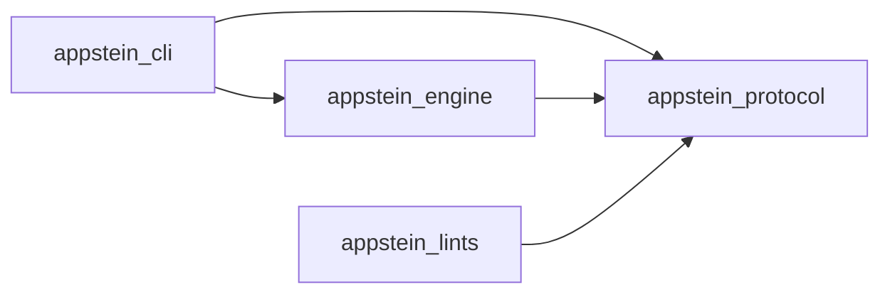
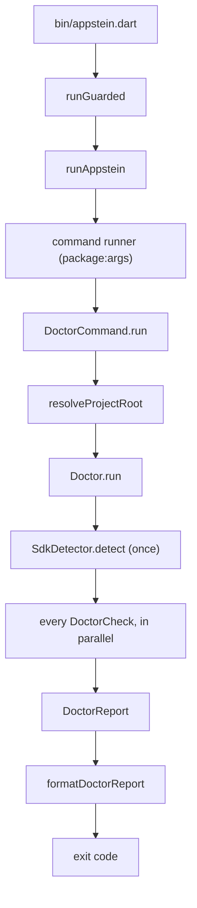

<!-- covers:
packages/appstein_engine/lib/appstein_engine.dart
packages/appstein_protocol/lib/**
-->

# How Appstein works

This is the overview. It shows the parts and how they connect, then points to the page that explains each one.

## What exists now

Appstein is currently:

- a command line, `appstein`, with `--version` and five commands, `doctor`, `sync`, `mcp`, `docs` and `verify`;
- a verifier, `appstein verify`, that checks the project against its knowledge and reports findings (see [verify](verify.md)). It has its frame and the checks every project gets; the code checks, the lint rules, the package gate and the native checks come in later slices;
- a renderer, `appstein docs`, that turns the knowledge into Markdown pages for people, in the project's docs folder (see [human-docs](human-docs.md));
- an MCP server, `appstein mcp`, that answers an agent's questions from the knowledge, with seven read tools, reads and writes the project's decisions and memory with four more, and runs the verifier with `verify` (see [mcp-server](mcp-server.md) and [decisions-and-memory](decisions-and-memory.md));
- an engine behind it, which holds all the logic;
- shared data models;
- an analyzer plugin with one lint rule, `layer_imports`;
- the knowledge Appstein writes into a project's `.appstein/`: the platform layer, the version delta (see [version-delta](version-delta.md)) and the project map of the app's Dart code (see [project-map](project-map.md)) and the native config of its Android and iOS files (see [native-config](native-config.md)), and `INDEX.md`, the short summary an agent always has in view (see [index-md](index-md.md));
- package skills: `sync` runs package:skills when the dependencies change, so the agents set up in the project get the skills packages ship (see [package-skills](package-skills.md));
- three packs: `official_mvvm`, which knows Flutter's recommended app architecture, and `android` and `ios`, which read the native files.

The rest of the verifier's checks, `package_check` for the MCP server, and more packs come in later slices ([spec §18](../project/specs/2026-09-29-appstein-design.md#18-milestones)).

## The four packages

<!-- generated:package-graph -->

An arrow means "depends on". Read from each package's `pubspec.yaml`; dev dependencies are left out.

<!-- /generated:package-graph -->

- **protocol** holds data only: `SdkInfo`, `AppsteinConfig` (with one class per section of `appstein.yaml`), `LayerRules`, `Severity` and the `protocolVersion` constant. It imports nothing that touches the machine. See [`appstein_protocol.dart`](../../packages/appstein_protocol/lib/appstein_protocol.dart). Since slice 1b.2 it also defines the `.appstein/` file formats (`KnowledgeMeta`, `KnowledgeState`, `SdkInfo` with notes coverage, `CuratedNote`, `Toolchain`), so the CLI, the future MCP server and the UIs read one format (spec §4 principle 4). Since slice 1b.3 it also defines the **map formats** (`SymbolsMap`, `LayersMap`, `DepsMap`, `FeaturesMap`, `RoutesMap` and, since slice 1b.4, `NativeConfig`, in `src/map/`), and `LayerMatcher`, which both the `layer_imports` lint and the engine's `layers.json` use, so a file has the same layer tag in the editor and in the map. Slice 1c.1 added `DeltaKnowledge` (the format of `delta.json`) and `src/mcp/`: the MCP tools' input and result schemas, `FreshnessReport` and `withoutNulls`. Slice 1c.2 added `DecisionRecord` and `DecisionStatus` in `src/decisions/`, the shape of one decision record, and the schemas of the four decision and memory tools. Slice 1d.1 added `src/verify/`: `Finding` and `VerifyResult`, the shapes `appstein verify --format json` prints and the `verify` tool returns, with `sortFindings`, the one order every output uses; the `verify` tool's schemas; `SuppressionEntry` and the `suppressions` list on `AppsteinConfig`; and `resolvedFrom` on an unknown `NativeValue`, which says where the value would have come from. `toolOutputSchema` now keeps a result's own `summary`, which `verify` has.
- **engine** holds all behaviour. Environment variables and processes go through two small types in `packages/appstein_engine/lib/src/host/`:
  - `HostEnvironment` for environment variables, the PATH and the OS;
  - `ProcessRunner` for running tools.

  Tests swap them for fakes. File checks are different: tests give them real temporary folders. A few checks (`xcodebuild`, `pod`, `reg`) start a tool by bare name against the real PATH, and some tests skip themselves when a tool isn't installed.
- **cli** parses arguments, calls the engine and prints. `runAppstein()` returns an exit code instead of exiting, so tests run the whole CLI in-process. See [cli](cli.md).
- **lints** runs inside the Dart analyzer, so its rules appear in every IDE and agent. It depends on protocol by a `path:` dependency, because the analysis server resolves a plugin's dependencies outside the workspace. See [lints](lints.md), which also explains how `layer_imports` finds its rules.

Why split it this way: the engine has no command-line code, so the MCP server and agent hooks planned for later slices can call the same engine the CLI does (spec §5.1). The one-way dependencies keep that true, and the `layer_imports` rule enforces them on our own repo.

## One command, end to end

This is what happens when you run `appstein doctor`:

1. `bin/appstein.dart` hands the arguments to `runGuarded`. See [cli](cli.md).
2. `runGuarded` runs the CLI in a guarded zone, so even a stray async error ends with exit code 3. See [cli](cli.md).
3. `runAppstein` builds the command runner and turns any failure into exit code 3. See [cli](cli.md).
4. The command runner, from `package:args`, parses the global options and picks the `doctor` command. See [cli](cli.md).
5. `DoctorCommand.run` asks for the project folder, runs the doctor and prints the report. See [cli](cli.md).
6. `resolveProjectRoot` uses `--project`, or else the nearest folder upward with a `pubspec.yaml`. See [cli](cli.md).
7. `Doctor.run` builds one shared context for every check. See [doctor](doctor.md).
8. `SdkDetector.detect` finds the Flutter SDK **once**, and every check reuses the answer. See [sdk-lookups](sdk-lookups.md).
9. Every `DoctorCheck` runs in parallel. Checks run external tools through `ProcessRunner`. See [doctor](doctor.md) and [running-tools](running-tools.md).
10. The results come back as a `DoctorReport`, in check order. See [doctor](doctor.md).
11. `formatDoctorReport` turns the report into plain text. See [cli](cli.md).
12. The exit code is `1` if any check found an error, and `0` otherwise. See [cli](cli.md).

`appstein sync` follows the same shape: the CLI's `SyncCommand` loads `appstein.yaml`, chooses the packs with `packsFor`, and calls the engine's `KnowledgeSync`. That builds the platform layer (`PlatformSync`: SDK detection, `readToolchain`, `CuratedNotes`), the project map (`MapSync`: packages, analysis, the packs' extractors), the native config (`NativeSync`: the platform packs' native extractors) and the version delta (`collectDelta` inside `MapSync`, then `renderDelta`), and hands all of them to `KnowledgeStore`, which writes the files in `.appstein/`. With `--detect` it first compares the inputs' hashes with `state.json` and stops when nothing changed (see [incremental-sync](incremental-sync.md)). See [knowledge-store](knowledge-store.md), [project-map](project-map.md) and [native-config](native-config.md).

### How a pack reaches the engine

The engine's core (everything outside the pack folders `lib/src/packs/official_mvvm/`, `android/` and `ios/` and their entry files `lib/official_mvvm.dart`, `lib/android.dart` and `lib/ios.dart`) never imports a pack: the rule in spec §5.1, enforced by `layer_imports` on this repo. Instead the engine defines a small `Pack` interface (in `lib/src/packs/pack.dart`, exported from the barrel), the map's `MapExtractor` and the native config's `NativeExtractor`. A pack lives in its own folder and has its own entry file, such as `android.dart`. The CLI, which may import them all, calls `packsFor(config)` and passes the resulting `List<Pack>` into `KnowledgeSync`. From there `MapSync` and `NativeSync` see only the interface. A new pack is therefore a new folder, a new entry file, and one line in `packsFor`.

## Where each part is explained

| Engine folder | What it does | Guide page |
|---|---|---|
| `host/` | Environment variables, the PATH, finding executables, running tools | [running-tools](running-tools.md) |
| `config/` | Loads and validates `appstein.yaml` | [config](config.md) |
| `text/` | Edit distance, for "did you mean" hints in config errors | [config](config.md) |
| `sdk/` | Finds the Flutter SDK and reads its versions, including FVM pins | [sdk-lookups](sdk-lookups.md) |
| `android/` | Finds the JDK Flutter uses and the Android SDK | [sdk-lookups](sdk-lookups.md) |
| `doctor/` | The doctor and its checks | [doctor](doctor.md) |
| `project/` | Finds the project folder | [doctor](doctor.md) |
| `knowledge/` | The `.appstein/` store: canonical JSON, input hashes, the lock, `sync`; `freshness.dart` for `sync --detect`; `sync_timings.dart` for measuring a sync | [knowledge-store](knowledge-store.md), [incremental-sync](incremental-sync.md) |
| `map/` | The project map: packages, analysis, symbols, layers, deps; the map's inputs and the analyzer cache | [project-map](project-map.md), [incremental-sync](incremental-sync.md) |
| `native/` | Native config: the extractor seam and `NativeSync`, which writes `native.json` from the platform packs | [native-config](native-config.md) |
| `delta/` | The version delta: `fix_data` migrations, the deprecations the imports expose, the Markdown | [version-delta](version-delta.md) |
| `mcp/` | The MCP server: the tool list, the queue, the freshness step, and one function per tool | [mcp-server](mcp-server.md) |
| `decisions/` | Decision records: the text of one file, and the store that reads the folder by the spec's rules and writes under the lock | [decisions-and-memory](decisions-and-memory.md) |
| `memory/` | The memory files: where they are, and how a lesson line is appended | [decisions-and-memory](decisions-and-memory.md) |
| `docs/` | The human docs: what a page may read, the renderer, the page marker, the engine's own pages, and the code that compares, writes and deletes in the docs folder | [human-docs](human-docs.md) |
| `verify/` | The verifier: the frame (`runVerify`), the check interfaces, the engine's checks, suppressions | [verify](verify.md) |
| `index/` | `INDEX.md`: what it reads from the project, and the renderer that keeps it within 1,500 tokens | [index-md](index-md.md) |
| `skills/` | Package skills: running package:skills for the agents set up in the project when the dependencies change | [package-skills](package-skills.md) |
| `packs/` | The `Pack` interface; `official_mvvm/`: its layer rules, features, routes, doc pages and its decision check `stack.provider`; `android/` and `ios/`: the readers behind `native.json`, and their sections of `native.md` | [project-map](project-map.md), [native-config](native-config.md), [human-docs](human-docs.md), [verify](verify.md) |
| `notes/` | The curated notes, parsed and compiled in | [knowledge-store](knowledge-store.md) |
| `toolchain/` | Reads the native toolchain matrix from the Flutter SDK | [toolchain](toolchain.md) |

Outside the engine:

| Part | Guide page |
|---|---|
| The lints package, `packages/appstein_lints/` | [lints](lints.md) |
| The guide check, docs generator and hooks installer in `tool/` | [docs-tooling](docs-tooling.md) |
| The CI workflow, `tool/startup_check.dart` and `tool/measure_analyze.dart` | [ci](ci.md) |

## What the engine exports

The barrel file [`appstein_engine.dart`](../../packages/appstein_engine/lib/appstein_engine.dart) exports everything the CLI and the repo tools use: the host types, the config loader, the SDK and Android lookups, the project locator, the doctor and its checks, the knowledge sync and the map builders, the `Pack` interface, and the text helpers. Slice 1b.7 added three exports for incremental sync: `analyzer_cache.dart` (the analyzer's on-disk cache), `map_inputs.dart` (what the map is built from) and `freshness.dart` (the answer to "is `.appstein/` current?"). They are shared, so that the CLI's `sync --detect`, `verify` and the MCP server read one definition. Slice 1d.1 added the verifier's exports: `runVerify`, `checksFor`, the `VerifyCheck` and `DecisionCheck` interfaces, the engine's checks, `applySuppressions`, `refreshKnowledge` (the one refresh `docs` and `verify` share) and `prepareDocs`. A fourth, `sync_timings.dart`, records how long each step of a sync took (`SyncReport.timings`), for `appstein sync --timings` and `tool/measure_sync.dart`. See [incremental-sync](incremental-sync.md). There are three other public entry points, [`official_mvvm.dart`](../../packages/appstein_engine/lib/official_mvvm.dart), [`android.dart`](../../packages/appstein_engine/lib/android.dart) and [`ios.dart`](../../packages/appstein_engine/lib/ios.dart), which export the packs for the CLI to register; they are separate so that the core never imports a pack. The code itself lives under `lib/src/`, which by Dart convention is private to the package, and the barrel re-exports it. So a file can move inside `lib/src/` without breaking code that imports the barrel. A few helpers that only the engine itself uses, such as `readAndroidSdkContents` and `fileErrorReason`, live under `lib/src/` without an export; their tests import them from `src/` directly.

Some map helpers are exported even though only the engine uses them today: `ast_values`, `project_packages`, `interface_library` and the `build*` map functions. They are the building blocks of a pack. A pack outside the engine package, which will exist (the `Pack` and `MapExtractor` interface of spec §10), can import only the barrel, so it needs these to read the project's code the way the official_mvvm pack does.
