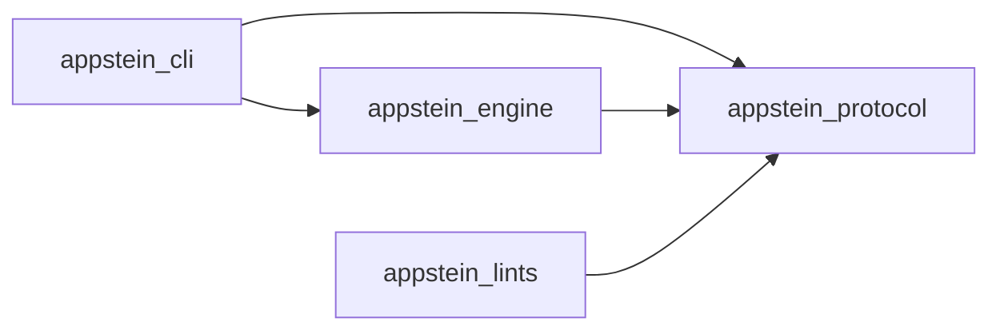
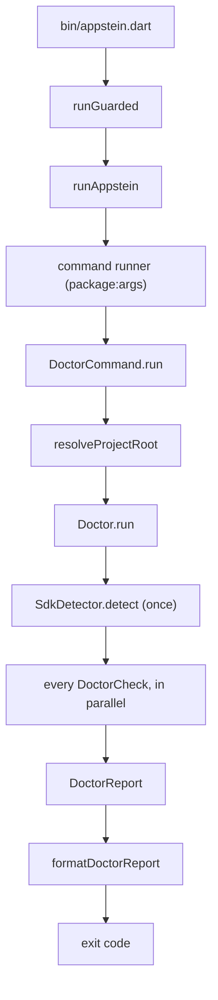

<!-- covers:
packages/appstein_engine/lib/appstein_engine.dart
packages/appstein_protocol/lib/**
-->

# How Appstein works

This is the overview. It shows the parts and how they connect, then points to the page that explains each one.

## What exists now

Appstein is currently:

- a command line, `appstein`, with `--version` and one command, `doctor`;
- an engine behind it, which holds all the logic;
- shared data models;
- an analyzer plugin with one lint rule, `layer_imports`.

Packs, knowledge, the verifier and the MCP server come in later slices ([spec §18](../superpowers/specs/2026-09-29-appstein-design.md#18-milestones)).

## The four packages

<!-- generated:package-graph -->

An arrow means "depends on". Read from each package's `pubspec.yaml`; dev dependencies are left out.

<!-- /generated:package-graph -->

- **protocol** holds data only: `SdkInfo`, `AppsteinConfig` (with one class per section of `appstein.yaml`), `LayerRules`, `Severity` and the `protocolVersion` constant. It imports nothing that touches the machine. See [`appstein_protocol.dart`](../../packages/appstein_protocol/lib/appstein_protocol.dart).
- **engine** holds all behaviour. Environment variables and processes go through two small types in `packages/appstein_engine/lib/src/host/`:
  - `HostEnvironment` for environment variables, the PATH and the OS;
  - `ProcessRunner` for running tools.

  Tests swap them for fakes. File checks are different: tests give them real temporary folders. A few checks (`xcodebuild`, `pod`, `reg`) start a tool by bare name against the real PATH, and some tests skip themselves when a tool isn't installed.
- **cli** parses arguments, calls the engine and prints. `runAppstein()` returns an exit code instead of exiting, so tests run the whole CLI in-process. See [cli](cli.md).
- **lints** runs inside the Dart analyzer, so its rules appear in every IDE and agent. It depends on protocol by a `path:` dependency, because the analysis server resolves a plugin's dependencies outside the workspace. See [lints](lints.md), which also explains how `layer_imports` finds its rules.

Why split it this way: the engine has no command-line code, so the MCP server and agent hooks planned for later slices can call the same engine the CLI does (spec §5.1). The one-way dependencies keep that true, and the `layer_imports` rule enforces them on our own repo.

## One command, end to end

This is what happens when you run `appstein doctor`:

1. `bin/appstein.dart` hands the arguments to `runGuarded`. See [cli](cli.md).
2. `runGuarded` runs the CLI in a guarded zone, so even a stray async error ends with exit code 3. See [cli](cli.md).
3. `runAppstein` builds the command runner and turns any failure into exit code 3. See [cli](cli.md).
4. The command runner, from `package:args`, parses the global options and picks the `doctor` command. See [cli](cli.md).
5. `DoctorCommand.run` asks for the project folder, runs the doctor and prints the report. See [cli](cli.md).
6. `resolveProjectRoot` uses `--project`, or else the nearest folder upward with a `pubspec.yaml`. See [cli](cli.md).
7. `Doctor.run` builds one shared context for every check. See [doctor](doctor.md).
8. `SdkDetector.detect` finds the Flutter SDK **once**, and every check reuses the answer. See [sdk-lookups](sdk-lookups.md).
9. Every `DoctorCheck` runs in parallel. Checks run external tools through `ProcessRunner`. See [doctor](doctor.md) and [running-tools](running-tools.md).
10. The results come back as a `DoctorReport`, in check order. See [doctor](doctor.md).
11. `formatDoctorReport` turns the report into plain text. See [cli](cli.md).
12. The exit code is `1` if any check found an error, and `0` otherwise. See [cli](cli.md).

## Where each part is explained

| Engine folder | What it does | Guide page |
|---|---|---|
| `host/` | Environment variables, the PATH, finding executables, running tools | [running-tools](running-tools.md) |
| `config/` | Loads and validates `appstein.yaml` | [config](config.md) |
| `text/` | Edit distance, for "did you mean" hints in config errors | [config](config.md) |
| `sdk/` | Finds the Flutter SDK and reads its versions, including FVM pins | [sdk-lookups](sdk-lookups.md) |
| `android/` | Finds the JDK Flutter uses and the Android SDK | [sdk-lookups](sdk-lookups.md) |
| `doctor/` | The doctor and its checks | [doctor](doctor.md) |
| `project/` | Finds the project folder | [doctor](doctor.md) |

Outside the engine:

| Part | Guide page |
|---|---|
| The lints package, `packages/appstein_lints/` | [lints](lints.md) |
| The guide check, docs generator and hooks installer in `tool/` | [docs-tooling](docs-tooling.md) |
| The CI workflow, `tool/startup_check.dart` and `tool/measure_analyze.dart` | [ci](ci.md) |

## What the engine exports

The barrel file [`appstein_engine.dart`](../../packages/appstein_engine/lib/appstein_engine.dart) exports everything the CLI and the repo tools use: the host types, the config loader, the SDK and Android lookups, the project locator, the doctor and its checks, and the text helpers. There is no other public entry point. The code itself lives under `lib/src/`, which by Dart convention is private to the package, and the barrel re-exports it. So a file can move inside `lib/src/` without breaking code that imports the barrel. A few helpers that only the engine itself uses, such as `readAndroidSdkContents` and `fileErrorReason`, live under `lib/src/` without an export; their tests import them from `src/` directly.
