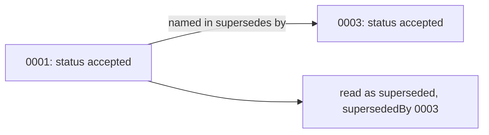

<!-- covers:
packages/appstein_engine/lib/src/decisions/**
packages/appstein_engine/lib/src/memory/**
packages/appstein_protocol/lib/src/decisions/**
-->

# Decisions and memory

Most of `.appstein/` is generated: Appstein reads the SDK and the code and writes what it found. Two folders are different. `decisions/` and `memory/` hold what no tool can work out from the code: **why** the project is built the way it is, and **what is being worked on**. People and agents write them, and the project commits them. This page explains their formats, the rules for reading and writing them, and how a write stays safe. The design is in [spec §6.7 and §6.8](../superpowers/specs/2026-09-29-appstein-design.md#67-decision-record-format).

Agents reach both through four MCP tools (see [mcp-server](mcp-server.md#decisions-and-memory)): `decisions` and `record_decision`, `memory_read` and `memory_write`.

| Where | What it holds |
|---|---|
| [`decision_record.dart`](../../packages/appstein_protocol/lib/src/decisions/decision_record.dart) | `DecisionRecord`, `DecisionStatus`, and `decisionChecks`, the two check names a record may list |
| [`decision_file.dart`](../../packages/appstein_engine/lib/src/decisions/decision_file.dart) | The text of one file: reading it, writing a new one, changing its status word, and the slug for its name. No file access |
| [`decision_store.dart`](../../packages/appstein_engine/lib/src/decisions/decision_store.dart) | `readDecisions`, which reads the folder by the reading rules, and `writeDecision`, which adds, replaces or accepts under the write lock |
| [`memory_store.dart`](../../packages/appstein_engine/lib/src/memory/memory_store.dart) | The two memory paths, reading a memory file, and the lesson line: `lessonLine`, `lessonsIn`, `withLesson` |

## A decision record

One file per decision, in `.appstein/decisions/`:

```markdown
---
id: 0002
title: State management with provider + ChangeNotifier
status: accepted
date: 2026-10-02
supersedes: null
paths: [lib/ui/**/view_models/**, lib/config/dependencies.dart]
checks: [stack.provider]
---
Why: Flutter's architecture guide recommends it; one stack pack keeps checks exact.
```

- **The file name** is `NNNN-<slug>.md`. The number in the name is the decision's number; `id` only repeats it and is never read.
- **`status`** is `proposed`, `accepted` or `superseded`. Only an accepted decision binds.
- **`paths`** are glob patterns from the project folder. They say where the decision applies; an empty list means everywhere.
- **`checks`** name verifier checks that confirm the decision. They are stored now and run in slice 1d.
- **The text below the front matter** is the reason. A leading `Why:` is dropped when it is read.

## Reading: one reader, three rules

`INDEX.md` and the `decisions` tool both read through `readDecisions`, so they can never disagree about which decisions are in force. It returns a `DecisionSet`, and never throws for the project's own files.

**1. A decision that a later one replaces is superseded, whatever its own file says.** If decision 3 says `supersedes: 0001` and its own status line is accepted or proposed, decision 1 counts as superseded even when its file still says `accepted`. Two things can leave a file like that: a person who writes a replacement by hand and forgets the old file, and a write that was interrupted between its two steps (below). Without this rule either would leave two decisions in force. Each `DecisionEntry` therefore has two statuses: `record.status` is the file's word, and `status` is what readers use. `supersededBy` names the replacement.



A decision whose own line says `superseded` replaces nothing. If decisions name each other in a circle, none would be left in force, so the one with the highest number stays and `DecisionSet.problems` says so.

**2. A number used twice is reported, not resolved.** Two branches that each add decision 5 merge into two files with that number. Both are read. `duplicates` lists them, `numbered(5)` returns null, and `record_decision` refuses to accept or replace number 5 until one file is renamed. Appstein doesn't pick a winner, because it can't know which one the team means.

**3. A file that can't be read is reported with its reason.** It appears in `unreadable` with words such as "it has no front matter", and its number is still counted by `nextNumber`, so a damaged file's number is never given to a new decision.

## Writing: add, replace, accept

`record_decision` can do three things and nothing else. It never rewrites the title, reason, paths or checks of a decision that exists: a decision that changes is replaced by a new one, so the history stays readable.

| Action | What is written |
|---|---|
| **Add** | A new file with the next number, today's date and the given fields. Status `proposed`, unless the agent passes `accepted` |
| **Replace** | A new file whose `supersedes` names the old decision, then the old file's status word becomes `superseded` |
| **Accept** | A proposed decision's status word becomes `accepted` |

**Who may accept.** An agent's decision is `proposed` by default. The tool's description tells the agent to pass `accepted` only when the user agreed to the decision in the conversation. This is a rule for the agent, not something Appstein can check: it has no way to see the conversation.

**Changing one word.** Replace and Accept change an existing file. `withDecisionStatus` finds the `status:` line inside the front matter and swaps only the word after it. A comment on that line, Windows line breaks, a byte order mark and every other byte stay as they were. When the line isn't a plain `status: word` (a quoted status, say), it changes nothing: Accept is refused with "change it by hand", and Replace keeps the new decision and returns a `warning`. Rule 1 above still makes readers treat the old decision as superseded.

**Titles YAML would misread.** A title such as `true`, `123` or `a: b` would come back as something else, or break the file. `renderDecision` writes a value plainly only when YAML reads it back as the same text, and quotes it otherwise. The same goes for a path that starts with `*`.

**What is refused**, before anything is written: an empty title or reason, a title over 120 characters, a check that isn't one of the two built-in names, a path that is absolute or leaves the project or isn't a valid glob, replacing a decision that is missing, duplicated, unreadable or already superseded, and accepting one that isn't proposed.

## How a write stays safe

- **The lock.** `writeDecision` and `memory_write` take the same `.appstein/.lock` that `sync` takes (see [knowledge-store](knowledge-store.md#the-lock-and-why-files-are-renamed-into-place)), and read the folder only after they hold it. So two agents that record a decision at the same moment get two different numbers.
- **Whole files.** Every file is written beside its target and renamed over it (`replaceFile`), so a reader never sees half a file.
- **The order of two writes.** Replace writes the new decision first, then the old status word. If the second step fails or the process dies in between, the new file exists and names the old one, and rule 1 already counts the old one as superseded. Finishing a task in memory appends the lesson first, then deletes `current.md`; if the delete fails, the summary is not lost, and calling again deletes the file without adding the lesson twice.

## Memory

Two files in `.appstein/memory/`:

| File | Holds | Written by |
|---|---|---|
| `current.md` | The task in progress: goal, plan, status, open questions | `memory_write` with `kind: current` replaces the whole file |
| `lessons.md` | One dated line per lesson: `- 2026-10-03: plugin X needs minSdk 26` | `kind: lesson` appends a line |

**Finishing a task** is `kind: complete`. The agent passes its own one-paragraph summary as `text`. Appstein has no model inside it, so it can't write a summary, and it doesn't pretend to by copying the first paragraph of `current.md`, which is the goal written at the start and not what was learned. The summary is appended as a lesson and `current.md` is deleted. Without a text, or with no task in progress, the call is refused and nothing is cleared.

**Appending keeps every byte.** `withLesson` adds one line at the end of `lessons.md` and touches nothing before it, so a person's edits survive. It adds a line break first when the file doesn't end with one, and uses Windows line breaks when the file already does. A lesson the file already holds, on whatever date, isn't added again.

**Dates** are the machine's local date. The server takes a clock so tests can fix it.

**Secrets.** Both files are committed, and so are decisions. The tools' descriptions tell agents never to put secrets in them. Appstein can't detect a secret reliably and doesn't claim to.

## How INDEX.md follows

`INDEX.md` lists the decisions in force and the first lines of `current.md` (see [index-md](index-md.md)), and both are part of its input hash. After `record_decision` or `memory_write` succeeds, the server runs its freshness check a second time, so `INDEX.md` on disk already shows the change when the reply arrives.

## Testing it

| Test | What it proves |
|---|---|
| `packages/appstein_protocol/test/decision_record_test.dart` | The status names, the check names, four-digit numbers |
| `packages/appstein_engine/test/decisions/decision_file_test.dart` | Reading (every reason a file is unreadable, Windows files, how `supersedes` may be written), the written layout, titles and paths YAML would misread, the status word swap, slugs |
| `packages/appstein_engine/test/decisions/decision_store_test.dart` | The three reading rules, chains and circles, the next number |
| `packages/appstein_engine/test/mcp/decisions_query_test.dart` | The `decisions` tool: all, by words, by file path |
| `packages/appstein_engine/test/mcp/record_decision_test.dart` | Add, replace and accept on real folders; every refusal with nothing written; three writers at once; a lock held by another process |
| `packages/appstein_engine/test/mcp/memory_tools_test.dart` | The lesson line, appending without changing earlier bytes, the three kinds of write, reading |
| `packages/appstein_engine/test/mcp/appstein_mcp_server_test.dart`, `mcp_stdio_test.dart` | The tools through the server, `INDEX.md` following a write, and the real process writing real files |

**Trying it by hand.** Start the server as [mcp-server](mcp-server.md#testing-it) describes, call `record_decision` with a `title` and a `why`, and open the new file in `.appstein/decisions/`. Then open `.appstein/INDEX.md`: its Decisions section lists it.
