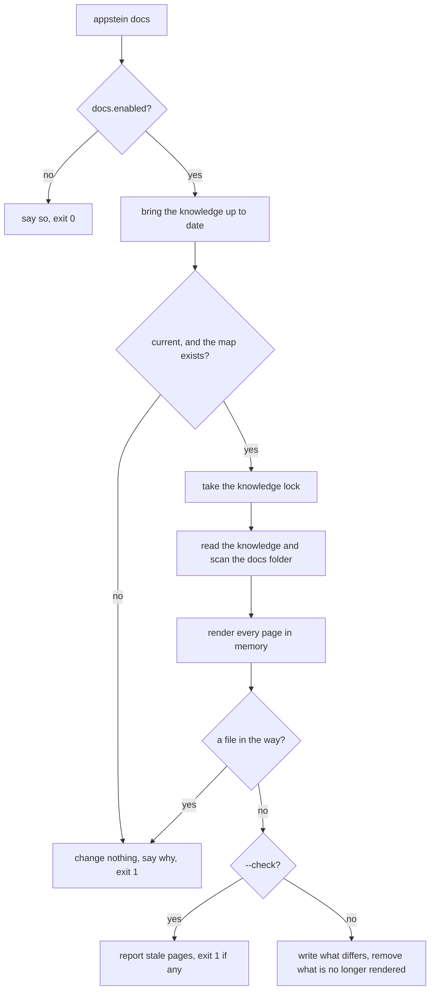

<!-- covers:
packages/appstein_engine/lib/src/docs/**
-->

# Human docs

Everything in `.appstein/` is shaped for agents: compact, machine-readable and git-ignored. `appstein docs` renders the same knowledge as Markdown pages a person can read, in the project's docs folder (by default `app` inside its `docs` folder), and those pages are committed. This page explains how a page is built, how Appstein knows which files in that folder are its own, and how it decides that a page is behind. The design is in [spec §6.9](../superpowers/specs/2026-09-29-appstein-design.md#69-human-documentation-docsapp).

Nothing is written just for the docs. A page's facts come from the project map, the decisions and `///` doc comments. The only prose Appstein adds is **concept text** ("what a view model is"), written once inside each pack.

| Where | What it holds |
|---|---|
| [`docs_knowledge.dart`](../../packages/appstein_engine/lib/src/docs/docs_knowledge.dart) | `DocsKnowledge`: everything a page may read. `TeamNote`: a Markdown file in the folder that isn't Appstein's |
| [`doc_page.dart`](../../packages/appstein_engine/lib/src/docs/doc_page.dart) | `DocPage`, the interface a pack implements, and `DocSection`, the Markdown it returns for one file |
| [`docs_renderer.dart`](../../packages/appstein_engine/lib/src/docs/docs_renderer.dart) | `renderPages`: joins sections into pages and adds the marker. Pure: no file access |
| [`doc_marker.dart`](../../packages/appstein_engine/lib/src/docs/doc_marker.dart) | `DocMarker`, the first line of every generated page, and the body hash |
| [`markdown_text.dart`](../../packages/appstein_engine/lib/src/docs/markdown_text.dart) | Escaping, tables, block quotes, links and Mermaid labels |
| [`engine_pages.dart`](../../packages/appstein_engine/lib/src/docs/engine_pages.dart), [`pages/`](../../packages/appstein_engine/lib/src/docs/pages/) | The engine's own pages: `README.md`, `dependencies.md`, `decisions.md` |
| [`native_section.dart`](../../packages/appstein_engine/lib/src/docs/native_section.dart) | Turns a section of `native.json` into tables, for the platform packs |
| [`docs_folder.dart`](../../packages/appstein_engine/lib/src/docs/docs_folder.dart) | Reads the docs folder, compares it with the rendered pages, writes and deletes |
| [`docs_run.dart`](../../packages/appstein_engine/lib/src/docs/docs_run.dart) | `runDocs`: the whole run, from freshness to writing |

## The pages

| Page | Rendered by | From |
|---|---|---|
| `README.md` | engine | the project's name, SDK versions, app IDs, every other page, the team's notes |
| `architecture.md` | `official_mvvm` | the pack's layer rules and `layers.json` |
| `features/<feature>.md` | `official_mvvm` | `features.json`, `symbols.json` (the summaries), `routes.json` |
| `routes.md` | `official_mvvm` | `routes.json` |
| `native.md` | `android`, `ios` | `native.json` |
| `dependencies.md` | engine | `deps.json` |
| `decisions.md` | engine | the decision records, read by the [rules of spec §6.7](decisions-and-memory.md) |

A feature in a nested folder keeps its folders: `auth/login` is `features/auth/login.md`.

## One run



1. **Knowledge first.** `runDocs` calls `KnowledgeSync.detect`, the step `sync --detect` and the MCP server use (see [incremental-sync](incremental-sync.md)). One command is enough after a person edits code by hand, and it works in CI, where `.appstein/` doesn't exist yet. Package skills are off, as in the MCP server: they start a process and write agent folders, which belongs to `appstein sync`.
2. **All of the knowledge, or nothing.** If the sync fails, the lock is busy, the map was skipped (for example `flutter pub get` failed) or a knowledge file can't be read, `runDocs` returns `DocsRefused` and nothing in the docs folder is written, removed or judged. Old map files stay on disk when a sync skips the map, so reading them would render stale pages; the sync's report is what says the map is missing. A set of pages that describes two different moments is worse than the old set.
3. **Under the lock.** Reading the knowledge, rendering and writing happen while holding `.appstein/.lock`, the lock every writer of the knowledge takes (see [knowledge-store](knowledge-store.md)). A sync can't replace a map file between two reads, and two `appstein docs` at once can't write the same page.
4. **Render, then compare.** Every page is rendered in memory first. Only then is anything compared or written.

## How a page is built

A pack lists **page sources** in `Pack.docPages`. A page source is a `DocPage`: it takes the `DocsKnowledge` and returns `DocSection`s. Each section names the file it belongs to, the page's title, and its Markdown.

`renderPages` runs the engine's page sources first, then each pack's, in the order of `appstein.yaml`. Sections with the same path are **joined** in that order under the first one's title. That is how `native.md` gets an Android part and an iOS part from two packs that never see each other. `README.md` is rendered last, by the engine, because it lists the other pages.

Every page has the same frame:

```markdown
<!-- appstein:generated templates=official_mvvm@2 body=<sha256> -->
> Generated by Appstein; edits are overwritten. Write `///` doc comments or a team note instead.

# Routes

...the sections, a blank line between each...
```

**Text from the app is always escaped.** A class summary, a decision title or a file name can hold `|`, a backtick or `<br>`, which would break a table or be read as markup. `mdText` escapes them, `mdCode` picks a backtick fence long enough for the text, and a decision's reason goes into a block quote (`mdQuote`), so a heading inside it stays inside. Mermaid node ids are made by Appstein (`screen_0`); names from the app only ever appear in quoted labels.

**A page source that fails stops the render.** If one throws, or returns a section with a bad path (outside the folder, not `.md`, `README.md`, or differing from another path only in letter case), `renderPages` throws a `DocPageError` and no page is rendered. That is a bug in Appstein or a pack, so the command crashes with exit 3 instead of writing a smaller set of pages and deleting the rest.

**Output is deterministic.** Lists are sorted, there is no timestamp, and nothing depends on the machine. The same knowledge gives the same bytes, so a run after nothing changed produces no git diff.

## The marker

The first line of a generated page is an HTML comment, so it doesn't show on GitHub:

- **It says the page is Appstein's.** A Markdown file whose first line is a marker is generated. Any other file is a **team note**: Appstein never changes it, and `README.md` lists it under "Team notes".
- **`templates`** names who rendered the page and their template version: a pack's id and version, or `engine` and `docsEngineVersion`. It is not the Appstein version, which would change the first line of every page at every release.
- **`body`** is the SHA-256 of everything after the marker line. If a file's body no longer matches it, someone edited the page by hand.

**There is no hash of the page's inputs.** A page's inputs are whole knowledge files: every feature page reads `symbols.json`. A hash of them would change the marker of every feature page whenever one class is added anywhere, which is exactly the git noise the docs must not make. Whether a page is behind is found the direct way: render it again and compare. That is exact, and it is cheap (see [the time budget](#testing-it)).

## Comparing with the folder

`scanDocsFolder` reads every `.md` file in the folder (links are not followed) and sorts them into generated pages and team notes. `planDocs` then gives each page one of these:

| Result | When |
|---|---|
| unchanged | The file is what a render gives |
| write, `missing` | There is no file |
| write, `behind` | The file is an older render: the app or the templates changed |
| write, `handEdited` | The file's body doesn't match the hash in its own marker |
| remove, `notRendered` | The file has the marker, but no page is rendered there any more (its feature was removed) |

**Line endings never count.** Git on Windows can check a committed page out with `\r\n`. Both the comparison and the body hash turn `\r\n` into `\n` and drop a byte order mark first (`plainLines`), so a fresh Windows clone isn't reported as stale or hand-edited. Pages are always written with `\n`.

**A file in the way stops the run.** A file without the marker where a page would be written (a team's own `routes.md`), or a folder or a link there, is never overwritten. `planDocs` reports it as blocked, and `runDocs` refuses: nothing is written or removed until the file is moved.

**Writing.** `applyDocs` writes each page in one step (the store's `replaceFile`: a temporary file renamed over the target), `README.md` last so the index never names a page that isn't there yet. Then it removes the pages that are no longer rendered, and the folders that leaves empty, but never the docs folder itself. A hand-edited page is overwritten, and the command says so.

`appstein docs --check` stops after `planDocs`: it prints each page that isn't unchanged and exits 1 if there is one. The `docs.stale` check of slice 1d will reuse the same two functions.

## The engine's pages

- **`README.md`** ([`readme_page.dart`](../../packages/appstein_engine/lib/src/docs/pages/readme_page.dart)): the stack, the platforms, the Flutter and Dart versions, and the app IDs. The ID lines come from `appIdLines`, the function `INDEX.md` uses, so the two never disagree. "Run it" adds `fvm` when the project pins Flutter with FVM, and names the Android flavors.
- **`dependencies.md`** ([`dependencies_page.dart`](../../packages/appstein_engine/lib/src/docs/pages/dependencies_page.dart)): the packages grouped by how the app depends on them, with the first five files that import each. The package gate's verdict joins it in slice 1d.
- **`decisions.md`** ([`decisions_page.dart`](../../packages/appstein_engine/lib/src/docs/pages/decisions_page.dart)): accepted decisions with their reasons, then proposed ones, which nobody has agreed to yet and which the reader is the person to accept, then superseded ones, then what is wrong with the records.

## The packs' pages

- **`official_mvvm`** ([`packs/official_mvvm/docs/`](../../packages/appstein_engine/lib/src/packs/official_mvvm/docs/)). `architecture.md` draws which layer may use which **from the pack's layer rules**, the same object the `layer_imports` lint enforces, so the diagram can't drift from the rule. Layers that share a first name and may all use each other (`data.repository`, `data.service`, `data.model`) are drawn as one box, because an arrow for every pair hid the diagram; a table under it lists every rule exactly. A feature page shows its parts by kind. The map doesn't record which class calls which, so the arrows go between kinds and the page says so. `routes.md` lists a route Appstein couldn't resolve as unresolved, with the reason, and never guesses it.
- **`android` and `ios`** ([`android_docs.dart`](../../packages/appstein_engine/lib/src/packs/android/android_docs.dart), [`ios_docs.dart`](../../packages/appstein_engine/lib/src/packs/ios/ios_docs.dart)). Each gives its concept text, the headings for its part of `native.json`, and their order. `nativeTables` walks the whole section, so a value the pack doesn't name still appears, under its key. An unknown value shows its reason and is never guessed (see [native-config](native-config.md)).

To add a page, see [add a doc page](how-to/add-a-doc-page.md).

## Testing it

- **Each page source** is tested on small hand-built knowledge (`sampleKnowledge` in [`docs_support.dart`](../../packages/appstein_engine/test/docs/support/docs_support.dart)), with the exact Markdown it must give.
- **Every page of the fixture app** has a golden file in [`goldens/docs/`](../../packages/appstein_engine/test/fixtures/apps/goldens/docs/). After an intended change, run the test with `APPSTEIN_UPDATE_GOLDENS=1` and **read the diff**: the golden is what a person will read.
- **The folder rules** (line endings, team notes, files in the way, a failed write) run on real temporary folders.
- **`runDocs`** runs on the fixture app with a real sync: the refusals, a changed doc comment, a removed feature, a `\r\n` checkout.
- **The time budget.** Spec §15 wants `appstein docs` from fresh knowledge under 2 s. [`tool/measure_sync.dart`](../../tool/measure_sync.dart) runs the compiled command on the 200-file app in CI and fails at 2 s or more (see [ci](ci.md)). It took about 0.4 s to write every page and 0.15 s with nothing to write when this was built. That measurement is what the "render again and compare" rule relies on.
