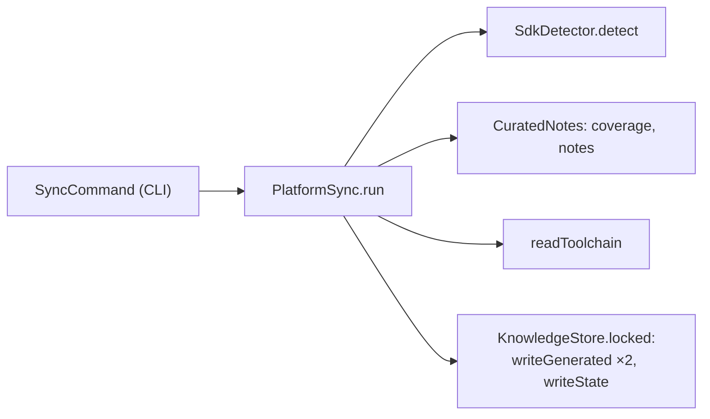

<!-- covers:
packages/appstein_engine/lib/src/knowledge/**
packages/appstein_engine/lib/src/notes/**
tool/gen_notes.dart
tool/src/notes_bundle.dart
-->

# The knowledge store and `appstein sync`

`appstein sync` writes what an agent needs to know about a project into the project's `.appstein/` folder (spec §6.1–6.2). Slice 1b.2 built the store itself and the **platform layer**. The project map, the version delta (`delta.md`), `INDEX.md` and incremental sync come in later slices (1b.3–1b.5).

## What `sync` writes now

| File | Holds | Rewritten when |
|---|---|---|
| `.appstein/platform/sdk.json` | Flutter, Dart, channel, the project's language version, the FVM pin, and how well the curated notes cover this SDK | the detected facts change |
| `.appstein/platform/toolchain.json` | The native toolchain matrix (see [toolchain](toolchain.md)), the stores' build minimums, and the Android, iOS and tooling notes for this SDK | an SDK toolchain file, the notes or the Flutter version changes |
| `.appstein/state.json` | When `sync` last ran, and each generated file's input hash | every sync |
| `.appstein/.lock` | Nothing: it exists to be locked | never |

All of it is generated and meant to be git-ignored (spec §6.2). `integrate` (slice 1e) writes the `.gitignore` entries, so until then a project shows `.appstein/` as untracked.

## How one sync runs

1. [`PlatformSync.run`](../../packages/appstein_engine/lib/src/knowledge/platform_sync.dart) detects the Flutter SDK, with the same detection `appstein doctor` uses. No usable SDK is a `SyncException`, which the CLI prints with its fix before exiting 3.
2. It reads everything **before** taking the lock: the SDK facts, the notes coverage and the toolchain. Parsing takes a fraction of a second, and holding the lock only while writing keeps another writer's wait to milliseconds.
3. Under the lock, it writes the two platform files, then `state.json`.

**A known gap.** Because the SDK is read before the lock is taken, two syncs that race across an SDK upgrade could let the later lock holder write the older reading. The next sync notices that the inputs differ and heals it, so nothing needs fixing by hand.

## Three rules every generated file follows

**Canonical JSON.** [`canonicalJson`](../../packages/appstein_engine/lib/src/knowledge/canonical_json.dart) sorts keys at every level, indents two spaces and ends with a newline. The same value always gives the same bytes, on every OS (spec §15).

**Metadata and an input hash.** Every generated file has a `meta` key with `generatedAt`, `appsteinVersion`, `formatVersion`, `sdkVersion` and `inputHash` (spec §6.2).
- [`inputHash`](../../packages/appstein_engine/lib/src/knowledge/input_hash.dart) is a SHA-256 over a sorted list of *named* inputs, such as `sdk:` plus a Flutter file's path, or `notes:3.47.yaml`, together with the Appstein and format versions.
- Names are hashed, not paths, so moving a project folder doesn't change its hashes.
- The versions are hashed, so a new Appstein regenerates everything.
- `sdk.json`'s input is the detected facts themselves. Detection reads only a few small files, so hashing its result is the cheapest exact input.
- `sdk.json` also records `appsteinNotesCoverage`, the answer to "do the curated notes cover this SDK?". It is part of the detected facts, so a new Appstein with newer notes rewrites the file.

**Rewrite only on change.** [`KnowledgeStore.writeGenerated`](../../packages/appstein_engine/lib/src/knowledge/knowledge_store.dart) rebuilds the file's text with the `generatedAt` already in the file, and skips the write only when that text equals the file's bytes. This is how `generatedAt` and byte-identical output (spec §15) live together: syncing unchanged inputs changes no byte, `generatedAt` included. Comparing bytes, and not just the input hash, also means a hand-edited file is put back: an agent that "corrects" a number in `toolchain.json` must not make it stick (spec §6.2, §15). A reformatted, missing or damaged file is rewritten too, with the current time as `generatedAt`.

## The lock, and why files are renamed into place

Two hooks or two agents may sync at the same moment (spec §15).
- **Writers take an operating-system lock** on `.appstein/.lock`, through `RandomAccessFile.lockSync` in [`knowledge_lock.dart`](../../packages/appstein_engine/lib/src/knowledge/knowledge_lock.dart). They poll for up to 10 s, then fail with `KnowledgeLockTimeout`. The message names the last operating-system error. A failure to create or open the lock file becomes a [`KnowledgeWriteException`](../../packages/appstein_engine/lib/src/knowledge/knowledge_write_exception.dart).
- **The OS drops the lock when the process ends,** even after a crash, so a stale lock can never block anyone. A "the lock file exists" scheme would leave one behind.

**An in-process mutex sits in front of the file lock.** POSIX file locks belong to the whole process, and Windows locks belong to a file handle, so the two systems disagree about what a second lock request from the same process means. Appstein avoids the question: a mutex keyed by the normalized folder path (case-insensitive on Windows) lets one isolate hold a folder's lock at most once at a time. A second `acquire` from the same isolate waits its turn instead of failing. The mutex lives in one isolate, so two isolates of one process must not both write the same folder.

**Readers never take the lock.** `replaceFile` writes `<file>.tmp` and renames it over the target, so a reader sees the old file or the new one, never half of one.

On Windows, renaming over a file that another program has open fails with "Access is denied". A spike on the development machine found this. So `replaceFile` retries every 20 ms for up to 2 s. Readers hold a file for milliseconds, so in practice the retry costs nothing. After 2 s it fails with a `KnowledgeWriteException` that says another program may have the file open.

## The curated notes

The curated notes (spec §6.4) live in `notes/` at the repo root: one YAML file per **stable** Flutter minor version, plus `stores.yaml`.
- `notes/3.44.yaml` is for the oldest supported minor, so it also holds the notes from the delta baseline (Flutter 3.16) up to 3.44.
- `notes/3.47.yaml` holds what changed in 3.45–3.47. 3.45 and 3.46 were never stable releases.
- Each file records its minor's first stable release date and Dart version, the toolchain matrix used as a fallback, and its notes.
- `notes/stores.yaml` holds the stores' dated build minimums: the Play target API, 16 KB page support, the Xcode version and the minimum iOS target for App Store uploads. These are build requirements only, never review policies (spec §2.3).

[`parseNotesFile` and `parseStoreRequirements`](../../packages/appstein_engine/lib/src/notes/notes_parser.dart) check the format strictly. A `NotesFormatException` names the file and the line of a problem. For example:
- an unquoted version (YAML reads `3.40` as the number 3.4);
- an unknown key;
- a priority outside 1–3;
- a note newer than its file;
- a source that isn't an `https://` URL.

**The notes are compiled in.** The `appstein` binary runs in users' projects, where there is no `notes/` folder.
- [`tool/gen_notes.dart`](../../tool/gen_notes.dart) writes the YAML into `packages/appstein_engine/lib/src/notes/bundled_notes.g.dart`, as raw Dart strings. The work is done by [`notes_bundle.dart`](../../tool/src/notes_bundle.dart).
- `test/notes_bundle_test.dart` fails while that file is out of date, so a note edited without regenerating can be committed, but CI fails on it.
- `CuratedNotes.bundled()` parses it.

[`CuratedNotes`](../../packages/appstein_engine/lib/src/notes/curated_notes.dart) answers three questions:
- **`coverageFor(version)`:** `complete` up to the newest notes file's minor version, and `partial` above it. When it is partial, `sync` prints "Curated notes may be incomplete for Flutter X.Y".
- **`fileFor(version)`:** the newest notes file at or below the version. Its toolchain matrix is the fallback.
- **`notesFor(version, areas:)`:** the notes whose `since` is at or below the version, sorted by priority.

To add or change a note, see [How to: add a curated note](how-to/add-a-curated-note.md).
