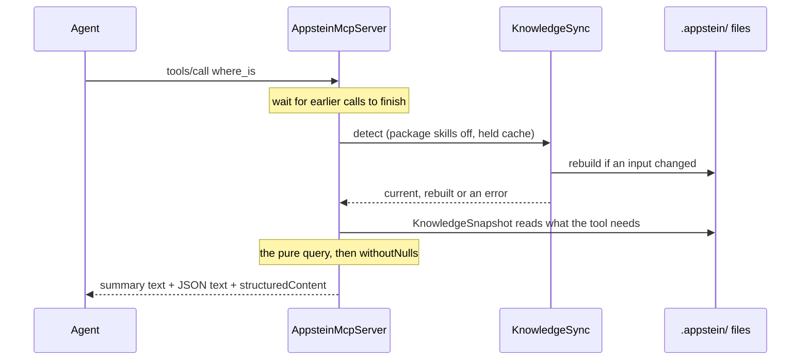

<!-- covers:
packages/appstein_engine/lib/src/mcp/**
packages/appstein_protocol/lib/src/mcp/**
-->

# The MCP server

`appstein mcp` lets an agent ask Appstein questions while it works. Instead of reading files or running `appstein sync` and parsing the output, the agent calls a tool such as `where_is` and gets a small, structured answer. This page explains what the server does on each call, and the rules behind each tool. The design is in [spec §8](../superpowers/specs/2026-09-29-appstein-design.md#8-mcp-server).

## What it is

The agent starts `appstein mcp` as a child process and talks to it over **stdio**: one JSON-RPC message per line on stdin, one on stdout. When the agent closes stdin, the server exits. Nothing but protocol messages may go to stdout, so startup problems go to stderr (see [cli](cli.md#appstein-mcp)).

It serves seven read tools:

| Tool | Answers |
|---|---|
| `overview` | The project's `INDEX.md`, the page to read first |
| `where_is` | Which files and symbols match free text such as "login screen" |
| `feature` | Everything in one feature: screens, view models, repositories, services, models, routes, tests |
| `route` | The go_router route for a path, with its screen and feature |
| `check_api` | Whether an API is deprecated or removed for this project |
| `what_changed` | The curated notes, and how many deprecated and removed APIs each library has |
| `toolchain` | The native versions that work with this Flutter, the project's values and every mismatch |

The spec lists more tools. `verify` and `package_check` come in slice 1d, because they need the verifier and the package gate that slice builds. The decision and memory tools come later still. This page covers only what exists.

All the code is in the engine and the protocol package, so the CLI stays thin:

| Where | What it holds |
|---|---|
| [`appstein_mcp_server.dart`](../../packages/appstein_engine/lib/src/mcp/appstein_mcp_server.dart) | `AppsteinMcpServer`: the tool list, the queue, the freshness step and the reply |
| [`knowledge_snapshot.dart`](../../packages/appstein_engine/lib/src/mcp/knowledge_snapshot.dart) | `KnowledgeSnapshot`: reads the knowledge files a call needs |
| [`tool_answer.dart`](../../packages/appstein_engine/lib/src/mcp/tool_answer.dart) | `ToolReply` and `ToolRefusal`, what a query returns |
| `where_is.dart`, `feature_query.dart`, `route_query.dart`, `check_api.dart`, `what_changed.dart`, `toolchain_report.dart` (same folder) | One pure function per tool |
| [`tool_schemas.dart`](../../packages/appstein_protocol/lib/src/mcp/tool_schemas.dart) | Each tool's input and result schema |
| [`freshness_report.dart`](../../packages/appstein_protocol/lib/src/mcp/freshness_report.dart) | `FreshnessReport`, the `freshness` field |
| [`tool_output.dart`](../../packages/appstein_protocol/lib/src/mcp/tool_output.dart), [`json_schema.dart`](../../packages/appstein_protocol/lib/src/mcp/json_schema.dart) | `withoutNulls`, the output schema, and small schema builders |

The schemas are plain maps, so the protocol package needs no MCP library. The engine wraps them for `package:dart_mcp`.

## One call, step by step

Each tool call goes through the same steps. The tools themselves are pure functions of the knowledge files, so the same files always give the same answer.



1. **Queue.** Calls are answered one at a time, in an in-process queue (`_oneAtATime`). Two calls at once would both start a sync. The file lock can't stop that, because on Linux and macOS an operating-system lock doesn't exclude the process that already holds it (see [knowledge-store](knowledge-store.md#the-lock-and-why-files-are-renamed-into-place)).
2. **`detect`.** The server builds a `KnowledgeSync` and calls `detect`, as `appstein sync --detect` does (see [incremental-sync](incremental-sync.md)). It builds a new one for every call, from the `appstein.yaml` as it is then. Package skills are off, and the analyzer cache is held in memory between calls.
3. **Snapshot.** A new `KnowledgeSnapshot` reads each knowledge file the first time the tool asks for it. If a file is missing or damaged, the tool answers with a refusal that names the file and says to run `appstein sync`.
4. **The query.** The tool's function turns the files and the arguments into a `ToolReply` (a result and a summary sentence) or a `ToolRefusal` (a message).
5. **The reply.** `withoutNulls` drops every null. The server adds `summary` and `freshness` to the result and sends it as `structuredContent`, plus two text blocks: the summary with a sentence about freshness, and the same structured result as JSON text. A refusal, or any exception inside a query, becomes a result marked `isError` that says why, and the server keeps running.

**The held cache.** Rebuilding after an edit needs the analyzer's cache, a file of about 57 MB at 200 files (see [incremental-sync](incremental-sync.md#the-analyzer-cache)). Reading it from disk before every rebuild would waste time, so `KnowledgeSync` takes an optional `heldCache`. A [`HeldAnalyzerCache`](../../packages/appstein_engine/lib/src/map/analyzer_cache.dart) hands the cache to a sync (`take`) and receives it back afterwards (`keep`). What it keeps is `AnalyzerCache.settled()`: only the entries the last run used, as if it had been saved and read again. So the memory use matches the file. A cache file that another process wrote in between isn't read. That costs a few cache misses, never wrong knowledge.

## Freshness

Every reply says whether the knowledge was up to date. There are three states:

| State | When | What the reply carries |
|---|---|---|
| `current` | Nothing the knowledge reads has changed | Just the state |
| `rebuilt` | The server rebuilt first: there was no sync yet (a fresh clone), an input changed (an edit, a new package version), or a file was hand-edited or deleted | `because` (the reasons), `changed` (the files, at most 20, then `moreChanged`) and `mapSkipped` when the project map couldn't be built |
| `stale` | The server couldn't sync, so it answered from the files on disk | `problem`, and `fixHint` when something can be done |

`stale` happens when:

- another process holds the knowledge lock past its timeout (`another sync is running and holds the lock`);
- the sync fails, for example with no usable Flutter SDK, or a write error;
- `appstein.yaml` is invalid. The next call reads it again, so fixing the file is enough.

If there is no knowledge file to answer from at all, for example a project that was never synced and whose first sync fails, the reply is an error that says what to do. A stale answer needs older files to exist.

**Why the server always calls `detect`.** A server that read files once at startup would answer from knowledge that went out of date with the first edit. The agent can't tell, and a wrong answer given with confidence is worse than a slow one. `detect` costs about 77 ms when nothing changed (see [incremental-sync](incremental-sync.md#the-idea)), so asking every time is cheap. When something did change, the rebuild takes about a second, and the reply says so.

## Each tool

### `overview`

No input. Returns `index` (the body of `INDEX.md`, without its front matter) and `generatedAt`. The knowledge's freshness is in the `freshness` field of the same reply.

### `where_is`

Input: `query`, free text. The query is cut into lowercase words at camelCase humps and at every character that isn't a letter or a digit, so `LoginScreen`, `login_screen` and `login_screen.dart` all give `login`, `screen`. The spec's ranking has no embeddings, so it is predictable.

Four kinds of candidate are matched, and each word scores by the kind it matched:

| Candidate | Matches a word of | Score per word |
|---|---|---|
| Symbol | its name, or its whole name | 5 |
| Route | its path, or its screen's name | 4 |
| Feature | its name | 3 |
| File | its path | 2 |

A word of four or more letters that matches nothing exactly scores 1 when it is at most two edits from a word of the candidate, so `bookng` still finds `booking`. Words of three letters or fewer never match this way, because almost any short word is two edits from another. A candidate's score is the sum over the query's words, ties go to the name and then the file, and the top 10 are listed, each with the reason for every word that matched. `total` says how many candidates matched in all.

One limit, stated honestly: the tiers are fixed, so a word that appears in 10 or more symbol names fills the whole top 10 with symbols (each worth 5), and the route or file you wanted may not show. Add a second, more specific word to the query.

### `feature`

Input: `name`, the feature's folder below `lib/ui/`, such as `auth/login`. These forms work: `auth/login`, `/auth/login/` and `lib/ui/auth/login`. The reply is the feature's map entry plus the routes that build its screens. An unknown name is refused with the closest known name (by edit distance) and the first 20 feature names.

### `route`

Input: `path`. A leading slash is added when it is missing, a trailing slash, a query (`?…`) and a fragment (`#…`) are ignored. An exact path wins. Otherwise a concrete path matches a go_router pattern with the same number of segments, where a `:parameter` segment matches any non-empty segment: `/booking/42` matches `/booking/:id`. The reply's `match` says `exact` or `pattern`.

Routes whose path the map couldn't work out are never matched; the refusal says how many there are. For each route the reply gives its screen, feature, parent, nested routes and whether it redirects. The map records that a route or its router redirects, not where to, and the reply says so.

### `check_api`

Input: `name`. The agent may write the name the way it appears in code. These forms are understood:

| Written | Understood as |
|---|---|
| `WillPopScope`, `Color.withOpacity` | a class or function, or a member with its class |
| `withOpacity`, `.withOpacity`, `color.withOpacity` | a member name alone |
| `withOpacity(0.5)` | the same, with the argument list dropped |
| `Text()` | the unnamed constructor `Text.new`, or the class `Text` |
| `Text.new(textScaleFactor)`, `Text(textScaleFactor)`, `Text(textScaleFactor: 1.2)` | a parameter of that constructor (a named argument is the parameter of that name) |
| `MaterialStateProperty<Color>.all`, `withOpacity<T>` | the same name without its type arguments (nested ones too) |
| `textScaleFactor` | a parameter name on its own |
| `package:flutter/material.dart` | a library (matches a moved library) |

A setter matches with or without its `=`.

**Matching.** The name is compared with the entries of `delta.json`. An entry whose name equals the query matches *exactly*. Only when nothing matches exactly does it fall back to *looser* matches: the same member name under any class (the delta lists an inherited member under the class that declares it, and an agent usually writes `color.withOpacity`, not the declaring class). The summary then names the entry that matched and its library, such as "`color.withOpacity` is deprecated in `Color.withOpacity` (dart:ui)" for a query of `color.withOpacity`, so the agent can judge whether it is the one it meant. **The class check.** The delta lists only elements that carry their own `@Deprecated`, so the members of a deprecated class (`MaterialStateProperty.all`) or its constructors (`WillPopScope.new`) are not in it. When nothing matches as deprecated or removed and the query has two or more segments, `check_api` also looks up the part before the last segment (for `X.new`, that is `X`). A class that is deprecated (kind `use`) or removed makes the member answer the same way, and the summary names the class and its library: "`MaterialStateProperty.all`: its class `MaterialStateProperty` is deprecated (package:flutter): Use WidgetStateProperty instead." A class whose deprecation is of another kind forbids only that one use, so its members stay `ok`. When a query names a member that owns a deprecated parameter, the parameters are listed in `matches` without changing the status.

**Statuses.** `removed` beats `deprecated`, and `deprecated` beats `ok`:

- `removed`: a removed API matches. Code that uses it doesn't compile.
- `deprecated`: an API matches whose deprecation is of kind `use`, the plain `@Deprecated`.
- `ok`: neither.

**Deprecation kinds.** Dart has seven (see [version-delta](version-delta.md#what-the-imports-expose-means)). Only `use` makes the status `deprecated`, as the plain annotation says not to use it at all. The other six forbid only one thing: `implement`, `extend`, `subclass`, `instantiate`, `mixin` and `optional` (always pass this argument). For those the status stays `ok`, and the summary adds the rule, such as "Its deprecation forbids only this: don't implement it." Changed APIs, moved libraries and parameters of a member are listed in `matches` and don't change the status either.

**What `ok` means.** Nothing the project imports deprecates or removes the name. It does **not** say the name exists: a made-up name is also `ok`. The reply says so in `meaning`, because Dart's own MCP server (`dart mcp-server`) runs next to ours and its analyzer answers that question (spec §8).

The reply also lists the curated notes whose `avoid` text names the identifier as a whole word, each with its source. When the delta's API lists couldn't be collected (`delta.json` has `missing` instead), only the notes are checked, and `incomplete` says so.

### `what_changed`

Input: optional `since` (a Flutter version such as `3.27`) and optional `library` (such as `package:go_router`). `since` narrows only the notes. A `since` older than the delta's baseline starts at the baseline, and the summary says so. Notes that need a newer language version than the project's come back in `laterNotes`.

Without `library`, the reply holds the notes and, per library, the **counts** of deprecated, removed, changed and moved APIs. It lists no entries. The reason is size: on a Material app the delta holds about 354 deprecated and 355 removed entries, roughly 35,000 to 45,000 tokens. Claude Code warns about a tool output above 10,000 tokens and cuts it above 25,000 by default, so a full list would be lost exactly when it matters. `check_api` answers for one name, and `library` lists one library's entries in full.

`library` accepts `package:go_router`, `go_router`, or a library file URI such as `package:flutter/material.dart`, which is the same library as `package:flutter`: entries are grouped by package, and a moved library counts under its package. An unknown library is refused with the libraries that do have entries.

### `toolchain`

No input. It returns the native versions that work with this Flutter (`valid`, from `toolchain.json`), the project's current values with where each was found (`current`, from `native.json`), and the mismatches. Only thresholds Flutter itself applies are used:

| Value | Error | Warning |
|---|---|---|
| Gradle, AGP, KGP | below the version where Flutter's Gradle plugin fails the build | below the version where it warns, or above the newest this Flutter knows |
| `minSdk` | below Flutter's build-check threshold | below its warning threshold |
| `compileSdk` | – | below Flutter's minimum |
| iOS deployment target | – | below the SDK template's |

`targetSdk` and the NDK version are shown but have no threshold. A value that `native.json` records as `unknown`, or whose platform pack failed, is listed in `notComparable` with its reason instead of being guessed. Versions are compared as dotted numbers, and a `-rc1` suffix is ignored. Without `native.json`, only the valid set is returned and the summary says so.

## Replies for Claude Code

A reply holds the same result three times, because clients read it differently:

- the structured result, as `structuredContent`;
- the same result as JSON text;
- a short sentence, `summary`, plus a sentence about freshness.

**Why `summary` and `freshness` are inside the structured result.** Claude Code shows the model only `structuredContent` when a tool returns it, and drops the text blocks ([claude-code#55677](https://github.com/anthropics/claude-code/issues/55677)). A summary that lived only in the text would never reach the model. So every output schema is the tool's result schema plus `summary` and `freshness` (`toolOutputSchema`), and the server adds both to the result.

**Why replies never hold null.** `withoutNulls` removes null values from maps and lists at every depth, so a missing value is an absent key. That keeps the schemas simple: none uses a type array such as `["string", "null"]`, which not every client's schema checker handles, and an optional field is just one that isn't `required`.

## Testing it

| Test | What it proves |
|---|---|
| `packages/appstein_engine/test/mcp/where_is_test.dart`, `feature_query_test.dart`, `route_query_test.dart`, `check_api_test.dart`, `what_changed_test.dart`, `toolchain_report_test.dart` | Each query on its own, on the fixture app's golden map files (see [testing](testing.md#the-fixture-app-and-goldens)) and a sample delta |
| `packages/appstein_engine/test/mcp/knowledge_snapshot_test.dart` | A missing, unreadable or damaged file gives a `problem` that names it |
| `packages/appstein_engine/test/mcp/appstein_mcp_server_test.dart` | The server through an in-process client: the tool list and schemas, the first call syncing a new project, an edit picked up before the next answer, bad input, three calls at once answered in turn, a lock held by another process, a failing sync, a damaged file, an invalid `appstein.yaml` |
| `packages/appstein_engine/test/mcp/mcp_stdio_test.dart` | The real thing: a new process over real stdio, in a folder whose name has a space and an umlaut. Every tool answers, and stdout holds only protocol messages |
| `packages/appstein_cli/test/mcp_command_test.dart` | The command: it serves until the client closes, writes nothing to its output sink, re-reads `appstein.yaml` on every call, exits 3 outside a project, and its sync factory turns package skills off and shares one held cache |
| `tool/measure_sync.dart` | The speed target (below) |

**The timing table.** After the sync rows, [`tool/measure_sync.dart`](../../tool/measure_sync.dart) starts one `appstein mcp` process on the 200-file app, with fresh knowledge. It talks to the server with a small JSON-RPC client over the process's stdin and stdout. The first call starts the server and isn't counted. Then it calls each of the seven tools three times and prints a table with the median and the three times. Spec §15 sets the target, MCP answers under 1 s from fresh knowledge, and the tool fails when a median reaches it, or when a call returns an error. Only the 200-file app is measured. See [ci](ci.md#measure).

**Trying it by hand.** Compile the command, then send it an `initialize` request:

```powershell
fvm dart compile exe packages/appstein_cli/bin/appstein.dart -o <out>
```

Pipe a JSON-RPC `initialize` message to `<out> --project <app> mcp` and it answers with its name, version and instructions. `fvm dart packages/appstein_cli/bin/appstein.dart --project <app> mcp` works too, only slower to start. On Windows, Defender sometimes quarantines a freshly compiled, unsigned Dart executable in a temporary folder. That is a false positive: compile somewhere else or use the second command. The server exits when stdin closes.
