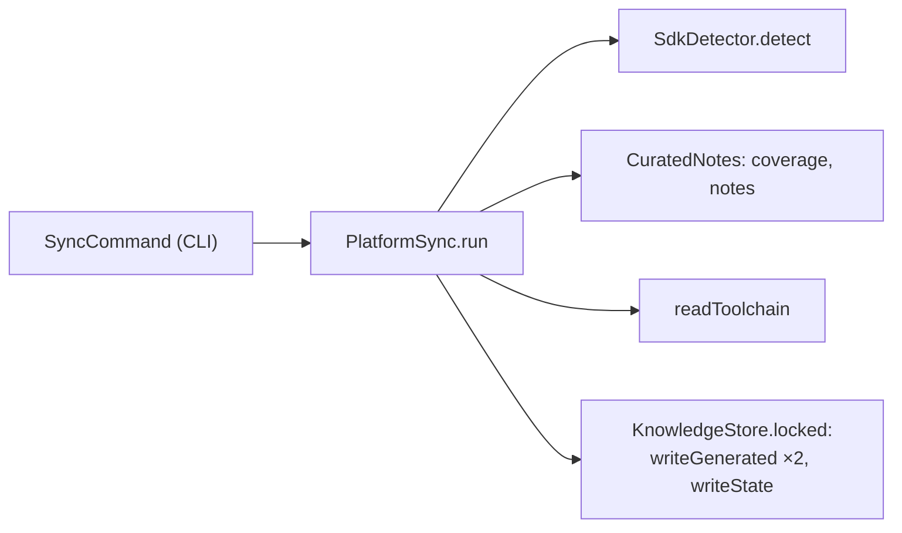

# Slice 1b.2: Knowledge store and platform layer Implementation Plan

> **For agentic workers:** REQUIRED SUB-SKILL: Use superpowers:subagent-driven-development (recommended) or superpowers:executing-plans to implement this plan task-by-task. Steps use checkbox (`- [ ]`) syntax for tracking.

**Goal:** `appstein sync` writes the platform layer of `.appstein/`: `platform/sdk.json`, `platform/toolchain.json` and `state.json`, under a write lock, from the installed Flutter SDK and Appstein's curated notes for Flutter 3.44 and 3.47.

**Architecture:**
- **Models (protocol):** the file formats live in `appstein_protocol`: knowledge metadata, state, curated notes, the toolchain matrix and notes coverage.
- **Engine, writing:** `knowledge/` writes files with canonical JSON, input hashes, an OS lock and atomic replace.
- **Engine, reading:** `toolchain/` reads Flutter's own `gradle_utils.dart` (with `package:analyzer`'s parser), `DependencyVersionChecker.kt` and the Xcode templates. When they can't be read, it falls back to the curated notes.
- **Notes:** `notes/` (repo root) holds the reviewed YAML, compiled into the binary as a generated Dart file.
- **CLI and doctor:** `appstein sync` is a thin CLI command over `PlatformSync`. The Android SDK doctor check gains Flutter's minimum platform and build-tools.

**Tech Stack:** Dart 3.12+ (Flutter 3.47.5 via FVM), `package:analyzer` 14.4 (parser only), `package:crypto` (SHA-256), `package:yaml`, `package:pub_semver`, `package:test`.

**Spec:** `docs/superpowers/specs/2026-09-29-appstein-design.md`. This plan implements §6.1–6.2 (the store), §6.4 (curated notes; the delta itself is slice 1b.4), §12 (toolchain), §15 (concurrency, determinism, offline) and §18 row 1b (the part assigned to 1b.2). It includes the owner-approved edits E1–E6 of 2026-10-01 (state.json/.lock, rewrite-only-on-change, the notes file format, the two Android source files, the `project.pbxproj` deployment targets, and the OS lock).

## Global Constraints

- **Commands:** run every Dart command through FVM: `fvm dart …`. The repo pins Flutter 3.47.5 (Dart 3.13.4); packages declare `sdk: ^3.12.0`.
- **Boundaries (spec §5.1):** `appstein_protocol` depends on nothing internal; `appstein_engine` depends only on `appstein_protocol`; `appstein_cli` depends on the engine and protocol. The `layer_imports` lint enforces this.
- **Docs and analysis:** every public API has a `///` doc comment (`public_member_api_docs`). `fvm dart analyze --fatal-infos` and `fvm dart format --output=none --set-exit-if-changed .` must pass from the repo root.
- **Byte order marks:** no raw U+FEFF byte in any `.dart` file. Write the escape `'\uFEFF'` (the CI `analyze` job rejects the raw byte).
- **Windows is first-class:** every file-system test uses `tempDir()` (`packages/appstein_engine/test/support/temp.dart`), whose path holds a space and a non-ASCII character.
- **Determinism (§15):** every `.appstein/` JSON file is written by `canonicalJson`: keys sorted at every level, two-space indent, `\n` endings, final newline. A generated file is rewritten only when its input hash changes (§6.2).
- **No network at runtime (§4 principle 9, §15):** the curated notes are compiled into the binary.
- **Store minimums only (§2.3):** `notes/stores.yaml` holds dated store *build* minimums (target API, Xcode, deployment target, 16 KB pages), never review policies.
- **Version strings:** versions read from Flutter's files stay verbatim strings (`'9.2'`, `'8.14.100'`, `'1.8'`). Only API levels (`compileSdk`, `targetSdk`, `minSdk`) are integers.
- **Tests stay in temp folders:** tests never write into the repo, `graphify-out/` or `.git/hooks`.
- **Commits:** subagents never commit. The controller commits each task after its review, with the trailer lines the session gives.
- **Fixtures:** Flutter files used as test fixtures end in `.fixture`. The analyzer then doesn't compile them, and graphify doesn't index them.

## Review Focus

These are the five inputs most likely to bite a user, though no single feature test covers them. Each one has a test in the task named.

1. **CRLF line endings in the SDK's files.** A Flutter SDK checked out by git on Windows has `\r\n` endings, and the owner's 3.47.5 does. The parsers must read them exactly as they read `\n`. *Tests: Task 5, Task 6.*
2. **A Flutter SDK whose toolchain files are missing or reshaped**, for example a future Flutter that renames a constant. `sync` must still succeed: it takes that part from the curated notes and reports `toolchain.fallback`, or leaves the part out with a reason when no notes cover it. It never crashes. *Test: Task 9.*
3. **An SDK outside the notes:**
   - a pre-release or newer SDK (`3.48.0-0.1.pre`, `3.50.1`) gets coverage `partial` and the fallback from the newest notes file at or below it;
   - an older SDK (`3.38.6`, installed on the development machine) gets coverage `complete` and no fallback file.

   *Tests: Task 8, Task 9.*
4. **Another program holding a knowledge file open on Windows** while `sync` replaces it, such as an editor or a reading agent. The replace retries for a bounded time, then fails with a clear message. *Test: Task 4.*
5. **Damaged `.appstein/` contents**, such as a `sdk.json` that isn't JSON or has no `meta`, or a missing `platform/` folder. `sync` rewrites them instead of failing. *Tests: Task 4, Task 10.*

---

## File map

| File | Responsibility |
|---|---|
| `packages/appstein_protocol/lib/src/json_fields.dart` | Typed field reading with "file: key must be…" errors |
| `packages/appstein_protocol/lib/src/knowledge/knowledge_meta.dart` | `knowledgeFormatVersion`, `KnowledgeMeta`, `formatKnowledgeTime` |
| `packages/appstein_protocol/lib/src/knowledge/knowledge_state.dart` | `state.json` model |
| `packages/appstein_protocol/lib/src/knowledge/notes_coverage.dart` | `NotesCoverage` enum |
| `packages/appstein_protocol/lib/src/knowledge/curated_note.dart` | `NoteArea`, `CuratedNote` |
| `packages/appstein_protocol/lib/src/knowledge/toolchain.dart` | The `toolchain.json` models |
| `packages/appstein_protocol/lib/src/sdk_info.dart` | + `notesCoverage` (`appsteinNotesCoverage`) |
| `packages/appstein_engine/lib/src/knowledge/canonical_json.dart` | `canonicalJson` |
| `packages/appstein_engine/lib/src/knowledge/input_hash.dart` | `sha256Hex`, `inputHash` |
| `packages/appstein_engine/lib/src/knowledge/knowledge_lock.dart` | `KnowledgeLock`, `KnowledgeLockTimeout` |
| `packages/appstein_engine/lib/src/knowledge/knowledge_store.dart` | `KnowledgeStore`, `replaceFile`, `KnowledgeWriteException` |
| `packages/appstein_engine/lib/src/knowledge/platform_sync.dart` | `PlatformSync`, `SyncReport`, `SyncException` |
| `packages/appstein_engine/lib/src/toolchain/toolchain_files.dart` | `ToolchainFiles` (the SDK paths), `ToolchainParseException` |
| `packages/appstein_engine/lib/src/toolchain/gradle_utils_parser.dart` | `parseGradleUtils`, `GradleUtilsFacts` |
| `packages/appstein_engine/lib/src/toolchain/gradle_plugin_checks_parser.dart` | `parseGradlePluginChecks` |
| `packages/appstein_engine/lib/src/toolchain/xcode_template_parser.dart` | `parseDeploymentTarget` |
| `packages/appstein_engine/lib/src/toolchain/toolchain_reader.dart` | `readToolchain`, `ToolchainReading` |
| `packages/appstein_engine/lib/src/notes/flutter_minor.dart` | `FlutterMinor`, `flutterMinorOf`, `compareFlutterMinors` |
| `packages/appstein_engine/lib/src/notes/notes_parser.dart` | `NotesFile`, `parseNotesFile`, `parseStoreRequirements`, `NotesFormatException` |
| `packages/appstein_engine/lib/src/notes/curated_notes.dart` | `CuratedNotes` |
| `packages/appstein_engine/test/fixtures/flutter_sdk/{3.44.9,3.47.5}/**.fixture` | Flutter's four toolchain files, downloaded |
| `packages/appstein_engine/test/support/flutter_fixtures.dart` | `fixtureFlutterVersions`, `fixtureText`, `addToolchainFiles` |
| `packages/appstein_engine/test/knowledge/support/lock_holder.dart` | A second process that holds the lock |
| `packages/appstein_engine/test/integration/sync_real_environment_test.dart` | The parsers and `sync` on this machine's real SDK |
| `packages/appstein_cli/test/support/fake_flutter_sdk.dart` | A minimal SDK for the CLI tests |
| `tool/src/notes_bundle.dart` | `readNotesSources`, `renderNotesBundle` |
| `packages/appstein_engine/lib/src/notes/bundled_notes.g.dart` | Generated: the notes YAML compiled in |
| `notes/3.44.yaml`, `notes/3.47.yaml`, `notes/stores.yaml` | The curated notes (owner-reviewed content) |
| `tool/gen_notes.dart` | Regenerates `bundled_notes.g.dart` |
| `packages/appstein_cli/lib/src/sync_command.dart` | `appstein sync` |
| `packages/appstein_engine/lib/src/doctor/checks/android_sdk_check.dart` | + Flutter's minimum platform and build-tools |
| `docs/guide/knowledge-store.md`, `docs/guide/toolchain.md`, `docs/guide/how-to/add-a-curated-note.md` | New guide pages |

---

### Task 1: Protocol — knowledge metadata, state and notes coverage

**Files:**
- Create: `packages/appstein_protocol/lib/src/json_fields.dart`
- Create: `packages/appstein_protocol/lib/src/knowledge/knowledge_meta.dart`
- Create: `packages/appstein_protocol/lib/src/knowledge/knowledge_state.dart`
- Create: `packages/appstein_protocol/lib/src/knowledge/notes_coverage.dart`
- Modify: `packages/appstein_protocol/lib/src/sdk_info.dart`
- Modify: `packages/appstein_protocol/lib/appstein_protocol.dart`
- Test: `packages/appstein_protocol/test/json_fields_test.dart`, `test/knowledge_meta_test.dart`, `test/knowledge_state_test.dart`, `test/sdk_info_test.dart`

**Interfaces:**
- Consumes: nothing new.
- Produces:
  - `JsonFields(String file, Map<String, Object?> json)` with `string`, `optionalString`, `integer`, `object`, `optionalObject`, `objects`, `stringMap`. Internal to the protocol, not exported.
  - `const knowledgeFormatVersion = 1`.
  - `KnowledgeMeta({generatedAt, appsteinVersion, formatVersion, sdkVersion, inputHash})` with `fromJson` and `toJson`.
  - `String formatKnowledgeTime(DateTime)`.
  - `KnowledgeState({formatVersion, appsteinVersion, lastSync, files})` with `fromJson` and `toJson`.
  - `enum NotesCoverage { complete, partial }`.
  - `SdkInfo.notesCoverage` (`NotesCoverage?`, JSON key `appsteinNotesCoverage`) and `SdkInfo.withNotesCoverage(NotesCoverage)`.

- [ ] **Step 1: Write the failing tests**

`packages/appstein_protocol/test/json_fields_test.dart`:

```dart
import 'package:appstein_protocol/src/json_fields.dart';
import 'package:test/test.dart';

void main() {
  const fields = JsonFields('x.json', {
    'name': 'a',
    'count': 3,
    'none': null,
    'inner': {'k': 'v'},
    'items': [
      {'k': 1},
    ],
    'strings': {'a': 'b'},
    'mixed': {'a': 1},
  });

  test('reads typed fields', () {
    expect(fields.string('name'), 'a');
    expect(fields.integer('count'), 3);
    expect(fields.optionalString('none'), isNull);
    expect(fields.optionalString('missing'), isNull);
    expect(fields.object('inner').string('k'), 'v');
    expect(fields.optionalObject('none'), isNull);
    expect(fields.objects('items').single.integer('k'), 1);
    expect(fields.stringMap('strings'), {'a': 'b'});
  });

  test('a wrong or missing field names the file and key', () {
    expect(
      () => fields.string('count'),
      throwsA(
        isA<FormatException>().having(
          (e) => e.message,
          'message',
          'x.json: "count" must be a string.',
        ),
      ),
    );
    expect(() => fields.integer('missing'), throwsFormatException);
    expect(() => fields.object('name'), throwsFormatException);
    expect(() => fields.objects('inner'), throwsFormatException);
    expect(() => fields.stringMap('mixed'), throwsFormatException);
    expect(() => fields.optionalString('count'), throwsFormatException);
  });
}
```

`packages/appstein_protocol/test/knowledge_meta_test.dart`:

```dart
import 'package:appstein_protocol/appstein_protocol.dart';
import 'package:test/test.dart';

void main() {
  const meta = KnowledgeMeta(
    generatedAt: '2026-10-01T09:30:05Z',
    appsteinVersion: '0.1.0-dev',
    formatVersion: knowledgeFormatVersion,
    sdkVersion: '3.47.5',
    inputHash: 'abc123',
  );

  test('round-trips through JSON with the spec §6.2 key names', () {
    final json = meta.toJson();
    expect(json, {
      'generatedAt': '2026-10-01T09:30:05Z',
      'appsteinVersion': '0.1.0-dev',
      'formatVersion': 1,
      'sdkVersion': '3.47.5',
      'inputHash': 'abc123',
    });
    final back = KnowledgeMeta.fromJson(json);
    expect(back.toJson(), json);
  });

  test('a missing field names the file', () {
    expect(
      () => KnowledgeMeta.fromJson({'generatedAt': 'x'}, file: 'sdk.json'),
      throwsA(
        isA<FormatException>().having(
          (e) => e.message,
          'message',
          startsWith('sdk.json: '),
        ),
      ),
    );
  });

  test('times are UTC, to the second, with a Z', () {
    expect(
      formatKnowledgeTime(DateTime.utc(2026, 10, 1, 9, 30, 5, 123)),
      '2026-10-01T09:30:05Z',
    );
    expect(
      formatKnowledgeTime(DateTime.utc(2026, 1, 2, 3, 4, 5).toLocal()),
      '2026-01-02T03:04:05Z',
    );
  });
}
```

`packages/appstein_protocol/test/knowledge_state_test.dart`:

```dart
import 'package:appstein_protocol/appstein_protocol.dart';
import 'package:test/test.dart';

void main() {
  test('round-trips through JSON', () {
    const state = KnowledgeState(
      formatVersion: 1,
      appsteinVersion: '0.1.0-dev',
      lastSync: '2026-10-01T09:30:05Z',
      files: {'platform/sdk.json': 'h1', 'platform/toolchain.json': 'h2'},
    );
    final json = state.toJson();
    expect(json, {
      'formatVersion': 1,
      'appsteinVersion': '0.1.0-dev',
      'lastSync': '2026-10-01T09:30:05Z',
      'files': {'platform/sdk.json': 'h1', 'platform/toolchain.json': 'h2'},
    });
    expect(KnowledgeState.fromJson(json).toJson(), json);
  });

  test('file hashes must be strings', () {
    expect(
      () => KnowledgeState.fromJson({
        'formatVersion': 1,
        'appsteinVersion': 'x',
        'lastSync': 'x',
        'files': {'a': 1},
      }),
      throwsA(
        isA<FormatException>().having(
          (e) => e.message,
          'message',
          'state.json: "files" must be an object of strings.',
        ),
      ),
    );
  });
}
```

Replace `packages/appstein_protocol/test/sdk_info_test.dart` with:

```dart
import 'package:appstein_protocol/appstein_protocol.dart';
import 'package:test/test.dart';

void main() {
  const info = SdkInfo(
    flutterVersion: '3.47.5',
    dartVersion: '3.13.4',
    channel: 'stable',
    languageVersion: '3.9',
    fvmVersion: '3.47.5',
    notesCoverage: NotesCoverage.partial,
  );

  test('round-trips through JSON with the sdk.json key names', () {
    final json = info.toJson();
    expect(json, {
      'flutter': '3.47.5',
      'dart': '3.13.4',
      'channel': 'stable',
      'languageVersion': '3.9',
      'fvm': '3.47.5',
      'appsteinNotesCoverage': 'partial',
    });
    expect(SdkInfo.fromJson(json), info);
  });

  test('optional fields may be null', () {
    final json = {'flutter': '3.47.5', 'dart': '3.13.4', 'channel': 'stable'};
    final parsed = SdkInfo.fromJson(json);
    expect(parsed.languageVersion, isNull);
    expect(parsed.fvmVersion, isNull);
    expect(parsed.notesCoverage, isNull);
    expect(parsed.toJson()['appsteinNotesCoverage'], isNull);
  });

  test('a missing required field is a FormatException', () {
    expect(
      () => SdkInfo.fromJson({'dart': '3.13.4', 'channel': 'stable'}),
      throwsA(isA<FormatException>()),
    );
  });

  test('an unknown notes coverage is a FormatException', () {
    expect(
      () => SdkInfo.fromJson({
        'flutter': '3.47.5',
        'dart': '3.13.4',
        'channel': 'stable',
        'appsteinNotesCoverage': 'some',
      }),
      throwsA(isA<FormatException>()),
    );
  });

  test('withNotesCoverage keeps every other field', () {
    const detected = SdkInfo(
      flutterVersion: '3.47.5',
      dartVersion: '3.13.4',
      channel: 'stable',
    );
    final covered = detected.withNotesCoverage(NotesCoverage.complete);
    expect(covered.notesCoverage, NotesCoverage.complete);
    expect(covered.flutterVersion, '3.47.5');
    expect(covered, isNot(detected));
  });
}
```

- [ ] **Step 2: Run the tests to verify they fail**

Run: `cd packages/appstein_protocol && fvm dart test`
Expected: FAIL. The test files don't compile: `json_fields.dart`, `KnowledgeMeta`, `KnowledgeState`, `NotesCoverage` and `notesCoverage` are undefined.

- [ ] **Step 3: Write the implementation**

`packages/appstein_protocol/lib/src/json_fields.dart`:

```dart
/// Reads typed fields from a decoded JSON object, with errors that name the
/// file and the key, so a damaged `.appstein/` file or curated note is
/// reported clearly.
final class JsonFields {
  /// Wraps [json], which was read from [file] (such as `sdk.json`).
  const JsonFields(this.file, this.json);

  /// The file named in error messages.
  final String file;

  /// The decoded object.
  final Map<String, Object?> json;

  /// The string at [key].
  ///
  /// Throws a [FormatException] when it is missing or not a string.
  String string(String key) => switch (json[key]) {
    final String value => value,
    _ => throw _wrong(key, 'a string'),
  };

  /// The string at [key], or null when it is missing or null.
  String? optionalString(String key) => switch (json[key]) {
    null => null,
    final String value => value,
    _ => throw _wrong(key, 'a string or null'),
  };

  /// The integer at [key].
  int integer(String key) => switch (json[key]) {
    final int value => value,
    _ => throw _wrong(key, 'an integer'),
  };

  /// The object at [key], read as part of the same file.
  JsonFields object(String key) => switch (json[key]) {
    final Map<String, Object?> value => JsonFields(file, value),
    _ => throw _wrong(key, 'an object'),
  };

  /// The object at [key], or null when it is missing or null.
  JsonFields? optionalObject(String key) =>
      json[key] == null ? null : object(key);

  /// The list of objects at [key].
  List<JsonFields> objects(String key) {
    final value = json[key];
    if (value is List<Object?> &&
        value.every((item) => item is Map<String, Object?>)) {
      return [
        for (final item in value)
          JsonFields(file, item! as Map<String, Object?>),
      ];
    }
    throw _wrong(key, 'a list of objects');
  }

  /// The object of strings at [key].
  Map<String, String> stringMap(String key) {
    final value = json[key];
    if (value is Map<String, Object?> &&
        value.values.every((item) => item is String)) {
      return {
        for (final entry in value.entries) entry.key: entry.value! as String,
      };
    }
    throw _wrong(key, 'an object of strings');
  }

  FormatException _wrong(String key, String expected) =>
      FormatException('$file: "$key" must be $expected.');
}
```

`packages/appstein_protocol/lib/src/knowledge/knowledge_meta.dart`:

```dart
import '../json_fields.dart';

/// The version of the formats of the files Appstein writes into
/// `.appstein/` (spec §6.2, §19.5). It rises when a format changes, so
/// `upgrade` can migrate older files.
const knowledgeFormatVersion = 1;

/// What every generated `.appstein/` file records about itself, under its
/// `meta` key (spec §6.2).
final class KnowledgeMeta {
  /// Creates the metadata.
  const KnowledgeMeta({
    required this.generatedAt,
    required this.appsteinVersion,
    required this.formatVersion,
    required this.sdkVersion,
    required this.inputHash,
  });

  /// Reads the metadata from its JSON form. [file] names the file in error
  /// messages.
  ///
  /// Throws a [FormatException] when a field is missing or has the wrong
  /// type.
  factory KnowledgeMeta.fromJson(
    Map<String, Object?> json, {
    String file = 'meta',
  }) {
    final fields = JsonFields(file, json);
    return KnowledgeMeta(
      generatedAt: fields.string('generatedAt'),
      appsteinVersion: fields.string('appsteinVersion'),
      formatVersion: fields.integer('formatVersion'),
      sdkVersion: fields.string('sdkVersion'),
      inputHash: fields.string('inputHash'),
    );
  }

  /// When the file was generated, as [formatKnowledgeTime] writes it.
  final String generatedAt;

  /// The Appstein version that wrote it, such as `0.1.0-dev`.
  final String appsteinVersion;

  /// The format version it was written in ([knowledgeFormatVersion]).
  final int formatVersion;

  /// The Flutter version it was generated for, such as `3.47.5`.
  final String sdkVersion;

  /// The SHA-256 of everything the file was built from, as hex. The file is
  /// rewritten only when this changes (spec §6.2).
  final String inputHash;

  /// The JSON form.
  Map<String, Object?> toJson() => {
    'generatedAt': generatedAt,
    'appsteinVersion': appsteinVersion,
    'formatVersion': formatVersion,
    'sdkVersion': sdkVersion,
    'inputHash': inputHash,
  };
}

/// Formats [time] the way `.appstein/` files record times: in UTC, to the
/// second, such as `2026-10-01T09:30:05Z`.
String formatKnowledgeTime(DateTime time) {
  final utc = time.toUtc();
  String two(int value) => value.toString().padLeft(2, '0');
  return '${utc.year.toString().padLeft(4, '0')}-${two(utc.month)}-'
      '${two(utc.day)}T${two(utc.hour)}:${two(utc.minute)}:'
      '${two(utc.second)}Z';
}
```

`packages/appstein_protocol/lib/src/knowledge/knowledge_state.dart`:

```dart
import '../json_fields.dart';

/// The contents of `.appstein/state.json` (spec §6.2): when the knowledge
/// was last synced, and the input hash of each generated file.
final class KnowledgeState {
  /// Creates the state.
  const KnowledgeState({
    required this.formatVersion,
    required this.appsteinVersion,
    required this.lastSync,
    required this.files,
  });

  /// Reads the state from its JSON form.
  ///
  /// Throws a [FormatException] when a field is missing or has the wrong
  /// type.
  factory KnowledgeState.fromJson(Map<String, Object?> json) {
    final fields = JsonFields('state.json', json);
    return KnowledgeState(
      formatVersion: fields.integer('formatVersion'),
      appsteinVersion: fields.string('appsteinVersion'),
      lastSync: fields.string('lastSync'),
      files: fields.stringMap('files'),
    );
  }

  /// The format version it was written in.
  final int formatVersion;

  /// The Appstein version that wrote it.
  final String appsteinVersion;

  /// When `appstein sync` last ran, as `formatKnowledgeTime` writes it.
  final String lastSync;

  /// The input hash of each generated file, by its path inside `.appstein/`
  /// with `/` separators, such as `platform/sdk.json`.
  final Map<String, String> files;

  /// The JSON form.
  Map<String, Object?> toJson() => {
    'formatVersion': formatVersion,
    'appsteinVersion': appsteinVersion,
    'lastSync': lastSync,
    'files': files,
  };
}
```

`packages/appstein_protocol/lib/src/knowledge/notes_coverage.dart`:

```dart
/// How well Appstein's curated notes cover a Flutter SDK (spec §6.4).
enum NotesCoverage {
  /// There are notes up to this SDK's minor version.
  complete,

  /// The SDK is newer than the newest notes, so notes may be incomplete.
  /// Everything generated from the SDK itself still works.
  partial,
}
```

In `packages/appstein_protocol/lib/src/sdk_info.dart`:
- Add `import 'knowledge/notes_coverage.dart';` at the top.
- Replace the class doc comment's second paragraph ("This is the content of … adds notes coverage.") with:

  ```dart
  /// This is the content of `.appstein/platform/sdk.json` (spec §6.2).
  /// Detection fills every field except [notesCoverage], which
  /// `appstein sync` adds from the curated notes before writing the file.
  ```
- Add `this.notesCoverage,` as the last constructor parameter.
- In `fromJson`, add a local reader after `readOptional`, and pass the field:

  ```dart
      NotesCoverage? readCoverage() {
        final value = json['appsteinNotesCoverage'];
        if (value == null) return null;
        for (final coverage in NotesCoverage.values) {
          if (coverage.name == value) return coverage;
        }
        throw const FormatException(
          'sdk.json: "appsteinNotesCoverage" must be "complete", "partial" '
          'or null.',
        );
      }
  ```

  ```dart
        notesCoverage: readCoverage(),
  ```
- Add the field after `fvmVersion`:

  ```dart
  /// How well Appstein's curated notes cover this SDK (spec §6.4), or null
  /// before `appstein sync` adds it.
  final NotesCoverage? notesCoverage;

  /// These facts with [coverage] as their [notesCoverage].
  SdkInfo withNotesCoverage(NotesCoverage coverage) => SdkInfo(
    flutterVersion: flutterVersion,
    dartVersion: dartVersion,
    channel: channel,
    languageVersion: languageVersion,
    fvmVersion: fvmVersion,
    notesCoverage: coverage,
  );
  ```
- In `toJson`, add `'appsteinNotesCoverage': notesCoverage?.name,` as the last entry.
- Add `other.notesCoverage == notesCoverage` to `==`, and `notesCoverage` to `Object.hash`.

In `packages/appstein_protocol/lib/appstein_protocol.dart`, add these exports in alphabetical order with the existing ones:

```dart
export 'src/knowledge/knowledge_meta.dart';
export 'src/knowledge/knowledge_state.dart';
export 'src/knowledge/notes_coverage.dart';
```

- [ ] **Step 4: Run the tests to verify they pass**

Run: `cd packages/appstein_protocol && fvm dart test`
Expected: PASS (all protocol tests).

Then run the other packages' tests, because they may compare `SdkInfo.toJson()`:
`cd packages/appstein_engine && fvm dart test` and `cd packages/appstein_cli && fvm dart test`
Expected: PASS. If a test compares the old four-key or five-key JSON map, add `'appsteinNotesCoverage': null` to its expected map.

- [ ] **Step 5: Analyze and format**

Run (repo root): `fvm dart analyze --fatal-infos && fvm dart format --output=none --set-exit-if-changed .`
Expected: no issues.

- [ ] **Step 6: Controller commits**

```bash
git add packages/appstein_protocol
git commit -m "feat(protocol): knowledge metadata, state.json and notes coverage (spec §6.2, §6.4)"
```

---

### Task 2: Protocol — curated note and toolchain models

**Files:**
- Create: `packages/appstein_protocol/lib/src/knowledge/curated_note.dart`
- Create: `packages/appstein_protocol/lib/src/knowledge/toolchain.dart`
- Modify: `packages/appstein_protocol/lib/appstein_protocol.dart`
- Test: `packages/appstein_protocol/test/curated_note_test.dart`, `packages/appstein_protocol/test/toolchain_test.dart`

**Interfaces:**
- Consumes: `JsonFields` (Task 1).
- Produces. Every class has `toJson()` and `fromJson(Map<String, Object?>)`:
  - `enum NoteArea { framework, dart, android, ios, tooling }` and `CuratedNote({id, since, languageVersion?, priority, area, summary, use, avoid, source})`;
  - `enum ToolchainSource { sdk, notes }`;
  - `VersionThreshold({warnBelow, errorBelow})`;
  - `JavaGradleCompat({javaMin, javaMax, gradleMin, gradleMax?})` and `JavaAgpCompat({javaMin, javaDefault, agpMin, agpMax})`;
  - `AndroidTemplate({gradle, agp, kgp, ndk, compileSdk, targetSdk, minSdk})`, `AndroidMinimums({compileSdk, buildTools, java})`, `AndroidBuildChecks({gradle, agp, kgp, java, minSdk})` and `AndroidMaxKnown({gradle, kgp, agp, agpWithFullKotlinSupport})`;
  - `AndroidToolchain({template, flutterMinimums, buildChecks, maxKnown, javaGradle, javaAgp})` and `AppleToolchain({deploymentTarget})`;
  - `Sourced<T>(T value, ToolchainSource source)`;
  - `StoreRequirement({value?, since, formFactor?, summary, source})` and `StoreRequirements({play, appStore})`;
  - `Toolchain({android?, ios?, macos?, fallbacks, stores, notes})`.

The JSON shape of `toolchain.json` (keys shown sorted, as `canonicalJson` writes them):

```json
{
  "android": {
    "buildChecks": {"agp": {"errorBelow": "8.11.1", "warnBelow": "9.0.1"}, "gradle": {…}, "java": {…}, "kgp": {…}, "minSdk": {"errorBelow": "23", "warnBelow": "24"}},
    "flutterMinimums": {"buildTools": "28.0.3", "compileSdk": 36, "java": {"errorBelow": "17.0.0", "warnBelow": "17.0.0"}},
    "javaAgp": [{"agpMax": "9.2", "agpMin": "8.0", "javaDefault": "17", "javaMin": "17"}, …],
    "javaGradle": [{"gradleMax": null, "gradleMin": "9.1.0", "javaMax": "26", "javaMin": "25"}, …],
    "maxKnown": {"agp": "9.2", "agpWithFullKotlinSupport": "9.1.0", "gradle": "9.3.1", "kgp": "2.4.0"},
    "source": "sdk",
    "template": {"agp": "9.1.0", "compileSdk": 36, "gradle": "9.3.1", "kgp": "2.4.0", "minSdk": 24, "ndk": "28.2.13676358", "targetSdk": 36}
  },
  "fallbacks": [],
  "ios": {"deploymentTarget": "15.0", "source": "sdk"},
  "macos": {"deploymentTarget": "12.0", "source": "sdk"},
  "notes": [ … CuratedNote … ],
  "stores": {"appStore": {"xcode": [ … ]}, "play": {"targetSdk": [ … ]}}
}
```

- [ ] **Step 1: Write the failing tests**

`packages/appstein_protocol/test/curated_note_test.dart`:

```dart
import 'package:appstein_protocol/appstein_protocol.dart';
import 'package:test/test.dart';

void main() {
  final json = <String, Object?>{
    'id': 'dot-shorthands',
    'since': '3.38',
    'languageVersion': '3.10',
    'priority': 2,
    'area': 'dart',
    'summary': 'Dot shorthands omit the type name.',
    'use': '`.center`',
    'avoid': 'Below language version 3.10.',
    'source': 'https://dart.dev/language/dot-shorthands',
  };

  test('round-trips through JSON', () {
    final note = CuratedNote.fromJson(json);
    expect(note.area, NoteArea.dart);
    expect(note.languageVersion, '3.10');
    expect(note.toJson(), json);
  });

  test('languageVersion is optional', () {
    final note = CuratedNote.fromJson({...json}..remove('languageVersion'));
    expect(note.languageVersion, isNull);
    expect(note.toJson()['languageVersion'], isNull);
  });

  test('priority must be 1, 2 or 3', () {
    expect(
      () => CuratedNote.fromJson({...json, 'priority': 4}),
      throwsA(
        isA<FormatException>().having(
          (e) => e.message,
          'message',
          'note: "priority" must be 1, 2 or 3.',
        ),
      ),
    );
  });

  test('an unknown area is a FormatException', () {
    expect(
      () => CuratedNote.fromJson({...json, 'area': 'web'}),
      throwsA(
        isA<FormatException>().having(
          (e) => e.message,
          'message',
          'note: "area" must be one of framework, dart, android, ios, '
              'tooling.',
        ),
      ),
    );
  });
}
```

`packages/appstein_protocol/test/toolchain_test.dart`:

```dart
import 'package:appstein_protocol/appstein_protocol.dart';
import 'package:test/test.dart';

void main() {
  const threshold = VersionThreshold(warnBelow: '9.1.0', errorBelow: '8.14.0');
  const android = AndroidToolchain(
    template: AndroidTemplate(
      gradle: '9.3.1',
      agp: '9.1.0',
      kgp: '2.4.0',
      ndk: '28.2.13676358',
      compileSdk: 36,
      targetSdk: 36,
      minSdk: 24,
    ),
    flutterMinimums: AndroidMinimums(
      compileSdk: 36,
      buildTools: '28.0.3',
      java: VersionThreshold(warnBelow: '17.0.0', errorBelow: '17.0.0'),
    ),
    buildChecks: AndroidBuildChecks(
      gradle: threshold,
      agp: VersionThreshold(warnBelow: '9.0.1', errorBelow: '8.11.1'),
      kgp: VersionThreshold(warnBelow: '2.3.20', errorBelow: '2.2.20'),
      java: VersionThreshold(warnBelow: '17', errorBelow: '17'),
      minSdk: VersionThreshold(warnBelow: '24', errorBelow: '23'),
    ),
    maxKnown: AndroidMaxKnown(
      gradle: '9.3.1',
      kgp: '2.4.0',
      agp: '9.2',
      agpWithFullKotlinSupport: '9.1.0',
    ),
    javaGradle: [
      JavaGradleCompat(javaMin: '25', javaMax: '26', gradleMin: '9.1.0'),
      JavaGradleCompat(
        javaMin: '16',
        javaMax: '17',
        gradleMin: '7.0',
        gradleMax: '8.14.100',
      ),
    ],
    javaAgp: [
      JavaAgpCompat(
        javaMin: '17',
        javaDefault: '17',
        agpMin: '8.0',
        agpMax: '9.2',
      ),
    ],
  );
  const note = CuratedNote(
    id: 'ios-minimum-15',
    since: '3.47',
    priority: 1,
    area: NoteArea.ios,
    summary: 'iOS 15 is the minimum.',
    use: 'IPHONEOS_DEPLOYMENT_TARGET = 15.0',
    avoid: '13.0',
    source: 'https://docs.flutter.dev/reference/supported-platforms',
  );
  const stores = StoreRequirements(
    play: {
      'targetSdk': [
        StoreRequirement(
          value: '36',
          since: '2026-08-31',
          summary: 'New apps and updates must target API level 36.',
          source:
              'https://developer.android.com/google/play/requirements/target-sdk',
        ),
      ],
    },
    appStore: {
      'xcode': [
        StoreRequirement(
          value: '27',
          since: '2027-04',
          formFactor: 'iphone',
          summary: 'Uploads must be built with the iOS 27 SDK.',
          source: 'https://developer.apple.com/news/?id=k1mtkt1k',
        ),
      ],
    },
  );
  const toolchain = Toolchain(
    android: Sourced(android, ToolchainSource.sdk),
    ios: Sourced(AppleToolchain(deploymentTarget: '15.0'), ToolchainSource.sdk),
    macos: Sourced(
      AppleToolchain(deploymentTarget: '12.0'),
      ToolchainSource.notes,
    ),
    fallbacks: ['macOS: the template could not be read.'],
    stores: stores,
    notes: [note],
  );

  test('writes the toolchain.json shape', () {
    final json = toolchain.toJson();
    final androidJson = json['android']! as Map<String, Object?>;
    expect(androidJson['source'], 'sdk');
    expect(androidJson['template'], {
      'gradle': '9.3.1',
      'agp': '9.1.0',
      'kgp': '2.4.0',
      'ndk': '28.2.13676358',
      'compileSdk': 36,
      'targetSdk': 36,
      'minSdk': 24,
    });
    expect(
      (androidJson['javaGradle']! as List<Object?>).first,
      {'javaMin': '25', 'javaMax': '26', 'gradleMin': '9.1.0', 'gradleMax': null},
    );
    expect(json['macos'], {'deploymentTarget': '12.0', 'source': 'notes'});
    expect(json['fallbacks'], ['macOS: the template could not be read.']);
    expect(
      ((json['stores']! as Map<String, Object?>)['play']!
          as Map<String, Object?>)['targetSdk'],
      [
        {
          'value': '36',
          'since': '2026-08-31',
          'formFactor': null,
          'summary': 'New apps and updates must target API level 36.',
          'source':
              'https://developer.android.com/google/play/requirements/target-sdk',
        },
      ],
    );
  });

  test('round-trips through JSON', () {
    final json = toolchain.toJson();
    expect(Toolchain.fromJson(json).toJson(), json);
  });

  test('a missing part is null and stays null', () {
    const empty = Toolchain(
      fallbacks: ['Android: unknown.'],
      stores: StoreRequirements(play: {}, appStore: {}),
      notes: [],
    );
    final json = empty.toJson();
    expect(json['android'], isNull);
    final back = Toolchain.fromJson(json);
    expect(back.android, isNull);
    expect(back.toJson(), json);
  });

  test('an unknown source is a FormatException', () {
    final json = toolchain.toJson();
    (json['ios']! as Map<String, Object?>)['source'] = 'guess';
    expect(() => Toolchain.fromJson(json), throwsFormatException);
  });

  test('AndroidToolchain.fromJson ignores a source key', () {
    final json = {...android.toJson(), 'source': 'notes'};
    expect(AndroidToolchain.fromJson(json).toJson(), android.toJson());
  });
}
```

- [ ] **Step 2: Run the tests to verify they fail**

Run: `cd packages/appstein_protocol && fvm dart test test/curated_note_test.dart test/toolchain_test.dart`
Expected: FAIL. They don't compile: `CuratedNote` and `Toolchain` are undefined.

- [ ] **Step 3: Write the implementation**

`packages/appstein_protocol/lib/src/knowledge/curated_note.dart`:

```dart
import '../json_fields.dart';

/// What part of building a Flutter app a curated note is about.
enum NoteArea {
  /// The Flutter framework: widgets, Material, Cupertino, rendering.
  framework,

  /// The Dart language and its core libraries.
  dart,

  /// Android builds: Gradle, AGP, Kotlin, SDK levels.
  android,

  /// iOS and macOS builds: Xcode, deployment targets, Swift Package Manager.
  ios,

  /// Flutter's tools and project templates.
  tooling,
}

/// One curated note (spec §6.4): a change in Flutter that the SDK's own
/// files can't express, such as a new default or a language feature gated
/// by the project's language version.
final class CuratedNote {
  /// Creates a note.
  const CuratedNote({
    required this.id,
    required this.since,
    this.languageVersion,
    required this.priority,
    required this.area,
    required this.summary,
    required this.use,
    required this.avoid,
    required this.source,
  });

  /// Reads a note from its JSON form.
  ///
  /// Throws a [FormatException] when a field is missing or has the wrong
  /// type, the priority isn't 1 to 3, or the area is unknown.
  factory CuratedNote.fromJson(Map<String, Object?> json) {
    final fields = JsonFields('note', json);
    final priority = fields.integer('priority');
    if (priority < 1 || priority > 3) {
      throw const FormatException('note: "priority" must be 1, 2 or 3.');
    }
    final area = NoteArea.values.asNameMap()[fields.string('area')];
    if (area == null) {
      throw FormatException(
        'note: "area" must be one of '
        '${NoteArea.values.map((a) => a.name).join(', ')}.',
      );
    }
    return CuratedNote(
      id: fields.string('id'),
      since: fields.string('since'),
      languageVersion: fields.optionalString('languageVersion'),
      priority: priority,
      area: area,
      summary: fields.string('summary'),
      use: fields.string('use'),
      avoid: fields.string('avoid'),
      source: fields.string('source'),
    );
  }

  /// A stable kebab-case name, such as `dot-shorthands`.
  final String id;

  /// The stable Flutter minor version it first applies to, such as `3.38`.
  final String since;

  /// For a Dart language feature, the language version that enables it,
  /// such as `3.10`. Null for everything else.
  final String? languageVersion;

  /// 1 when agents get it wrong often and it matters, 2 when it is common,
  /// 3 when it is niche.
  final int priority;

  /// What part of building an app it is about.
  final NoteArea area;

  /// What changed, in one sentence.
  final String summary;

  /// What to write now.
  final String use;

  /// What not to write.
  final String avoid;

  /// A URL to the official docs that state it.
  final String source;

  /// The JSON form.
  Map<String, Object?> toJson() => {
    'id': id,
    'since': since,
    'languageVersion': languageVersion,
    'priority': priority,
    'area': area.name,
    'summary': summary,
    'use': use,
    'avoid': avoid,
    'source': source,
  };
}
```

`packages/appstein_protocol/lib/src/knowledge/toolchain.dart`:

```dart
import '../json_fields.dart';
import 'curated_note.dart';

const _file = 'toolchain.json';

/// Where a part of the toolchain matrix came from (spec §12).
enum ToolchainSource {
  /// Read from the installed Flutter SDK's own files.
  sdk,

  /// From Appstein's curated notes, because the SDK's files couldn't be
  /// read.
  notes,
}

/// A part of the toolchain matrix and where it came from.
final class Sourced<T> {
  /// Pairs [value] with its [source].
  const Sourced(this.value, this.source);

  /// The part.
  final T value;

  /// Where it came from.
  final ToolchainSource source;
}

/// The versions below which Flutter warns, and below which it fails.
final class VersionThreshold {
  /// Creates the threshold.
  const VersionThreshold({required this.warnBelow, required this.errorBelow});

  /// Reads the JSON form.
  factory VersionThreshold.fromJson(Map<String, Object?> json) {
    final fields = JsonFields(_file, json);
    return VersionThreshold(
      warnBelow: fields.string('warnBelow'),
      errorBelow: fields.string('errorBelow'),
    );
  }

  /// Flutter warns below this version.
  final String warnBelow;

  /// Flutter fails below this version.
  final String errorBelow;

  /// The JSON form.
  Map<String, Object?> toJson() => {
    'warnBelow': warnBelow,
    'errorBelow': errorBelow,
  };
}

/// One row of Flutter's Java↔Gradle compatibility list: Java versions from
/// [javaMin] up to (not including) [javaMax] need at least [gradleMin], and
/// at most [gradleMax] when it is set.
final class JavaGradleCompat {
  /// Creates the row.
  const JavaGradleCompat({
    required this.javaMin,
    required this.javaMax,
    required this.gradleMin,
    this.gradleMax,
  });

  /// Reads the JSON form.
  factory JavaGradleCompat.fromJson(Map<String, Object?> json) {
    final fields = JsonFields(_file, json);
    return JavaGradleCompat(
      javaMin: fields.string('javaMin'),
      javaMax: fields.string('javaMax'),
      gradleMin: fields.string('gradleMin'),
      gradleMax: fields.optionalString('gradleMax'),
    );
  }

  /// The lowest Java version of the row.
  final String javaMin;

  /// The Java version the row stops before.
  final String javaMax;

  /// The lowest Gradle version for these Java versions.
  final String gradleMin;

  /// The highest Gradle version for these Java versions, or null for no
  /// limit.
  final String? gradleMax;

  /// The JSON form.
  Map<String, Object?> toJson() => {
    'javaMin': javaMin,
    'javaMax': javaMax,
    'gradleMin': gradleMin,
    'gradleMax': gradleMax,
  };
}

/// One row of Flutter's AGP↔Java compatibility list: AGP versions from
/// [agpMin] to [agpMax] (both included) need at least Java [javaMin].
final class JavaAgpCompat {
  /// Creates the row.
  const JavaAgpCompat({
    required this.javaMin,
    required this.javaDefault,
    required this.agpMin,
    required this.agpMax,
  });

  /// Reads the JSON form.
  factory JavaAgpCompat.fromJson(Map<String, Object?> json) {
    final fields = JsonFields(_file, json);
    return JavaAgpCompat(
      javaMin: fields.string('javaMin'),
      javaDefault: fields.string('javaDefault'),
      agpMin: fields.string('agpMin'),
      agpMax: fields.string('agpMax'),
    );
  }

  /// The lowest Java version these AGP versions accept.
  final String javaMin;

  /// The Java version these AGP versions use by default.
  final String javaDefault;

  /// The lowest AGP version of the row.
  final String agpMin;

  /// The highest AGP version of the row.
  final String agpMax;

  /// The JSON form.
  Map<String, Object?> toJson() => {
    'javaMin': javaMin,
    'javaDefault': javaDefault,
    'agpMin': agpMin,
    'agpMax': agpMax,
  };
}

/// The versions `flutter create` writes into a new Android project.
final class AndroidTemplate {
  /// Creates the template versions.
  const AndroidTemplate({
    required this.gradle,
    required this.agp,
    required this.kgp,
    required this.ndk,
    required this.compileSdk,
    required this.targetSdk,
    required this.minSdk,
  });

  /// Reads the JSON form.
  factory AndroidTemplate.fromJson(Map<String, Object?> json) {
    final fields = JsonFields(_file, json);
    return AndroidTemplate(
      gradle: fields.string('gradle'),
      agp: fields.string('agp'),
      kgp: fields.string('kgp'),
      ndk: fields.string('ndk'),
      compileSdk: fields.integer('compileSdk'),
      targetSdk: fields.integer('targetSdk'),
      minSdk: fields.integer('minSdk'),
    );
  }

  /// The Gradle version.
  final String gradle;

  /// The Android Gradle Plugin version.
  final String agp;

  /// The Kotlin Gradle Plugin version.
  final String kgp;

  /// The NDK version.
  final String ndk;

  /// The compile SDK API level (`flutter.compileSdkVersion`).
  final int compileSdk;

  /// The target SDK API level (`flutter.targetSdkVersion`).
  final int targetSdk;

  /// The minimum SDK API level (`flutter.minSdkVersion`).
  final int minSdk;

  /// The JSON form.
  Map<String, Object?> toJson() => {
    'gradle': gradle,
    'agp': agp,
    'kgp': kgp,
    'ndk': ndk,
    'compileSdk': compileSdk,
    'targetSdk': targetSdk,
    'minSdk': minSdk,
  };
}

/// What `flutter doctor` requires of the machine's Android setup.
final class AndroidMinimums {
  /// Creates the minimums.
  const AndroidMinimums({
    required this.compileSdk,
    required this.buildTools,
    required this.java,
  });

  /// Reads the JSON form.
  factory AndroidMinimums.fromJson(Map<String, Object?> json) {
    final fields = JsonFields(_file, json);
    return AndroidMinimums(
      compileSdk: fields.integer('compileSdk'),
      buildTools: fields.string('buildTools'),
      java: VersionThreshold.fromJson(fields.object('java').json),
    );
  }

  /// The lowest API level the newest installed platform may have.
  final int compileSdk;

  /// The lowest build-tools version.
  final String buildTools;

  /// The Java versions below which `flutter doctor` warns and fails.
  final VersionThreshold java;

  /// The JSON form.
  Map<String, Object?> toJson() => {
    'compileSdk': compileSdk,
    'buildTools': buildTools,
    'java': java.toJson(),
  };
}

/// The versions below which Flutter's Gradle plugin warns or fails a build.
final class AndroidBuildChecks {
  /// Creates the checks.
  const AndroidBuildChecks({
    required this.gradle,
    required this.agp,
    required this.kgp,
    required this.java,
    required this.minSdk,
  });

  /// Reads the JSON form.
  factory AndroidBuildChecks.fromJson(Map<String, Object?> json) {
    final fields = JsonFields(_file, json);
    VersionThreshold read(String key) =>
        VersionThreshold.fromJson(fields.object(key).json);
    return AndroidBuildChecks(
      gradle: read('gradle'),
      agp: read('agp'),
      kgp: read('kgp'),
      java: read('java'),
      minSdk: read('minSdk'),
    );
  }

  /// Gradle.
  final VersionThreshold gradle;

  /// The Android Gradle Plugin.
  final VersionThreshold agp;

  /// The Kotlin Gradle Plugin.
  final VersionThreshold kgp;

  /// Java.
  final VersionThreshold java;

  /// The app's minimum SDK API level.
  final VersionThreshold minSdk;

  /// The JSON form.
  Map<String, Object?> toJson() => {
    'gradle': gradle.toJson(),
    'agp': agp.toJson(),
    'kgp': kgp.toJson(),
    'java': java.toJson(),
    'minSdk': minSdk.toJson(),
  };
}

/// The newest versions Flutter's tools know about.
final class AndroidMaxKnown {
  /// Creates the versions.
  const AndroidMaxKnown({
    required this.gradle,
    required this.kgp,
    required this.agp,
    required this.agpWithFullKotlinSupport,
  });

  /// Reads the JSON form.
  factory AndroidMaxKnown.fromJson(Map<String, Object?> json) {
    final fields = JsonFields(_file, json);
    return AndroidMaxKnown(
      gradle: fields.string('gradle'),
      kgp: fields.string('kgp'),
      agp: fields.string('agp'),
      agpWithFullKotlinSupport: fields.string('agpWithFullKotlinSupport'),
    );
  }

  /// The newest Gradle version Flutter tests.
  final String gradle;

  /// The newest Kotlin Gradle Plugin version Flutter knows.
  final String kgp;

  /// The newest Android Gradle Plugin version Flutter knows.
  final String agp;

  /// The newest AGP version with full Kotlin support in Flutter.
  final String agpWithFullKotlinSupport;

  /// The JSON form.
  Map<String, Object?> toJson() => {
    'gradle': gradle,
    'kgp': kgp,
    'agp': agp,
    'agpWithFullKotlinSupport': agpWithFullKotlinSupport,
  };
}

/// The Android part of the toolchain matrix (spec §12).
final class AndroidToolchain {
  /// Creates the Android matrix.
  const AndroidToolchain({
    required this.template,
    required this.flutterMinimums,
    required this.buildChecks,
    required this.maxKnown,
    required this.javaGradle,
    required this.javaAgp,
  });

  /// Reads the JSON form. Other keys, such as `source`, are ignored.
  factory AndroidToolchain.fromJson(Map<String, Object?> json) {
    final fields = JsonFields(_file, json);
    return AndroidToolchain(
      template: AndroidTemplate.fromJson(fields.object('template').json),
      flutterMinimums: AndroidMinimums.fromJson(
        fields.object('flutterMinimums').json,
      ),
      buildChecks: AndroidBuildChecks.fromJson(
        fields.object('buildChecks').json,
      ),
      maxKnown: AndroidMaxKnown.fromJson(fields.object('maxKnown').json),
      javaGradle: [
        for (final row in fields.objects('javaGradle'))
          JavaGradleCompat.fromJson(row.json),
      ],
      javaAgp: [
        for (final row in fields.objects('javaAgp'))
          JavaAgpCompat.fromJson(row.json),
      ],
    );
  }

  /// The versions in new projects.
  final AndroidTemplate template;

  /// What `flutter doctor` requires.
  final AndroidMinimums flutterMinimums;

  /// What Flutter's Gradle plugin checks during a build.
  final AndroidBuildChecks buildChecks;

  /// The newest versions Flutter knows.
  final AndroidMaxKnown maxKnown;

  /// Java↔Gradle compatibility, in Flutter's order (newest Java first).
  final List<JavaGradleCompat> javaGradle;

  /// AGP↔Java compatibility, in Flutter's order (newest AGP first).
  final List<JavaAgpCompat> javaAgp;

  /// The JSON form.
  Map<String, Object?> toJson() => {
    'template': template.toJson(),
    'flutterMinimums': flutterMinimums.toJson(),
    'buildChecks': buildChecks.toJson(),
    'maxKnown': maxKnown.toJson(),
    'javaGradle': [for (final row in javaGradle) row.toJson()],
    'javaAgp': [for (final row in javaAgp) row.toJson()],
  };
}

/// The iOS or macOS part of the toolchain matrix.
final class AppleToolchain {
  /// Creates the Apple matrix.
  const AppleToolchain({required this.deploymentTarget});

  /// Reads the JSON form. Other keys, such as `source`, are ignored.
  factory AppleToolchain.fromJson(Map<String, Object?> json) =>
      AppleToolchain(
        deploymentTarget: JsonFields(_file, json).string('deploymentTarget'),
      );

  /// The deployment target in new projects, such as `15.0`.
  final String deploymentTarget;

  /// The JSON form.
  Map<String, Object?> toJson() => {'deploymentTarget': deploymentTarget};
}

/// A store's build minimum from a date on (spec §12), from
/// `notes/stores.yaml`.
final class StoreRequirement {
  /// Creates the requirement.
  const StoreRequirement({
    this.value,
    required this.since,
    this.formFactor,
    required this.summary,
    required this.source,
  });

  /// Reads the JSON form.
  factory StoreRequirement.fromJson(Map<String, Object?> json) {
    final fields = JsonFields(_file, json);
    return StoreRequirement(
      value: fields.optionalString('value'),
      since: fields.string('since'),
      formFactor: fields.optionalString('formFactor'),
      summary: fields.string('summary'),
      source: fields.string('source'),
    );
  }

  /// The required value, such as `36` for a target API level, or null when
  /// the requirement has none (such as 16 KB page support).
  final String? value;

  /// The date it applies from: `YYYY-MM-DD`, or `YYYY-MM` when the store
  /// named only the month.
  final String since;

  /// The kind of device it applies to (such as `wear` or `tv`), or null for
  /// phones and tablets.
  final String? formFactor;

  /// What it requires, in one sentence.
  final String summary;

  /// A URL to the store's own page that states it.
  final String source;

  /// The JSON form.
  Map<String, Object?> toJson() => {
    'value': value,
    'since': since,
    'formFactor': formFactor,
    'summary': summary,
    'source': source,
  };
}

/// The stores' dated build minimums, by store and by kind (such as
/// `targetSdk` or `xcode`), each list oldest first.
final class StoreRequirements {
  /// Creates the requirements.
  const StoreRequirements({required this.play, required this.appStore});

  /// Reads the JSON form.
  factory StoreRequirements.fromJson(Map<String, Object?> json) {
    final fields = JsonFields(_file, json);
    Map<String, List<StoreRequirement>> read(String store) {
      final byKind = fields.object(store);
      return {
        for (final kind in byKind.json.keys)
          kind: [
            for (final row in byKind.objects(kind))
              StoreRequirement.fromJson(row.json),
          ],
      };
    }

    return StoreRequirements(play: read('play'), appStore: read('appStore'));
  }

  /// Google Play's requirements.
  final Map<String, List<StoreRequirement>> play;

  /// Apple's App Store requirements.
  final Map<String, List<StoreRequirement>> appStore;

  /// The JSON form.
  Map<String, Object?> toJson() {
    Map<String, Object?> write(Map<String, List<StoreRequirement>> store) => {
      for (final entry in store.entries)
        entry.key: [for (final row in entry.value) row.toJson()],
    };
    return {'play': write(play), 'appStore': write(appStore)};
  }
}

/// The contents of `.appstein/platform/toolchain.json` (spec §12): the
/// native versions that work with the installed Flutter, where each part
/// came from, the stores' build minimums, and the curated notes about
/// Android and iOS builds.
final class Toolchain {
  /// Creates the matrix.
  const Toolchain({
    this.android,
    this.ios,
    this.macos,
    required this.fallbacks,
    required this.stores,
    required this.notes,
  });

  /// Reads the JSON form.
  ///
  /// Throws a [FormatException] when a field is missing or has the wrong
  /// type, or a source is unknown.
  factory Toolchain.fromJson(Map<String, Object?> json) {
    final fields = JsonFields(_file, json);
    Sourced<T>? read<T>(
      String key,
      T Function(Map<String, Object?> json) parse,
    ) {
      final part = fields.optionalObject(key);
      if (part == null) return null;
      final source = ToolchainSource.values.asNameMap()[part.string('source')];
      if (source == null) {
        throw FormatException('$_file: "$key.source" must be sdk or notes.');
      }
      return Sourced(parse(part.json), source);
    }

    final fallbacks = json['fallbacks'];
    if (fallbacks is! List<Object?> || fallbacks.any((f) => f is! String)) {
      throw const FormatException(
        '$_file: "fallbacks" must be a list of strings.',
      );
    }
    return Toolchain(
      android: read('android', AndroidToolchain.fromJson),
      ios: read('ios', AppleToolchain.fromJson),
      macos: read('macos', AppleToolchain.fromJson),
      fallbacks: fallbacks.cast<String>(),
      stores: StoreRequirements.fromJson(fields.object('stores').json),
      notes: [
        for (final note in fields.objects('notes'))
          CuratedNote.fromJson(note.json),
      ],
    );
  }

  /// The Android matrix, or null when neither the SDK nor the notes give
  /// one.
  final Sourced<AndroidToolchain>? android;

  /// The iOS minimums, or null when neither the SDK nor the notes give them.
  final Sourced<AppleToolchain>? ios;

  /// The macOS minimums, or null when neither the SDK nor the notes give
  /// them.
  final Sourced<AppleToolchain>? macos;

  /// Why a part came from the notes or is missing, one sentence each
  /// (`toolchain.fallback`, spec §12). Empty when everything came from the
  /// SDK.
  final List<String> fallbacks;

  /// The stores' dated build minimums.
  final StoreRequirements stores;

  /// The curated notes about Android, iOS and tooling that apply to this
  /// SDK.
  final List<CuratedNote> notes;

  /// The JSON form.
  Map<String, Object?> toJson() {
    Map<String, Object?>? write<T>(
      Sourced<T>? part,
      Map<String, Object?> Function(T value) toJson,
    ) => part == null
        ? null
        : {...toJson(part.value), 'source': part.source.name};

    return {
      'android': write(android, (a) => a.toJson()),
      'ios': write(ios, (a) => a.toJson()),
      'macos': write(macos, (a) => a.toJson()),
      'fallbacks': fallbacks,
      'stores': stores.toJson(),
      'notes': [for (final note in notes) note.toJson()],
    };
  }
}
```

In `packages/appstein_protocol/lib/appstein_protocol.dart`, add these exports in alphabetical order:

```dart
export 'src/knowledge/curated_note.dart';
export 'src/knowledge/toolchain.dart';
```

- [ ] **Step 4: Run the tests to verify they pass**

Run: `cd packages/appstein_protocol && fvm dart test`
Expected: PASS.

- [ ] **Step 5: Analyze and format**

Run (repo root): `fvm dart analyze --fatal-infos && fvm dart format --output=none --set-exit-if-changed .`
Expected: no issues.

- [ ] **Step 6: Controller commits**

```bash
git add packages/appstein_protocol
git commit -m "feat(protocol): curated note and toolchain models (spec §6.4, §12)"
```

---

### Task 3: Engine — canonical JSON and input hashes

**Files:**
- Modify: `packages/appstein_engine/pubspec.yaml` (add `crypto`)
- Create: `packages/appstein_engine/lib/src/knowledge/canonical_json.dart`
- Create: `packages/appstein_engine/lib/src/knowledge/input_hash.dart`
- Modify: `packages/appstein_engine/lib/appstein_engine.dart`
- Test: `packages/appstein_engine/test/knowledge/canonical_json_test.dart`, `packages/appstein_engine/test/knowledge/input_hash_test.dart`

**Interfaces:**
- Consumes: nothing new.
- Produces:
  - `String canonicalJson(Object? value)`;
  - `String sha256Hex(List<int> bytes)`;
  - `String inputHash(Map<String, List<int>?> inputs, {required String appsteinVersion, required int formatVersion})`.

- [ ] **Step 1: Add the dependency**

In `packages/appstein_engine/pubspec.yaml`, add `crypto: ^3.0.7` under `dependencies:` in alphabetical order (after `appstein_protocol`). Run `fvm dart pub get` from the repo root. `pubspec.lock` should change only by `crypto` moving from transitive to direct main.

- [ ] **Step 2: Write the failing tests**

`packages/appstein_engine/test/knowledge/canonical_json_test.dart`:

```dart
import 'package:appstein_engine/appstein_engine.dart';
import 'package:test/test.dart';

void main() {
  test('sorts keys at every level, indents two spaces, ends with a newline', () {
    expect(
      canonicalJson({
        'b': 1,
        'a': {
          'd': [
            {'z': 1, 'y': 2},
          ],
          'c': null,
        },
      }),
      '{\n'
      '  "a": {\n'
      '    "c": null,\n'
      '    "d": [\n'
      '      {\n'
      '        "y": 2,\n'
      '        "z": 1\n'
      '      }\n'
      '    ]\n'
      '  },\n'
      '  "b": 1\n'
      '}\n',
    );
  });

  test('the same value gives the same text whatever the insertion order', () {
    expect(
      canonicalJson({'x': 1, 'y': 2}),
      canonicalJson({'y': 2, 'x': 1}),
    );
  });

  test('keeps list order and writes non-ASCII text as is', () {
    expect(canonicalJson(['b', 'a']), '[\n  "b",\n  "a"\n]\n');
    expect(canonicalJson({'path': r'C:\Jöhn Doe'}), contains('Jöhn Doe'));
  });
}
```

`packages/appstein_engine/test/knowledge/input_hash_test.dart`:

```dart
import 'dart:convert';

import 'package:appstein_engine/appstein_engine.dart';
import 'package:test/test.dart';

void main() {
  test('sha256Hex is lowercase hex SHA-256', () {
    expect(
      sha256Hex(utf8.encode('abc')),
      'ba7816bf8f01cfea414140de5dae2223b00361a396177a9cb410ff61f20015ad',
    );
  });

  group('inputHash', () {
    String hash(
      Map<String, List<int>?> inputs, {
      String appstein = '0.1.0',
      int format = 1,
    }) => inputHash(inputs, appsteinVersion: appstein, formatVersion: format);

    final a = utf8.encode('a');
    final b = utf8.encode('b');

    test('does not depend on the order of the inputs', () {
      expect(hash({'x': a, 'y': b}), hash({'y': b, 'x': a}));
    });

    test('changes when an input, its name, or its presence changes', () {
      final base = hash({'x': a});
      expect(hash({'x': b}), isNot(base));
      expect(hash({'z': a}), isNot(base));
      expect(hash({'x': null}), isNot(base));
      expect(hash({'x': a, 'y': null}), isNot(base));
    });

    test('changes with the Appstein or format version', () {
      final base = hash({'x': a});
      expect(hash({'x': a}, appstein: '0.2.0'), isNot(base));
      expect(hash({'x': a}, format: 2), isNot(base));
    });
  });
}
```

- [ ] **Step 3: Run the tests to verify they fail**

Run: `cd packages/appstein_engine && fvm dart test test/knowledge`
Expected: FAIL (compile errors: `canonicalJson`, `sha256Hex` and `inputHash` are undefined).

- [ ] **Step 4: Write the implementation**

`packages/appstein_engine/lib/src/knowledge/canonical_json.dart`:

```dart
import 'dart:convert';

/// Encodes [value] the way every `.appstein/` JSON file is written (spec
/// §15): object keys sorted at every level, a two-space indent, `\n` line
/// endings and a final newline. The same value always gives the same text,
/// so unchanged knowledge never shows up as a change.
String canonicalJson(Object? value) =>
    '${const JsonEncoder.withIndent('  ').convert(_sorted(value))}\n';

Object? _sorted(Object? value) {
  if (value is Map<Object?, Object?>) {
    final keys = [for (final key in value.keys) key! as String]..sort();
    return {for (final key in keys) key: _sorted(value[key])};
  }
  if (value is List<Object?>) return [for (final item in value) _sorted(item)];
  return value;
}
```

`packages/appstein_engine/lib/src/knowledge/input_hash.dart`:

```dart
import 'dart:convert';

import 'package:crypto/crypto.dart';

/// The SHA-256 of [bytes], as lowercase hex.
String sha256Hex(List<int> bytes) => sha256.convert(bytes).toString();

/// The hash of everything a generated `.appstein/` file is built from
/// (spec §6.2).
///
/// [inputs] maps a stable name for each input, such as
/// `sdk:packages/flutter_tools/lib/src/android/gradle_utils.dart`, to its
/// bytes, or to null when it is missing. Names are hashed instead of paths,
/// so a project moved to another folder keeps its hashes. The Appstein and
/// format versions are part of the hash, so a new Appstein regenerates its
/// files.
String inputHash(
  Map<String, List<int>?> inputs, {
  required String appsteinVersion,
  required int formatVersion,
}) {
  final names = inputs.keys.toList()..sort();
  final lines = [
    'appstein $appsteinVersion',
    'format $formatVersion',
    for (final name in names)
      '$name ${switch (inputs[name]) {
        null => 'missing',
        final bytes => sha256Hex(bytes),
      }}',
  ];
  return sha256Hex(utf8.encode(lines.join('\n')));
}
```

In `packages/appstein_engine/lib/appstein_engine.dart`, add, in alphabetical order:

```dart
export 'src/knowledge/canonical_json.dart';
export 'src/knowledge/input_hash.dart';
```

- [ ] **Step 5: Run the tests to verify they pass**

Run: `cd packages/appstein_engine && fvm dart test test/knowledge`
Expected: PASS.

- [ ] **Step 6: Analyze, format and check dependencies**

Run (repo root): `fvm dart analyze --fatal-infos && fvm dart format --output=none --set-exit-if-changed . && fvm dart run dependency_validator`
Expected: no issues.

- [ ] **Step 7: Controller commits**

```bash
git add packages/appstein_engine pubspec.lock
git commit -m "feat(engine): canonical JSON and input hashes for .appstein/ (spec §6.2, §15)"
```

---

### Task 4: Engine — the write lock and the knowledge store

**Files:**
- Create: `packages/appstein_engine/lib/src/knowledge/knowledge_lock.dart`
- Create: `packages/appstein_engine/lib/src/knowledge/knowledge_store.dart`
- Modify: `packages/appstein_engine/lib/appstein_engine.dart`
- Test: `packages/appstein_engine/test/knowledge/knowledge_lock_test.dart`, `packages/appstein_engine/test/knowledge/knowledge_store_test.dart`, `packages/appstein_engine/test/knowledge/support/lock_holder.dart`

**Interfaces:**
- Consumes: `canonicalJson` (Task 3); `KnowledgeMeta`, `KnowledgeState`, `knowledgeFormatVersion`, `formatKnowledgeTime` (Task 1); `fileErrorReason` (`lib/src/host/file_errors.dart`).
- Produces:
  - `KnowledgeLock.acquire(String folder, {Duration timeout, Duration pollInterval})` returning `Future<KnowledgeLock>`, with `release()`;
  - `KnowledgeLockTimeout(folder, timeout)`;
  - `KnowledgeStore(String projectRoot, {DateTime Function()? clock})` with:
    - `folder`;
    - `now()`;
    - `locked<T>(Future<T> Function() action, {Duration timeout})`;
    - `writeGenerated(String path, Map<String, Object?> body, {required String inputHash, required String appsteinVersion, required String sdkVersion})` returning `Future<bool>`;
    - `writeState(KnowledgeState)` returning `Future<void>`;
  - `replaceFile(String path, String contents, {Duration retryFor, Duration retryEvery})` returning `Future<void>`;
  - `KnowledgeWriteException(path, reason)`.

**Why an OS lock and a retrying rename (spec §15, edit E6):**
- *The lock.* `RandomAccessFile.lockSync(FileLock.exclusive)` takes an operating-system lock. The OS drops it when the process ends, even after a crash. A spike on the Windows development machine proved both points: a second process waited for the lock and got it within 50 ms of the holder exiting without unlocking.
- *The rename.* The same spike showed that on Windows, renaming over a file another process has open fails with "Access is denied". So `replaceFile` retries for a bounded time. Readers hold files for milliseconds, so they never wait.
- *Testing the lock.* POSIX locks belong to a process, not to a file handle, so two handles in one test process can't model two writers. The lock tests therefore run the holder as a separate process (`lock_holder.dart`), the way `process_runner_test.dart` runs `timeout_harness.dart`.

- [ ] **Step 1: Write the failing tests**

`packages/appstein_engine/test/knowledge/support/lock_holder.dart`:

```dart
// Run by knowledge_lock_test.dart as a separate process: takes the write
// lock on the folder in its first argument, prints "locked", holds it for
// the milliseconds in its second argument, then exits without releasing
// it, as a crashed writer would.
import 'dart:io';

import 'package:appstein_engine/appstein_engine.dart';

Future<void> main(List<String> arguments) async {
  await KnowledgeLock.acquire(arguments[0]);
  stdout.writeln('locked');
  await stdout.flush();
  await Future<void>.delayed(Duration(milliseconds: int.parse(arguments[1])));
  exit(0);
}
```

`packages/appstein_engine/test/knowledge/knowledge_lock_test.dart`:

```dart
import 'dart:convert';
import 'dart:io';

import 'package:appstein_engine/appstein_engine.dart';
import 'package:path/path.dart' as p;
import 'package:test/test.dart';

import '../support/temp.dart';

/// Starts a separate process that holds the lock on [folder] for [ms]
/// milliseconds, and waits until it has it.
Future<Process> holdLock(String folder, int ms) async {
  final holder = p.join(
    Directory.current.path,
    'test',
    'knowledge',
    'support',
    'lock_holder.dart',
  );
  final process = await Process.start(Platform.resolvedExecutable, [
    holder,
    folder,
    '$ms',
  ]);
  addTearDown(() => process.kill());
  await process.stdout
      .transform(utf8.decoder)
      .transform(const LineSplitter())
      .firstWhere((line) => line == 'locked');
  return process;
}

void main() {
  test('creates the folder and its .lock file, and can be taken again '
      'after release', () async {
    final folder = p.join(tempDir().path, '.appstein');
    final lock = await KnowledgeLock.acquire(folder);
    expect(File(p.join(folder, '.lock')).existsSync(), isTrue);
    lock.release();
    final again = await KnowledgeLock.acquire(
      folder,
      timeout: const Duration(seconds: 1),
    );
    again.release();
  });

  test('waits for another process, and gets the lock when that process '
      'ends without releasing it', () async {
    final folder = p.join(tempDir().path, '.appstein');
    final holder = await holdLock(folder, 1500);
    final lock = await KnowledgeLock.acquire(
      folder,
      timeout: const Duration(seconds: 30),
    );
    lock.release();
    expect(await holder.exitCode, 0);
  });

  test('gives up after the timeout, naming the folder', () async {
    final folder = p.join(tempDir().path, '.appstein');
    await holdLock(folder, 20000);
    await expectLater(
      KnowledgeLock.acquire(folder, timeout: const Duration(milliseconds: 300)),
      throwsA(
        isA<KnowledgeLockTimeout>().having(
          (e) => e.toString(),
          'message',
          allOf(contains(folder), contains('still writing')),
        ),
      ),
    );
  });
}
```

`packages/appstein_engine/test/knowledge/knowledge_store_test.dart`:

```dart
import 'dart:async';
import 'dart:io';

import 'package:appstein_engine/appstein_engine.dart';
import 'package:appstein_protocol/appstein_protocol.dart';
import 'package:path/path.dart' as p;
import 'package:test/test.dart';

import '../support/temp.dart';

void main() {
  late String project;
  late File sdkJson;

  setUp(() {
    project = tempDir().path;
    sdkJson = File(p.join(project, '.appstein', 'platform', 'sdk.json'));
  });

  KnowledgeStore storeAt(DateTime time) =>
      KnowledgeStore(project, clock: () => time);

  Future<bool> write(KnowledgeStore store, String hash) => store.writeGenerated(
    'platform/sdk.json',
    {'flutter': '3.47.5'},
    inputHash: hash,
    appsteinVersion: '0.1.0-dev',
    sdkVersion: '3.47.5',
  );

  test('writes canonical JSON with its meta, creating folders', () async {
    final wrote = await write(storeAt(DateTime.utc(2026, 10, 1, 9, 30, 5)), 'h1');
    expect(wrote, isTrue);
    expect(
      sdkJson.readAsStringSync(),
      '{\n'
      '  "flutter": "3.47.5",\n'
      '  "meta": {\n'
      '    "appsteinVersion": "0.1.0-dev",\n'
      '    "formatVersion": 1,\n'
      '    "generatedAt": "2026-10-01T09:30:05Z",\n'
      '    "inputHash": "h1",\n'
      '    "sdkVersion": "3.47.5"\n'
      '  }\n'
      '}\n',
    );
    expect(File('${sdkJson.path}.tmp').existsSync(), isFalse);
  });

  test('skips a file whose input hash is unchanged, so no byte changes '
      '(spec §6.2)', () async {
    await write(storeAt(DateTime.utc(2026, 10, 1)), 'h1');
    final before = sdkJson.readAsStringSync();
    final wrote = await write(storeAt(DateTime.utc(2026, 10, 2)), 'h1');
    expect(wrote, isFalse);
    expect(sdkJson.readAsStringSync(), before);
  });

  test('rewrites a file whose input hash changed', () async {
    await write(storeAt(DateTime.utc(2026, 10, 1)), 'h1');
    final wrote = await write(storeAt(DateTime.utc(2026, 10, 2)), 'h2');
    expect(wrote, isTrue);
    expect(sdkJson.readAsStringSync(), contains('"inputHash": "h2"'));
    expect(sdkJson.readAsStringSync(), contains('2026-10-02T00:00:00Z'));
  });

  for (final damaged in ['not json', '[]', '{"flutter": 1}', '{"meta": 3}']) {
    test('rewrites a damaged file: $damaged', () async {
      sdkJson.parent.createSync(recursive: true);
      sdkJson.writeAsStringSync(damaged);
      expect(await write(storeAt(DateTime.utc(2026, 10, 1)), 'h1'), isTrue);
      expect(sdkJson.readAsStringSync(), contains('"inputHash": "h1"'));
    });
  }

  test('a body may not carry its own meta', () {
    expect(
      () => storeAt(DateTime.utc(2026)).writeGenerated(
        'platform/sdk.json',
        {'meta': 1},
        inputHash: 'h',
        appsteinVersion: 'v',
        sdkVersion: 's',
      ),
      throwsArgumentError,
    );
  });

  test('writes state.json as canonical JSON', () async {
    await storeAt(DateTime.utc(2026)).writeState(
      const KnowledgeState(
        formatVersion: 1,
        appsteinVersion: '0.1.0-dev',
        lastSync: '2026-10-01T00:00:00Z',
        files: {'platform/sdk.json': 'h1'},
      ),
    );
    expect(
      File(p.join(project, '.appstein', 'state.json')).readAsStringSync(),
      '{\n'
      '  "appsteinVersion": "0.1.0-dev",\n'
      '  "files": {\n'
      '    "platform/sdk.json": "h1"\n'
      '  },\n'
      '  "formatVersion": 1,\n'
      '  "lastSync": "2026-10-01T00:00:00Z"\n'
      '}\n',
    );
  });

  test('now() is the clock in the .appstein/ time format', () {
    expect(
      storeAt(DateTime.utc(2026, 10, 1, 9, 30, 5)).now(),
      '2026-10-01T09:30:05Z',
    );
  });

  test('locked() runs the action under the lock and releases it', () async {
    final store = storeAt(DateTime.utc(2026));
    expect(await store.locked(() async => 42), 42);
    final lock = await KnowledgeLock.acquire(
      store.folder,
      timeout: const Duration(seconds: 1),
    );
    lock.release();
  });

  group('replaceFile', () {
    test('replaces a file another handle has open once it is closed '
        '(Windows refuses while it is open)', () async {
      final target = File(p.join(project, 'target.json'))
        ..writeAsStringSync('old');
      final reader = target.openSync();
      Timer(const Duration(milliseconds: 300), reader.closeSync);
      await replaceFile(target.path, 'new');
      expect(target.readAsStringSync(), 'new');
    });

    test('gives up after retryFor with a clear message', () async {
      final target = File(p.join(project, 'target.json'))
        ..writeAsStringSync('old');
      final reader = target.openSync();
      addTearDown(reader.closeSync);
      await expectLater(
        replaceFile(
          target.path,
          'new',
          retryFor: const Duration(milliseconds: 100),
        ),
        throwsA(
          isA<KnowledgeWriteException>().having(
            (e) => e.toString(),
            'message',
            allOf(contains(target.path), contains('open')),
          ),
        ),
      );
      expect(File('${target.path}.tmp').existsSync(), isFalse);
    }, testOn: 'windows');

    test('reports a parent that is a file', () async {
      File(p.join(project, 'blocker')).writeAsStringSync('');
      await expectLater(
        replaceFile(p.join(project, 'blocker', 'x.json'), '{}'),
        throwsA(isA<KnowledgeWriteException>()),
      );
    });
  });
}
```

- [ ] **Step 2: Run the tests to verify they fail**

Run: `cd packages/appstein_engine && fvm dart test test/knowledge`
Expected: FAIL (compile errors: `KnowledgeLock` and `KnowledgeStore` are undefined).

- [ ] **Step 3: Write the implementation**

`packages/appstein_engine/lib/src/knowledge/knowledge_lock.dart`:

```dart
import 'dart:io';

import 'package:path/path.dart' as p;

/// Thrown when another process holds the `.appstein/` write lock for longer
/// than the timeout.
final class KnowledgeLockTimeout implements Exception {
  /// Creates the exception for [folder].
  const KnowledgeLockTimeout(this.folder, this.timeout);

  /// The `.appstein/` folder.
  final String folder;

  /// How long Appstein waited.
  final Duration timeout;

  @override
  String toString() =>
      'Another Appstein process is still writing $folder after waiting '
      '${timeout.inMilliseconds / 1000} s. Try again when it has finished.';
}

/// The write lock on a `.appstein/` folder (spec §15): an operating-system
/// lock on its `.lock` file.
///
/// The operating system releases the lock when the process ends, even after
/// a crash, so a stale lock can never block later writers. Readers don't
/// take it: files are replaced in one step, so they never see a half-written
/// file (see `replaceFile`).
final class KnowledgeLock {
  KnowledgeLock._(this._file);

  final RandomAccessFile _file;

  /// Takes the lock on [folder], creating the folder and its `.lock` file
  /// when needed. Tries every [pollInterval] for up to [timeout], then
  /// throws [KnowledgeLockTimeout].
  static Future<KnowledgeLock> acquire(
    String folder, {
    Duration timeout = const Duration(seconds: 10),
    Duration pollInterval = const Duration(milliseconds: 50),
  }) async {
    Directory(folder).createSync(recursive: true);
    final file = File(p.join(folder, '.lock')).openSync(mode: FileMode.append);
    final waited = Stopwatch()..start();
    while (true) {
      try {
        file.lockSync(FileLock.exclusive);
        return KnowledgeLock._(file);
      } on FileSystemException {
        if (waited.elapsed >= timeout) {
          file.closeSync();
          throw KnowledgeLockTimeout(folder, timeout);
        }
        await Future<void>.delayed(pollInterval);
      }
    }
  }

  /// Releases the lock.
  void release() {
    _file
      ..unlockSync()
      ..closeSync();
  }
}
```

`packages/appstein_engine/lib/src/knowledge/knowledge_store.dart`:

```dart
import 'dart:convert';
import 'dart:io';

import 'package:appstein_protocol/appstein_protocol.dart';
import 'package:path/path.dart' as p;

import '../host/file_errors.dart';
import 'canonical_json.dart';
import 'knowledge_lock.dart';

/// Thrown when a `.appstein/` file can't be written.
final class KnowledgeWriteException implements Exception {
  /// Creates the exception for [path].
  const KnowledgeWriteException(this.path, this.reason);

  /// The file Appstein tried to write.
  final String path;

  /// Why it failed.
  final String reason;

  @override
  String toString() => 'Could not write $path: $reason';
}

/// A project's `.appstein/` folder (spec §6.2).
///
/// It writes generated files as canonical JSON with their metadata, skips a
/// file whose inputs haven't changed (so its bytes, `generatedAt`
/// included, stay the same), and replaces files in one step.
final class KnowledgeStore {
  /// The store of the project at [projectRoot]. [clock] gives the time to
  /// record (the real time by default).
  KnowledgeStore(String projectRoot, {DateTime Function()? clock})
    : folder = p.join(projectRoot, '.appstein'),
      _clock = clock ?? DateTime.now;

  /// The `.appstein/` folder.
  final String folder;

  final DateTime Function() _clock;

  /// The current time, in the `.appstein/` time format.
  String now() => formatKnowledgeTime(_clock());

  /// Runs [action] while holding the write lock, waiting up to [timeout]
  /// for it.
  Future<T> locked<T>(
    Future<T> Function() action, {
    Duration timeout = const Duration(seconds: 10),
  }) async {
    final lock = await KnowledgeLock.acquire(folder, timeout: timeout);
    try {
      return await action();
    } finally {
      lock.release();
    }
  }

  /// Writes [body] to [path] (inside `.appstein/`, with `/` separators),
  /// adding a `meta` key with [inputHash], unless the file already carries
  /// that input hash. Returns whether it wrote.
  ///
  /// Throws an [ArgumentError] when [body] has its own `meta` key, and a
  /// [KnowledgeWriteException] when the file can't be written.
  Future<bool> writeGenerated(
    String path,
    Map<String, Object?> body, {
    required String inputHash,
    required String appsteinVersion,
    required String sdkVersion,
  }) async {
    if (body.containsKey('meta')) {
      throw ArgumentError.value(body, 'body', 'must not have a "meta" key');
    }
    final target = _pathOf(path);
    if (_storedHash(target) == inputHash) return false;
    final meta = KnowledgeMeta(
      generatedAt: now(),
      appsteinVersion: appsteinVersion,
      formatVersion: knowledgeFormatVersion,
      sdkVersion: sdkVersion,
      inputHash: inputHash,
    );
    await replaceFile(target, canonicalJson({...body, 'meta': meta.toJson()}));
    return true;
  }

  /// Writes `state.json`.
  Future<void> writeState(KnowledgeState state) =>
      replaceFile(_pathOf('state.json'), canonicalJson(state.toJson()));

  String _pathOf(String path) => p.joinAll([folder, ...path.split('/')]);

  /// The input hash in the `meta` of the file at [path], or null when the
  /// file is missing, unreadable or damaged.
  static String? _storedHash(String path) {
    try {
      final json = jsonDecode(File(path).readAsStringSync());
      if (json is! Map<String, Object?>) return null;
      final meta = json['meta'];
      if (meta is! Map<String, Object?>) return null;
      final hash = meta['inputHash'];
      return hash is String ? hash : null;
    } on FileSystemException {
      return null;
    } on FormatException {
      return null;
    }
  }
}

/// Replaces the file at [path] with [contents] in one step: it writes
/// `<path>.tmp` and renames it over [path], creating folders as needed, so
/// a reader sees either the old file or the new one, never half of one.
///
/// Windows refuses to rename over a file another program has open, so the
/// rename is retried every [retryEvery] for up to [retryFor]. Throws a
/// [KnowledgeWriteException] when it still fails.
Future<void> replaceFile(
  String path,
  String contents, {
  Duration retryFor = const Duration(seconds: 2),
  Duration retryEvery = const Duration(milliseconds: 20),
}) async {
  final temp = File('$path.tmp');
  try {
    File(path).parent.createSync(recursive: true);
    temp.writeAsStringSync(contents, flush: true);
  } on FileSystemException catch (error) {
    throw KnowledgeWriteException(path, fileErrorReason(error));
  }
  final waited = Stopwatch()..start();
  while (true) {
    try {
      temp.renameSync(path);
      return;
    } on FileSystemException catch (error) {
      if (waited.elapsed >= retryFor) {
        try {
          temp.deleteSync();
        } on FileSystemException {
          // Leave the temporary file; the next sync overwrites it.
        }
        throw KnowledgeWriteException(
          path,
          '${fileErrorReason(error)} Another program may have it open; '
          'close it and run `appstein sync` again.',
        );
      }
      await Future<void>.delayed(retryEvery);
    }
  }
}
```

In `packages/appstein_engine/lib/appstein_engine.dart`, add, in alphabetical order:

```dart
export 'src/knowledge/knowledge_lock.dart';
export 'src/knowledge/knowledge_store.dart';
```

- [ ] **Step 4: Run the tests to verify they pass**

Run: `cd packages/appstein_engine && fvm dart test test/knowledge`
Expected: PASS. On Windows, the "gives up after retryFor" test runs too. Elsewhere it is skipped (`testOn: 'windows'`).

- [ ] **Step 5: Analyze and format**

Run (repo root): `fvm dart analyze --fatal-infos && fvm dart format --output=none --set-exit-if-changed .`
Expected: no issues.

- [ ] **Step 6: Controller commits**

```bash
git add packages/appstein_engine
git commit -m "feat(engine): the .appstein/ write lock and atomic, skip-unchanged writes (spec §6.2, §15)"
```

---

### Task 5: Flutter fixtures and the `gradle_utils.dart` parser

**Files:**
- Modify: `packages/appstein_engine/pubspec.yaml` (add `analyzer`)
- Create: `packages/appstein_engine/lib/src/toolchain/toolchain_files.dart`
- Create: `packages/appstein_engine/lib/src/toolchain/gradle_utils_parser.dart`
- Modify: `packages/appstein_engine/lib/appstein_engine.dart`
- Create: 8 fixtures under `packages/appstein_engine/test/fixtures/flutter_sdk/{3.44.9,3.47.5}/` (downloaded)
- Create: `packages/appstein_engine/test/support/flutter_fixtures.dart`
- Test: `packages/appstein_engine/test/toolchain/gradle_utils_parser_test.dart`

**Interfaces:**
- Consumes: the protocol models (Task 2).
- Produces:
  - `ToolchainParseException(String file, String message)`;
  - `abstract final class ToolchainFiles` with `gradleUtils`, `gradlePluginChecks`, `iosTemplate`, `macosTemplate` and `all` (SDK-relative paths, `/`-separated);
  - `GradleUtilsFacts({template, flutterMinimums, maxKnown, javaGradle, javaAgp})`;
  - `GradleUtilsFacts parseGradleUtils(String text)`;
  - test support: `fixtureFlutterVersions`, `fixtureText(version, sdkPath)` and `addToolchainFiles(sdkRoot, version)`.

**Why the analyzer's parser:**
- Flutter writes these values as Dart: `const x = '9.3.1';`, `const compileSdkVersion = '$compileSdkVersionInt';`, `final minBuildToolsVersion = Version(28, 0, 3);`, and list entries that point at other constants (`agpMax: maxKnownAndSupportedAgpVersion`).
- `parseString` (no resolution) gives the exact syntax tree, whatever the formatting, comments or line endings. A spike on 3.47.5's file parsed it with 0 diagnostics in about 250 ms (JIT).
- Slice 1b.3 needs `package:analyzer` in the engine anyway, for the project map.
- Analyzer 14.4 renamed `NamedExpression` to `NamedArgument`. Use `Argument.argumentExpression` for every argument, and `NamedArgument.name.lexeme` for a named one.

- [ ] **Step 1: Add the dependency and download the fixtures**

In `packages/appstein_engine/pubspec.yaml`, add `analyzer: ^14.4.0` under `dependencies:` (first, alphabetically). Run `fvm dart pub get` from the repo root.

Download Flutter's four toolchain files for both supported stable minors (the newest 3.44 patch and the repo's 3.47.5) from the flutter/flutter repo:

```bash
cd packages/appstein_engine/test/fixtures/flutter_sdk 2>/dev/null || mkdir -p packages/appstein_engine/test/fixtures/flutter_sdk && cd packages/appstein_engine/test/fixtures/flutter_sdk
for v in 3.44.9 3.47.5; do
  for f in \
    packages/flutter_tools/lib/src/android/gradle_utils.dart \
    packages/flutter_tools/gradle/src/main/kotlin/DependencyVersionChecker.kt \
    packages/flutter_tools/templates/app/ios.tmpl/Runner.xcodeproj/project.pbxproj.tmpl \
    packages/flutter_tools/templates/app/macos.tmpl/Runner.xcodeproj/project.pbxproj.tmpl; do
    mkdir -p "$v/$(dirname "$f")"
    curl -fsSL "https://raw.githubusercontent.com/flutter/flutter/$v/$f" -o "$v/$f.fixture"
  done
done
```

Expected: 8 files, each non-empty (`find . -name '*.fixture' | wc -l` prints 8).

- [ ] **Step 2: Write the test support and the failing test**

`packages/appstein_engine/test/support/flutter_fixtures.dart`:

```dart
import 'dart:io';

import 'package:appstein_engine/appstein_engine.dart';
import 'package:path/path.dart' as p;

/// The Flutter versions whose toolchain files are test fixtures: the newest
/// patch of each supported stable minor when this was written.
///
/// The files under `test/fixtures/flutter_sdk/<version>/` are Flutter's own,
/// downloaded from the flutter/flutter repo at that tag. They keep their
/// license header (BSD-3-Clause, The Flutter Authors). Each name ends in
/// `.fixture`, so the analyzer doesn't compile them and graphify doesn't
/// index them.
const fixtureFlutterVersions = ['3.44.9', '3.47.5'];

/// The text of the SDK file at [sdkPath] (`/`-separated, such as
/// [ToolchainFiles.gradleUtils]) in Flutter [version].
String fixtureText(String version, String sdkPath) => File(
  '${p.joinAll([Directory.current.path, 'test', 'fixtures', 'flutter_sdk', version, ...sdkPath.split('/')])}.fixture',
).readAsStringSync();

/// Copies Flutter [version]'s toolchain files into the fake SDK at
/// [sdkRoot], under their real names.
void addToolchainFiles(String sdkRoot, String version) {
  for (final sdkPath in ToolchainFiles.all) {
    final target = File(p.joinAll([sdkRoot, ...sdkPath.split('/')]));
    target.parent.createSync(recursive: true);
    target.writeAsStringSync(fixtureText(version, sdkPath));
  }
}
```

`packages/appstein_engine/test/toolchain/gradle_utils_parser_test.dart`:

```dart
import 'package:appstein_engine/appstein_engine.dart';
import 'package:test/test.dart';

import '../support/flutter_fixtures.dart';

void main() {
  String gradleUtils(String version) =>
      fixtureText(version, ToolchainFiles.gradleUtils);

  test('reads Flutter 3.47.5', () {
    final facts = parseGradleUtils(gradleUtils('3.47.5'));
    expect(facts.template.toJson(), {
      'gradle': '9.3.1',
      'agp': '9.1.0',
      'kgp': '2.4.0',
      'ndk': '28.2.13676358',
      'compileSdk': 36,
      'targetSdk': 36,
      'minSdk': 24,
    });
    expect(facts.flutterMinimums.toJson(), {
      'compileSdk': 36,
      'buildTools': '28.0.3',
      'java': {'warnBelow': '17.0.0', 'errorBelow': '17.0.0'},
    });
    expect(facts.maxKnown.toJson(), {
      'gradle': '9.3.1',
      'kgp': '2.4.0',
      'agp': '9.2',
      'agpWithFullKotlinSupport': '9.1.0',
    });
    expect(facts.javaGradle, hasLength(18));
    expect(facts.javaGradle.first.toJson(), {
      'javaMin': '25',
      'javaMax': '26',
      'gradleMin': '9.1.0',
      'gradleMax': null,
    });
    // `gradleMax: maxGradleVersionForJavaPre17` resolves to its value.
    expect(facts.javaGradle[9].toJson(), {
      'javaMin': '16',
      'javaMax': '17',
      'gradleMin': '7.0',
      'gradleMax': '8.14.100',
    });
    expect(facts.javaGradle.last.toJson(), {
      'javaMin': '1.8',
      'javaMax': '1.9',
      'gradleMin': '2.0',
      'gradleMax': '8.14.100',
    });
    expect([for (final row in facts.javaAgp) row.toJson()], [
      {'javaMin': '17', 'javaDefault': '17', 'agpMin': '8.0', 'agpMax': '9.2'},
      {'javaMin': '11', 'javaDefault': '11', 'agpMin': '7.0', 'agpMax': '7.4'},
      {'javaMin': '1.8', 'javaDefault': '1.8', 'agpMin': '4.2', 'agpMax': '4.2'},
    ]);
  });

  test('reads Flutter 3.44.9', () {
    final facts = parseGradleUtils(gradleUtils('3.44.9'));
    expect(facts.template.toJson(), {
      'gradle': '9.1.0',
      'agp': '9.0.1',
      'kgp': '2.3.20',
      'ndk': '28.2.13676358',
      'compileSdk': 36,
      'targetSdk': 36,
      'minSdk': 24,
    });
    expect(facts.maxKnown.toJson(), {
      'gradle': '9.3.1',
      'kgp': '2.3.20',
      'agp': '9.1',
      'agpWithFullKotlinSupport': '9.0.1',
    });
    expect(facts.javaGradle, hasLength(18));
    expect(facts.javaAgp.first.agpMax, '9.1');
  });

  test('reads CRLF line endings as it reads LF (Review Focus 1)', () {
    final text = gradleUtils('3.47.5');
    final crlf = text.replaceAll('\r\n', '\n').replaceAll('\n', '\r\n');
    final lf = parseGradleUtils(text.replaceAll('\r\n', '\n'));
    final fromCrlf = parseGradleUtils(crlf);
    expect(fromCrlf.template.toJson(), lf.template.toJson());
    expect(
      [for (final row in fromCrlf.javaGradle) row.toJson()],
      [for (final row in lf.javaGradle) row.toJson()],
    );
  });

  test('a missing declaration names it', () {
    final text = gradleUtils(
      '3.47.5',
    ).replaceFirst(RegExp(r"const ndkVersion = '[^']*';"), '');
    expect(
      () => parseGradleUtils(text),
      throwsA(
        isA<ToolchainParseException>().having(
          (e) => e.toString(),
          'message',
          allOf(contains('gradle_utils.dart'), contains('ndkVersion')),
        ),
      ),
    );
  });

  test('a value of another shape is reported, not guessed', () {
    final text = gradleUtils('3.47.5').replaceFirst(
      "const templateDefaultGradleVersion = '9.3.1';",
      "const templateDefaultGradleVersion = gradleFor('9');",
    );
    expect(
      () => parseGradleUtils(text),
      throwsA(
        isA<ToolchainParseException>().having(
          (e) => e.message,
          'message',
          contains('templateDefaultGradleVersion has an unexpected value'),
        ),
      ),
    );
  });

  test('a list entry of another shape is reported', () {
    final text = gradleUtils('3.47.5').replaceFirst(
      'JavaAgpCompat(javaMin:',
      'const JavaAgpCompat(javaMin:',
    );
    expect(
      () => parseGradleUtils(text),
      throwsA(isA<ToolchainParseException>()),
    );
  });
}
```

- [ ] **Step 3: Run the test to verify it fails**

Run: `cd packages/appstein_engine && fvm dart test test/toolchain`
Expected: FAIL (compile errors: `ToolchainFiles` and `parseGradleUtils` are undefined).

- [ ] **Step 4: Write the implementation**

`packages/appstein_engine/lib/src/toolchain/toolchain_files.dart`:

```dart
/// Where Flutter keeps the files Appstein reads the toolchain matrix from
/// (spec §12), relative to the SDK root, with `/` separators.
abstract final class ToolchainFiles {
  /// The Android template versions, Flutter's minimums, the newest known
  /// versions and the Java compatibility lists.
  static const gradleUtils =
      'packages/flutter_tools/lib/src/android/gradle_utils.dart';

  /// The versions below which Flutter's Gradle plugin warns or fails a
  /// build.
  static const gradlePluginChecks =
      'packages/flutter_tools/gradle/src/main/kotlin/'
      'DependencyVersionChecker.kt';

  /// The iOS app template's Xcode project.
  static const iosTemplate =
      'packages/flutter_tools/templates/app/ios.tmpl/'
      'Runner.xcodeproj/project.pbxproj.tmpl';

  /// The macOS app template's Xcode project.
  static const macosTemplate =
      'packages/flutter_tools/templates/app/macos.tmpl/'
      'Runner.xcodeproj/project.pbxproj.tmpl';

  /// Every file above.
  static const all = [gradleUtils, gradlePluginChecks, iosTemplate, macosTemplate];
}

/// Thrown when a toolchain file in the SDK doesn't have the shape Appstein
/// reads. The toolchain then falls back to the curated notes (spec §12).
final class ToolchainParseException implements Exception {
  /// Creates the exception for [file].
  const ToolchainParseException(this.file, this.message);

  /// The SDK file, as in [ToolchainFiles].
  final String file;

  /// What was wrong.
  final String message;

  @override
  String toString() => '${file.split('/').last}: $message';
}
```

`packages/appstein_engine/lib/src/toolchain/gradle_utils_parser.dart`:

```dart
import 'package:analyzer/dart/analysis/utilities.dart';
import 'package:analyzer/dart/ast/ast.dart';
import 'package:appstein_protocol/appstein_protocol.dart';

import 'toolchain_files.dart';

/// What Appstein reads from Flutter's `gradle_utils.dart` (spec §12).
final class GradleUtilsFacts {
  /// Creates the facts.
  const GradleUtilsFacts({
    required this.template,
    required this.flutterMinimums,
    required this.maxKnown,
    required this.javaGradle,
    required this.javaAgp,
  });

  /// The versions `flutter create` writes.
  final AndroidTemplate template;

  /// What `flutter doctor` requires.
  final AndroidMinimums flutterMinimums;

  /// The newest versions Flutter knows.
  final AndroidMaxKnown maxKnown;

  /// Java↔Gradle compatibility, in Flutter's order.
  final List<JavaGradleCompat> javaGradle;

  /// AGP↔Java compatibility, in Flutter's order.
  final List<JavaAgpCompat> javaAgp;
}

/// Reads the toolchain facts from the text of Flutter's `gradle_utils.dart`.
///
/// The file is parsed with the Dart analyzer's parser (no resolution), and
/// the top-level declarations Appstein needs are evaluated. These are:
/// - string and integer literals;
/// - interpolations of, and references to, other top-level declarations;
/// - `Version(a, b, c)` calls.
///
/// Throws [ToolchainParseException] when a declaration is missing or has
/// another shape, so a changed file is reported instead of misread.
GradleUtilsFacts parseGradleUtils(String text) {
  final values = _TopLevelValues(
    parseString(content: text, throwIfDiagnostics: false).unit,
  );
  return GradleUtilsFacts(
    template: AndroidTemplate(
      gradle: values.string('templateDefaultGradleVersion'),
      agp: values.string('templateAndroidGradlePluginVersion'),
      kgp: values.string('templateKotlinGradlePluginVersion'),
      ndk: values.string('ndkVersion'),
      compileSdk: values.integer('compileSdkVersionInt'),
      targetSdk: values.integer('targetSdkVersion'),
      minSdk: values.integer('minSdkVersionInt'),
    ),
    flutterMinimums: AndroidMinimums(
      compileSdk: values.integer('compileSdkVersionInt'),
      buildTools: values.string('minBuildToolsVersion'),
      java: VersionThreshold(
        warnBelow: values.string('warnJavaMinVersionAndroid'),
        errorBelow: values.string('errorJavaMinVersionAndroid'),
      ),
    ),
    maxKnown: AndroidMaxKnown(
      gradle: values.string('maxKnownAndSupportedGradleVersion'),
      kgp: values.string('maxKnownAndSupportedKgpVersion'),
      agp: values.string('maxKnownAgpVersion'),
      agpWithFullKotlinSupport: values.string(
        'maxKnownAgpVersionWithFullKotlinSupport',
      ),
    ),
    javaGradle: [
      for (final row in values.rows('_javaGradleCompatList', 'JavaGradleCompat'))
        JavaGradleCompat(
          javaMin: row.string('javaMin'),
          javaMax: row.string('javaMax'),
          gradleMin: row.string('gradleMin'),
          gradleMax: row.optionalString('gradleMax'),
        ),
    ],
    javaAgp: [
      for (final row in values.rows('_javaAgpCompatList', 'JavaAgpCompat'))
        JavaAgpCompat(
          javaMin: row.string('javaMin'),
          javaDefault: row.string('javaDefault'),
          agpMin: row.string('agpMin'),
          agpMax: row.string('agpMax'),
        ),
    ],
  );
}

ToolchainParseException _error(String message) =>
    ToolchainParseException(ToolchainFiles.gradleUtils, message);

/// The top-level declarations of a parsed file, evaluated on demand.
final class _TopLevelValues {
  _TopLevelValues(CompilationUnit unit) {
    for (final declaration in unit.declarations) {
      if (declaration is! TopLevelVariableDeclaration) continue;
      for (final variable in declaration.variables.variables) {
        final initializer = variable.initializer;
        if (initializer != null) _initializers[variable.name.lexeme] = initializer;
      }
    }
  }

  final _initializers = <String, Expression>{};

  String string(String name) => '${_evaluate(name, _find(name), 0)}';

  int integer(String name) {
    final value = _evaluate(name, _find(name), 0);
    if (value is int) return value;
    final parsed = int.tryParse('$value');
    if (parsed == null) throw _error('$name is not a whole number: $value');
    return parsed;
  }

  /// The entries of the list [name], each a call of [constructor] with
  /// named arguments only.
  List<_Row> rows(String name, String constructor) {
    final list = _find(name);
    if (list is! ListLiteral) throw _error('$name is not a list');
    return [
      for (final element in list.elements)
        if (element is MethodInvocation &&
            element.target == null &&
            element.methodName.name == constructor)
          _Row(this, name, element.argumentList)
        else
          throw _error(
            '$name has an entry of another shape: ${element.toSource()}',
          ),
    ];
  }

  Expression _find(String name) =>
      _initializers[name] ?? (throw _error('no top-level $name'));

  Object _evaluate(String name, Expression expression, int depth) {
    if (depth > 8) throw _error('$name refers to itself');
    if (expression is SimpleStringLiteral) return expression.value;
    if (expression is IntegerLiteral && expression.value != null) {
      return expression.value!;
    }
    if (expression is AdjacentStrings) {
      return [
        for (final part in expression.strings) _evaluate(name, part, depth + 1),
      ].join();
    }
    if (expression is StringInterpolation) {
      final buffer = StringBuffer();
      for (final element in expression.elements) {
        if (element is InterpolationString) {
          buffer.write(element.value);
        } else if (element is InterpolationExpression) {
          buffer.write(_evaluate(name, element.expression, depth + 1));
        }
      }
      return buffer.toString();
    }
    if (expression is SimpleIdentifier) {
      final reference = expression.name;
      return _evaluate(reference, _find(reference), depth + 1);
    }
    if (expression is MethodInvocation &&
        expression.target == null &&
        expression.methodName.name == 'Version') {
      final parts = [
        for (final argument in expression.argumentList.arguments)
          argument.argumentExpression,
      ];
      if (parts.length == 3 &&
          parts.every((part) => part is IntegerLiteral && part.value != null)) {
        return parts.map((part) => (part as IntegerLiteral).value).join('.');
      }
    }
    throw _error('$name has an unexpected value: ${expression.toSource()}');
  }
}

/// One entry of a compatibility list: its named arguments.
final class _Row {
  _Row(this._values, this._list, ArgumentList arguments) {
    for (final argument in arguments.arguments) {
      if (argument is! NamedArgument) {
        throw _error('$_list has an entry with a positional argument');
      }
      _arguments[argument.name.lexeme] = argument.argumentExpression;
    }
  }

  final _TopLevelValues _values;
  final String _list;
  final _arguments = <String, Expression>{};

  String string(String key) =>
      optionalString(key) ?? (throw _error('$_list has an entry without $key'));

  String? optionalString(String key) {
    final expression = _arguments[key];
    if (expression == null) return null;
    return '${_values._evaluate('$_list.$key', expression, 0)}';
  }
}
```

In `packages/appstein_engine/lib/appstein_engine.dart`, add in alphabetical order:

```dart
export 'src/toolchain/gradle_utils_parser.dart';
export 'src/toolchain/toolchain_files.dart';
```

- [ ] **Step 5: Run the test to verify it passes**

Run: `cd packages/appstein_engine && fvm dart test test/toolchain`
Expected: PASS.

- [ ] **Step 6: Analyze, format and check dependencies**

Run (repo root): `fvm dart analyze --fatal-infos && fvm dart format --output=none --set-exit-if-changed . && fvm dart run dependency_validator`
Expected: no issues. The `.fixture` files are not Dart files, so neither the analyzer nor the formatter reads them.

- [ ] **Step 7: Controller commits**

```bash
git add packages/appstein_engine pubspec.lock
git commit -m "feat(engine): read Flutter's gradle_utils.dart with the analyzer's parser (spec §12)"
```

---

### Task 6: The Gradle plugin's checks and the Xcode templates

**Files:**
- Create: `packages/appstein_engine/lib/src/toolchain/gradle_plugin_checks_parser.dart`
- Create: `packages/appstein_engine/lib/src/toolchain/xcode_template_parser.dart`
- Modify: `packages/appstein_engine/lib/appstein_engine.dart`
- Test: `packages/appstein_engine/test/toolchain/gradle_plugin_checks_parser_test.dart`, `packages/appstein_engine/test/toolchain/xcode_template_parser_test.dart`

**Interfaces:**
- Consumes: `ToolchainFiles`, `ToolchainParseException`, `fixtureText` (Task 5); `AndroidBuildChecks`, `VersionThreshold` (Task 2).
- Produces:
  - `AndroidBuildChecks parseGradlePluginChecks(String text)`;
  - `String parseDeploymentTarget(String text, {required String setting, required String file})`.

`DependencyVersionChecker.kt` is Kotlin, so a regular expression reads its ten threshold lines. Their shape is the same in 3.44.9 and 3.47.5:
- `internal val warnGradleVersion: Version = Version(9, 1, 0)`;
- `JavaVersion.VERSION_17`;
- `AndroidPluginVersion(9, 0, 1)`;
- for minSdk, `@VisibleForTesting` on its own line, then `internal val warnMinSdkVersion: Int = 24`.

Flutter fails a build when a version is `< error…` and warns when it is `< warn…` (`checkGradleVersion` in the same file), so the fields are named `errorBelow` and `warnBelow`.

- [ ] **Step 1: Write the failing tests**

`packages/appstein_engine/test/toolchain/gradle_plugin_checks_parser_test.dart`:

```dart
import 'package:appstein_engine/appstein_engine.dart';
import 'package:test/test.dart';

import '../support/flutter_fixtures.dart';

void main() {
  String checks(String version) =>
      fixtureText(version, ToolchainFiles.gradlePluginChecks);

  test('reads Flutter 3.47.5', () {
    expect(parseGradlePluginChecks(checks('3.47.5')).toJson(), {
      'gradle': {'warnBelow': '9.1.0', 'errorBelow': '8.14.0'},
      'agp': {'warnBelow': '9.0.1', 'errorBelow': '8.11.1'},
      'kgp': {'warnBelow': '2.3.20', 'errorBelow': '2.2.20'},
      'java': {'warnBelow': '17', 'errorBelow': '17'},
      'minSdk': {'warnBelow': '24', 'errorBelow': '23'},
    });
  });

  test('reads Flutter 3.44.9', () {
    expect(parseGradlePluginChecks(checks('3.44.9')).toJson(), {
      'gradle': {'warnBelow': '8.14.0', 'errorBelow': '8.7.0'},
      'agp': {'warnBelow': '8.11.1', 'errorBelow': '8.6.0'},
      'kgp': {'warnBelow': '2.2.20', 'errorBelow': '2.0.0'},
      'java': {'warnBelow': '17', 'errorBelow': '17'},
      'minSdk': {'warnBelow': '24', 'errorBelow': '23'},
    });
  });

  test('reads CRLF line endings (Review Focus 1)', () {
    final lf = checks('3.47.5').replaceAll('\r\n', '\n');
    expect(
      parseGradlePluginChecks(lf.replaceAll('\n', '\r\n')).toJson(),
      parseGradlePluginChecks(lf).toJson(),
    );
  });

  test('a Java version like 1.8 keeps its dot', () {
    final text = checks('3.47.5').replaceFirst(
      'warnJavaVersion: JavaVersion = JavaVersion.VERSION_17',
      'warnJavaVersion: JavaVersion = JavaVersion.VERSION_1_8',
    );
    expect(parseGradlePluginChecks(text).java.warnBelow, '1.8');
  });

  test('a missing threshold names it', () {
    final text = checks(
      '3.47.5',
    ).replaceFirst(RegExp('val errorKGPVersion[^\n]*'), '');
    expect(
      () => parseGradlePluginChecks(text),
      throwsA(
        isA<ToolchainParseException>().having(
          (e) => e.message,
          'message',
          contains('errorKGPVersion'),
        ),
      ),
    );
  });

  test('a value of another shape is reported', () {
    final text = checks('3.47.5').replaceFirst(
      'Version = Version(9, 1, 0)',
      'Version = Version.parse("9.1.0")',
    );
    expect(
      () => parseGradlePluginChecks(text),
      throwsA(
        isA<ToolchainParseException>().having(
          (e) => e.message,
          'message',
          contains('warnGradleVersion has an unexpected value'),
        ),
      ),
    );
  });

  test('a threshold declared twice is reported', () {
    final text =
        '${checks('3.47.5')}\nval warnKGPVersion: Version = Version(1, 0, 0)\n';
    expect(
      () => parseGradlePluginChecks(text),
      throwsA(isA<ToolchainParseException>()),
    );
  });
}
```

`packages/appstein_engine/test/toolchain/xcode_template_parser_test.dart`:

```dart
import 'package:appstein_engine/appstein_engine.dart';
import 'package:test/test.dart';

import '../support/flutter_fixtures.dart';

void main() {
  String ios(String text) => parseDeploymentTarget(
    text,
    setting: 'IPHONEOS_DEPLOYMENT_TARGET',
    file: ToolchainFiles.iosTemplate,
  );
  String macos(String text) => parseDeploymentTarget(
    text,
    setting: 'MACOSX_DEPLOYMENT_TARGET',
    file: ToolchainFiles.macosTemplate,
  );

  test('reads the iOS and macOS targets of 3.47.5 and 3.44.9', () {
    expect(ios(fixtureText('3.47.5', ToolchainFiles.iosTemplate)), '15.0');
    expect(macos(fixtureText('3.47.5', ToolchainFiles.macosTemplate)), '12.0');
    expect(ios(fixtureText('3.44.9', ToolchainFiles.iosTemplate)), '13.0');
    expect(macos(fixtureText('3.44.9', ToolchainFiles.macosTemplate)), '10.15');
  });

  test('reads CRLF line endings and quoted values', () {
    expect(ios('a\r\n\t\tIPHONEOS_DEPLOYMENT_TARGET = 15.0;\r\n'), '15.0');
    expect(ios('IPHONEOS_DEPLOYMENT_TARGET = "16.0";'), '16.0');
  });

  test('build configurations that disagree are reported', () {
    expect(
      () => ios(
        'IPHONEOS_DEPLOYMENT_TARGET = 15.0;\n'
        'IPHONEOS_DEPLOYMENT_TARGET = 13.0;\n',
      ),
      throwsA(
        isA<ToolchainParseException>().having(
          (e) => e.message,
          'message',
          contains('13.0, 15.0'),
        ),
      ),
    );
  });

  test('a template without the setting is reported', () {
    expect(() => ios('nothing here'), throwsA(isA<ToolchainParseException>()));
  });
}
```

- [ ] **Step 2: Run the tests to verify they fail**

Run: `cd packages/appstein_engine && fvm dart test test/toolchain`
Expected: FAIL (compile errors: `parseGradlePluginChecks` and `parseDeploymentTarget` are undefined).

- [ ] **Step 3: Write the implementation**

`packages/appstein_engine/lib/src/toolchain/gradle_plugin_checks_parser.dart`:

```dart
import 'package:appstein_protocol/appstein_protocol.dart';

import 'toolchain_files.dart';

/// Reads the versions below which Flutter's Gradle plugin warns or fails a
/// build, from the text of its `DependencyVersionChecker.kt` (spec §12).
///
/// Each threshold is a declaration such as
/// `internal val warnGradleVersion: Version = Version(9, 1, 0)`. Values are
/// `Version(a, b, c)` or `AndroidPluginVersion(a, b, c)` calls,
/// `JavaVersion.VERSION_17` constants, or whole numbers. Throws
/// [ToolchainParseException] when a threshold is missing, declared twice,
/// or has another shape.
AndroidBuildChecks parseGradlePluginChecks(String text) {
  final found = <String, String>{};
  for (final match in _declaration.allMatches(text)) {
    final name = '${match[1]}${match[2]}Version';
    if (found.containsKey(name)) {
      throw ToolchainParseException(
        ToolchainFiles.gradlePluginChecks,
        '$name is declared twice',
      );
    }
    found[name] = _value(name, match[3]!.split('//').first.trim());
  }
  VersionThreshold threshold(String kind) => VersionThreshold(
    warnBelow: _required(found, 'warn${kind}Version'),
    errorBelow: _required(found, 'error${kind}Version'),
  );
  return AndroidBuildChecks(
    gradle: threshold('Gradle'),
    agp: threshold('AGP'),
    kgp: threshold('KGP'),
    java: threshold('Java'),
    minSdk: threshold('MinSdk'),
  );
}

final _declaration = RegExp(
  r'\bval\s+(warn|error)(Gradle|Java|AGP|KGP|MinSdk)Version\s*:\s*\w+\s*=\s*'
  r'([^\r\n]+)',
);
final _versionCall = RegExp(
  r'^(?:Version|AndroidPluginVersion)\(\s*(\d+)\s*,\s*(\d+)\s*,\s*(\d+)\s*\)$',
);
final _javaVersion = RegExp(r'^JavaVersion\.VERSION_(\d+)(?:_(\d+))?$');
final _wholeNumber = RegExp(r'^\d+$');

String _value(String name, String text) {
  final version = _versionCall.firstMatch(text);
  if (version != null) return '${version[1]}.${version[2]}.${version[3]}';
  final java = _javaVersion.firstMatch(text);
  if (java != null) return java[2] == null ? java[1]! : '${java[1]}.${java[2]}';
  if (_wholeNumber.hasMatch(text)) return text;
  throw ToolchainParseException(
    ToolchainFiles.gradlePluginChecks,
    '$name has an unexpected value: $text',
  );
}

String _required(Map<String, String> found, String name) =>
    found[name] ??
    (throw ToolchainParseException(
      ToolchainFiles.gradlePluginChecks,
      'no $name',
    ));
```

`packages/appstein_engine/lib/src/toolchain/xcode_template_parser.dart`:

```dart
import 'toolchain_files.dart';

/// Reads a deployment target from the text of one of Flutter's Xcode
/// project templates (spec §12): the value of [setting]
/// (`IPHONEOS_DEPLOYMENT_TARGET` or `MACOSX_DEPLOYMENT_TARGET`), which
/// every build configuration in the template sets.
///
/// [file] names the template in errors. Throws [ToolchainParseException]
/// when the setting is missing or the configurations disagree.
String parseDeploymentTarget(
  String text, {
  required String setting,
  required String file,
}) {
  final values = {
    for (final match in RegExp(
      '\\b$setting\\s*=\\s*"?([0-9][0-9.]*)"?\\s*;',
    ).allMatches(text))
      match[1]!,
  };
  if (values.isEmpty) throw ToolchainParseException(file, 'no $setting');
  if (values.length > 1) {
    throw ToolchainParseException(
      file,
      'its build configurations disagree on $setting: '
      '${(values.toList()..sort()).join(', ')}',
    );
  }
  return values.single;
}
```

In `packages/appstein_engine/lib/appstein_engine.dart`, add in alphabetical order:

```dart
export 'src/toolchain/gradle_plugin_checks_parser.dart';
export 'src/toolchain/xcode_template_parser.dart';
```

- [ ] **Step 4: Run the tests to verify they pass**

Run: `cd packages/appstein_engine && fvm dart test test/toolchain`
Expected: PASS.

- [ ] **Step 5: Analyze and format**

Run (repo root): `fvm dart analyze --fatal-infos && fvm dart format --output=none --set-exit-if-changed .`
Expected: no issues.

- [ ] **Step 6: Controller commits**

```bash
git add packages/appstein_engine
git commit -m "feat(engine): read Flutter's Gradle plugin checks and Xcode template targets (spec §12)"
```

---

### Task 7: The curated notes parser

**Files:**
- Create: `packages/appstein_engine/lib/src/notes/flutter_minor.dart`
- Create: `packages/appstein_engine/lib/src/notes/notes_parser.dart`
- Modify: `packages/appstein_engine/lib/appstein_engine.dart`
- Test: `packages/appstein_engine/test/notes/flutter_minor_test.dart`, `packages/appstein_engine/test/notes/notes_parser_test.dart`

**Interfaces:**
- Consumes: `CuratedNote`, `NoteArea`, `AndroidToolchain`, `AppleToolchain`, `StoreRequirement` and `StoreRequirements` (Task 2).
- Produces:
  - `typedef FlutterMinor = ({int major, int minor})`, with `FlutterMinor? flutterMinorOf(String version)` and `int compareFlutterMinors(FlutterMinor a, FlutterMinor b)`;
  - `NotesFile({flutter, released, dart, android, ios, macos, notes})`;
  - `NotesFile parseNotesFile(String file, String text)`;
  - `StoreRequirements parseStoreRequirements(String file, String text)`;
  - `NotesFormatException(String file, int? line, String message)`.

**The notes format** (spec §6.4, edit E3). The real files, `notes/3.44.yaml`, `notes/3.47.yaml` and `notes/stores.yaml`, were committed with this plan and reviewed by the owner. A notes file has exactly these top-level keys:
- `flutter`: the stable minor, quoted, such as `"3.47"`. It must match the file name.
- `released`: the first stable release date, `YYYY-MM-DD`.
- `dart`: the bundled Dart minor, quoted.
- `toolchain`: `android`, `ios` and `macos`, in the `toolchain.json` shape without `source`.
- `notes`: a list of notes with the keys of `CuratedNote`. `languageVersion` is optional.

Versions must be quoted strings. Unquoted, YAML reads `3.40` as the number 3.4. `stores.yaml` has `play` and `appStore`; each maps a kind to a list, oldest first, of `{value?, since, formFactor?, summary, source}`.

- [ ] **Step 1: Write the failing tests**

`packages/appstein_engine/test/notes/flutter_minor_test.dart`:

```dart
import 'package:appstein_engine/appstein_engine.dart';
import 'package:test/test.dart';

void main() {
  test('reads the major and minor at the start of a version', () {
    expect(flutterMinorOf('3.47.5'), (major: 3, minor: 47));
    expect(flutterMinorOf('3.48.0-0.1.pre'), (major: 3, minor: 48));
    expect(flutterMinorOf('3.44'), (major: 3, minor: 44));
    expect(flutterMinorOf('main'), isNull);
  });

  test('compares numerically, not as text', () {
    expect(
      compareFlutterMinors((major: 3, minor: 9), (major: 3, minor: 10)),
      lessThan(0),
    );
    expect(
      compareFlutterMinors((major: 4, minor: 0), (major: 3, minor: 47)),
      greaterThan(0),
    );
    expect(compareFlutterMinors((major: 3, minor: 47), (major: 3, minor: 47)), 0);
  });
}
```

`packages/appstein_engine/test/notes/notes_parser_test.dart`:

```dart
import 'package:appstein_engine/appstein_engine.dart';
import 'package:appstein_protocol/appstein_protocol.dart';
import 'package:test/test.dart';

const _head = 'flutter: "3.47"\nreleased: 2026-08-12\ndart: "3.13"\n';

const _toolchain = '''
toolchain:
  android:
    template: {gradle: "9.3.1", agp: "9.1.0", kgp: "2.4.0", ndk: "28.2.13676358", compileSdk: 36, targetSdk: 36, minSdk: 24}
    flutterMinimums: {compileSdk: 36, buildTools: "28.0.3", java: {warnBelow: "17.0.0", errorBelow: "17.0.0"}}
    buildChecks:
      gradle: {warnBelow: "9.1.0", errorBelow: "8.14.0"}
      agp: {warnBelow: "9.0.1", errorBelow: "8.11.1"}
      kgp: {warnBelow: "2.3.20", errorBelow: "2.2.20"}
      java: {warnBelow: "17", errorBelow: "17"}
      minSdk: {warnBelow: "24", errorBelow: "23"}
    maxKnown: {gradle: "9.3.1", kgp: "2.4.0", agp: "9.2", agpWithFullKotlinSupport: "9.1.0"}
    javaGradle:
      - {javaMin: "25", javaMax: "26", gradleMin: "9.1.0"}
    javaAgp:
      - {javaMin: "17", javaDefault: "17", agpMin: "8.0", agpMax: "9.2"}
  ios: {deploymentTarget: "15.0"}
  macos: {deploymentTarget: "12.0"}
''';

const _note = '''
  - id: ios-minimum-15
    since: "3.47"
    priority: 1
    area: ios
    summary: iOS 15 is the minimum.
    use: "`IPHONEOS_DEPLOYMENT_TARGET = 15.0`"
    avoid: "13.0"
    source: https://docs.flutter.dev/reference/supported-platforms
''';

String _file({String head = _head, String toolchain = _toolchain, String notes = _note}) =>
    '$head${toolchain}notes:\n$notes';

/// The 1-based line of the first [needle] in [text].
int _lineOf(String text, String needle) =>
    text.substring(0, text.indexOf(needle)).split('\n').length;

Matcher _formatError(String message, {int? line}) =>
    isA<NotesFormatException>()
        .having((e) => e.message, 'message', contains(message))
        .having((e) => e.line, 'line', line == null ? anything : line);

void main() {
  group('parseNotesFile', () {
    test('reads a valid file', () {
      final file = parseNotesFile('3.47.yaml', _file());
      expect(file.flutter, '3.47');
      expect(file.released, '2026-08-12');
      expect(file.dart, '3.13');
      expect(file.android.template.agp, '9.1.0');
      expect(file.android.javaGradle.single.gradleMax, isNull);
      expect(file.ios.deploymentTarget, '15.0');
      expect(file.notes.single.area, NoteArea.ios);
      expect(file.notes.single.languageVersion, isNull);
    });

    test('ignores a byte order mark', () {
      expect(parseNotesFile('3.47.yaml', '\uFEFF${_file()}').flutter, '3.47');
    });

    test('an unquoted version is reported on its line', () {
      final text = _file(notes: _note.replaceFirst('"3.47"', '3.40'));
      expect(
        () => parseNotesFile('3.47.yaml', text),
        throwsA(
          _formatError(
            'must be a quoted string such as "3.38"',
            line: _lineOf(text, 'since: 3.40'),
          ),
        ),
      );
    });

    final cases = <String, (String, String)>{
      'an unknown key': (
        _note.replaceFirst('    priority:', '    tags: [x]\n    priority:'),
        'unknown key "tags"',
      ),
      'a missing key': (
        _note.replaceFirst(RegExp('    avoid: .*\n'), ''),
        'is missing "avoid"',
      ),
      'a priority out of range': (
        _note.replaceFirst('priority: 1', 'priority: 4'),
        '"priority" must be 1, 2 or 3',
      ),
      'an unknown area': (
        _note.replaceFirst('area: ios', 'area: web'),
        '"area" must be one of framework, dart, android, ios, tooling',
      ),
      'a source that is not a URL': (
        _note.replaceFirst(RegExp('source: .*'), 'source: sdk:packages/x'),
        'must be an https:// URL',
      ),
      'a note newer than its file': (
        _note.replaceFirst('"3.47"', '"3.50"'),
        "after this file's Flutter 3.47",
      ),
      'a duplicate id': ('$_note$_note', 'appears twice'),
      'an id that is not kebab-case': (
        _note.replaceFirst('ios-minimum-15', 'iOS_minimum'),
        'must look like dot-shorthands',
      ),
    };
    cases.forEach((name, testCase) {
      test('reports $name', () {
        expect(
          () => parseNotesFile('3.47.yaml', _file(notes: testCase.$1)),
          throwsA(_formatError(testCase.$2)),
        );
      });
    });

    test('the flutter version must match the file name', () {
      expect(
        () => parseNotesFile('3.44.yaml', _file()),
        throwsA(_formatError('but the file is named 3.44.yaml', line: 1)),
      );
    });

    test('a bad toolchain value names the part and key', () {
      final text = _file(
        toolchain: _toolchain.replaceFirst('agp: "9.1.0"', 'agp: 9.1'),
      );
      expect(
        () => parseNotesFile('3.47.yaml', text),
        throwsA(_formatError('"toolchain.android": "agp" must be a string')),
      );
    });

    test('invalid YAML is a NotesFormatException with a line', () {
      expect(
        () => parseNotesFile('3.47.yaml', 'notes: [\n'),
        throwsA(isA<NotesFormatException>().having((e) => e.line, 'line', isNotNull)),
      );
    });
  });

  group('parseStoreRequirements', () {
    const valid = '''
play:
  targetSdk:
    - value: 36
      since: 2026-08-31
      summary: Target API level 36.
      source: https://developer.android.com/google/play/requirements/target-sdk
    - value: 35
      since: 2026-08-31
      formFactor: wear
      summary: Wear OS targets 35.
      source: https://developer.android.com/google/play/requirements/target-sdk
appStore:
  xcode:
    - value: "14.1"
      since: 2023-04-25
      summary: Xcode 14.1.
      source: https://developer.apple.com/news/upcoming-requirements/
    - value: 27
      since: 2027-04
      summary: The iOS 27 SDK.
      source: https://developer.apple.com/news/?id=k1mtkt1k
''';

    test('reads values as strings, months and form factors', () {
      final stores = parseStoreRequirements('stores.yaml', valid);
      expect(stores.play['targetSdk']!.first.value, '36');
      expect(stores.play['targetSdk']!.last.formFactor, 'wear');
      expect(stores.appStore['xcode']!.first.value, '14.1');
      expect(stores.appStore['xcode']!.last.since, '2027-04');
    });

    test('rejects an unquoted decimal value', () {
      expect(
        () => parseStoreRequirements(
          'stores.yaml',
          valid.replaceFirst('"14.1"', '14.1'),
        ),
        throwsA(_formatError('quoted string such as "14.1"')),
      );
    });

    test('rejects entries out of date order', () {
      expect(
        () => parseStoreRequirements(
          'stores.yaml',
          valid.replaceFirst('2023-04-25', '2028-01-01'),
        ),
        throwsA(_formatError('oldest first')),
      );
    });

    test('rejects a missing summary', () {
      expect(
        () => parseStoreRequirements(
          'stores.yaml',
          valid.replaceFirst('      summary: Xcode 14.1.\n', ''),
        ),
        throwsA(_formatError('is missing "summary"')),
      );
    });
  });
}
```

- [ ] **Step 2: Run the tests to verify they fail**

Run: `cd packages/appstein_engine && fvm dart test test/notes`
Expected: FAIL (compile errors: `flutterMinorOf`, `parseNotesFile` and `NotesFormatException` are undefined).

- [ ] **Step 3: Write the implementation**

`packages/appstein_engine/lib/src/notes/flutter_minor.dart`:

```dart
/// A Flutter major and minor version, such as 3.47.
typedef FlutterMinor = ({int major, int minor});

final _leadingMinor = RegExp(r'^(\d+)\.(\d+)');

/// The major and minor version at the start of [version] (such as
/// `3.47.5`, `3.48.0-0.1.pre` or `3.47`), or null when it doesn't start with
/// two numbers.
FlutterMinor? flutterMinorOf(String version) {
  final match = _leadingMinor.firstMatch(version);
  if (match == null) return null;
  return (major: int.parse(match[1]!), minor: int.parse(match[2]!));
}

/// Compares two Flutter minor versions, so 3.9 comes before 3.10.
int compareFlutterMinors(FlutterMinor a, FlutterMinor b) => a.major != b.major
    ? a.major.compareTo(b.major)
    : a.minor.compareTo(b.minor);
```

`packages/appstein_engine/lib/src/notes/notes_parser.dart`:

```dart
import 'package:appstein_protocol/appstein_protocol.dart';
import 'package:path/path.dart' as p;
import 'package:yaml/yaml.dart';

import 'flutter_minor.dart';

/// Thrown when a curated notes file isn't in the format of spec §6.4.
final class NotesFormatException implements Exception {
  /// Creates the exception for [file], at [line] (1-based) when known.
  const NotesFormatException(this.file, this.line, this.message);

  /// The notes file, such as `3.47.yaml`.
  final String file;

  /// The line of the problem, or null when it is about the whole file.
  final int? line;

  /// What is wrong.
  final String message;

  @override
  String toString() => line == null ? '$file: $message' : '$file:$line: $message';
}

/// One curated notes file, `notes/<flutter-minor>.yaml` (spec §6.4).
final class NotesFile {
  /// Creates the file's contents.
  const NotesFile({
    required this.flutter,
    required this.released,
    required this.dart,
    required this.android,
    required this.ios,
    required this.macos,
    required this.notes,
  });

  /// The stable Flutter minor version it covers, such as `3.47`.
  final String flutter;

  /// The date of that minor's first stable release, `YYYY-MM-DD`.
  final String released;

  /// The Dart minor version that release bundles, such as `3.13`.
  final String dart;

  /// The Android toolchain matrix, used when the SDK's files can't be read.
  final AndroidToolchain android;

  /// The iOS minimums, used when the SDK's template can't be read.
  final AppleToolchain ios;

  /// The macOS minimums, used when the SDK's template can't be read.
  final AppleToolchain macos;

  /// The notes.
  final List<CuratedNote> notes;
}

final _minorPattern = RegExp(r'^\d+\.\d+$');
final _datePattern = RegExp(r'^\d{4}-\d{2}-\d{2}$');
final _sincePattern = RegExp(r'^\d{4}-\d{2}(-\d{2})?$');
final _idPattern = RegExp(r'^[a-z0-9]+(-[a-z0-9]+)*$');

/// Reads the notes file named [file] (such as `3.47.yaml`) from [text].
///
/// Throws [NotesFormatException], naming the line, when the file isn't in
/// the format of spec §6.4.
NotesFile parseNotesFile(String file, String text) {
  final reader = _Reader(file);
  final root = reader.map(reader.load(text), 'The file');
  reader.keys(
    root,
    'The file',
    required: const {'flutter', 'released', 'dart', 'toolchain', 'notes'},
  );
  final fields = reader.fields(root);
  final flutter = reader.string(
    root,
    'flutter',
    'The file',
    pattern: _minorPattern,
    example: '"3.47"',
  );
  final named = p.basenameWithoutExtension(file);
  if (flutter != named) {
    throw reader.error(
      fields['flutter']!,
      '"flutter" is $flutter, but the file is named ${p.basename(file)}.',
    );
  }
  final released = reader.string(
    root,
    'released',
    'The file',
    pattern: _datePattern,
    example: '2026-08-12',
  );
  final dart = reader.string(
    root,
    'dart',
    'The file',
    pattern: _minorPattern,
    example: '"3.13"',
  );

  final toolchainNode = fields['toolchain']!;
  final toolchain = reader.map(toolchainNode, '"toolchain"');
  reader.keys(toolchain, '"toolchain"', required: const {'android', 'ios', 'macos'});
  T part<T>(String key, T Function(Map<String, Object?> json) parse) {
    final node = reader.fields(toolchain)[key]!;
    final plain = _plain(node);
    if (plain is! Map<String, Object?>) {
      throw reader.error(node, '"toolchain.$key" must be a map.');
    }
    try {
      return parse(plain);
    } on FormatException catch (error) {
      throw reader.error(
        node,
        '"toolchain.$key": '
        '${error.message.replaceFirst('toolchain.json: ', '')}',
      );
    }
  }

  final fileMinor = flutterMinorOf(flutter)!;
  final ids = <String>{};
  return NotesFile(
    flutter: flutter,
    released: released,
    dart: dart,
    android: part('android', AndroidToolchain.fromJson),
    ios: part('ios', AppleToolchain.fromJson),
    macos: part('macos', AppleToolchain.fromJson),
    notes: [
      for (final node in reader.list(fields['notes']!, '"notes"').nodes)
        _note(reader, node, flutter, fileMinor, ids),
    ],
  );
}

CuratedNote _note(
  _Reader reader,
  YamlNode node,
  String fileFlutter,
  FlutterMinor fileMinor,
  Set<String> ids,
) {
  final map = reader.map(node, 'A note');
  final fields = reader.fields(map);
  final idValue = fields['id']?.value;
  final what = idValue is String ? 'Note "$idValue"' : 'A note';
  reader.keys(
    map,
    what,
    required: const {
      'id',
      'since',
      'priority',
      'area',
      'summary',
      'use',
      'avoid',
      'source',
    },
    optional: const {'languageVersion'},
  );
  final id = reader.string(
    map,
    'id',
    what,
    pattern: _idPattern,
    example: 'dot-shorthands',
  );
  if (!ids.add(id)) throw reader.error(fields['id']!, 'Note "$id" appears twice.');
  final since = reader.string(
    map,
    'since',
    what,
    pattern: _minorPattern,
    example: '"3.38"',
  );
  if (compareFlutterMinors(flutterMinorOf(since)!, fileMinor) > 0) {
    throw reader.error(
      fields['since']!,
      "$what is since $since, after this file's Flutter $fileFlutter.",
    );
  }
  final languageVersion = fields.containsKey('languageVersion')
      ? reader.string(
          map,
          'languageVersion',
          what,
          pattern: _minorPattern,
          example: '"3.10"',
        )
      : null;
  final priorityNode = fields['priority']!;
  final priority = priorityNode.value;
  if (priority is! int || priority < 1 || priority > 3) {
    throw reader.error(priorityNode, '$what "priority" must be 1, 2 or 3.');
  }
  final areaNode = fields['area']!;
  final area = NoteArea.values.asNameMap()[areaNode.value];
  if (area == null) {
    throw reader.error(
      areaNode,
      '$what "area" must be one of '
      '${NoteArea.values.map((a) => a.name).join(', ')}.',
    );
  }
  return CuratedNote(
    id: id,
    since: since,
    languageVersion: languageVersion,
    priority: priority,
    area: area,
    summary: reader.string(map, 'summary', what),
    use: reader.string(map, 'use', what),
    avoid: reader.string(map, 'avoid', what),
    source: reader.url(map, 'source', what),
  );
}

/// Reads `notes/stores.yaml`, named [file], from [text] (spec §6.4, §12).
///
/// Throws [NotesFormatException], naming the line, when it isn't in the
/// format described in that file's header.
StoreRequirements parseStoreRequirements(String file, String text) {
  final reader = _Reader(file);
  final root = reader.map(reader.load(text), 'The file');
  reader.keys(root, 'The file', required: const {'play', 'appStore'});
  Map<String, List<StoreRequirement>> store(String name) {
    final byKind = reader.map(reader.fields(root)[name]!, '"$name"');
    return {
      for (final entry in reader.fields(byKind).entries)
        entry.key: _requirements(reader, '$name.${entry.key}', entry.value),
    };
  }

  return StoreRequirements(play: store('play'), appStore: store('appStore'));
}

List<StoreRequirement> _requirements(
  _Reader reader,
  String kind,
  YamlNode node,
) {
  final result = <StoreRequirement>[];
  final what = 'An entry of "$kind"';
  for (final item in reader.list(node, '"$kind"').nodes) {
    final map = reader.map(item, what);
    reader.keys(
      map,
      what,
      required: const {'since', 'summary', 'source'},
      optional: const {'value', 'formFactor'},
    );
    final fields = reader.fields(map);
    String? value;
    final valueNode = fields['value'];
    if (valueNode != null) {
      final raw = valueNode.value;
      if (raw is int) {
        value = '$raw';
      } else if (raw is String && raw.isNotEmpty) {
        value = raw;
      } else {
        throw reader.error(
          valueNode,
          '$what "value" must be a whole number or a quoted string such as '
          '"14.1".',
        );
      }
    }
    final since = reader.string(
      map,
      'since',
      what,
      pattern: _sincePattern,
      example: '2026-08-31 or 2027-04',
    );
    if (result.isNotEmpty && since.compareTo(result.last.since) < 0) {
      throw reader.error(
        fields['since']!,
        '"$kind" must be oldest first, but $since comes after '
        '${result.last.since}.',
      );
    }
    result.add(
      StoreRequirement(
        value: value,
        since: since,
        formFactor: fields.containsKey('formFactor')
            ? reader.string(map, 'formFactor', what)
            : null,
        summary: reader.string(map, 'summary', what),
        source: reader.url(map, 'source', what),
      ),
    );
  }
  return result;
}

/// Converts a YAML node to plain maps, lists and values.
Object? _plain(YamlNode node) => switch (node) {
  YamlMap() => {
    for (final entry in node.nodes.entries)
      '${(entry.key as YamlNode).value}': _plain(entry.value),
  },
  YamlList() => [for (final item in node.nodes) _plain(item)],
  _ => node.value,
};

/// Reads YAML nodes with errors that name the file and line.
final class _Reader {
  _Reader(this.file);

  final String file;

  NotesFormatException error(YamlNode node, String message) =>
      NotesFormatException(file, node.span.start.line + 1, message);

  YamlNode load(String text) {
    try {
      return loadYamlNode(text.startsWith('\uFEFF') ? text.substring(1) : text);
    } on YamlException catch (error) {
      final line = error.span?.start.line;
      throw NotesFormatException(file, line == null ? null : line + 1, error.message);
    }
  }

  YamlMap map(YamlNode node, String what) =>
      node is YamlMap ? node : throw error(node, '$what must be a map.');

  YamlList list(YamlNode node, String what) =>
      node is YamlList ? node : throw error(node, '$what must be a list.');

  /// The entries of [map], by key name.
  Map<String, YamlNode> fields(YamlMap map) => {
    for (final entry in map.nodes.entries)
      '${(entry.key as YamlNode).value}': entry.value,
  };

  void keys(
    YamlMap map,
    String what, {
    required Set<String> required,
    Set<String> optional = const {},
  }) {
    for (final key in map.nodes.keys) {
      final node = key as YamlNode;
      final name = '${node.value}';
      if (!required.contains(name) && !optional.contains(name)) {
        throw error(node, '$what has an unknown key "$name".');
      }
    }
    final present = fields(map).keys.toSet();
    for (final name in required) {
      if (!present.contains(name)) throw error(map, '$what is missing "$name".');
    }
  }

  String string(
    YamlMap map,
    String key,
    String what, {
    RegExp? pattern,
    String? example,
  }) {
    final node = fields(map)[key]!;
    final value = node.value;
    if (value is! String || value.trim().isEmpty) {
      throw error(
        node,
        example == null
            ? '$what "$key" must be text.'
            : '$what "$key" must be a quoted string such as $example.',
      );
    }
    if (pattern != null && !pattern.hasMatch(value)) {
      throw error(node, '$what "$key" must look like $example, not "$value".');
    }
    return value;
  }

  String url(YamlMap map, String key, String what) {
    final value = string(map, key, what);
    if (!value.startsWith('https://')) {
      throw error(
        fields(map)[key]!,
        '$what "$key" must be an https:// URL to official docs.',
      );
    }
    return value;
  }
}
```

In `packages/appstein_engine/lib/appstein_engine.dart`, add in alphabetical order:

```dart
export 'src/notes/flutter_minor.dart';
export 'src/notes/notes_parser.dart';
```

- [ ] **Step 4: Run the tests to verify they pass**

Run: `cd packages/appstein_engine && fvm dart test test/notes`
Expected: PASS.

- [ ] **Step 5: Analyze and format**

Run (repo root): `fvm dart analyze --fatal-infos && fvm dart format --output=none --set-exit-if-changed .`
Expected: no issues.

- [ ] **Step 6: Controller commits**

```bash
git add packages/appstein_engine
git commit -m "feat(engine): parse the curated notes and store minimums with line-numbered errors (spec §6.4)"
```

---

### Task 8: Compile the notes into Appstein, and `CuratedNotes`

**Files:**
- Create: `tool/src/notes_bundle.dart`, `tool/gen_notes.dart`
- Create (generated): `packages/appstein_engine/lib/src/notes/bundled_notes.g.dart`
- Create: `packages/appstein_engine/lib/src/notes/curated_notes.dart`
- Modify: `packages/appstein_engine/lib/appstein_engine.dart`
- Test: `test/notes_bundle_test.dart` (repo root), `packages/appstein_engine/test/notes/curated_notes_test.dart`
- Already in the repo (committed with this plan, owner-reviewed): `notes/3.44.yaml`, `notes/3.47.yaml`, `notes/stores.yaml`. Don't edit them in this task.

**Interfaces:**
- Consumes: `parseNotesFile`, `parseStoreRequirements`, `NotesFile`, `NotesFormatException`, `flutterMinorOf` and `compareFlutterMinors` (Task 7); `NotesCoverage` (Task 1).
- Produces:
  - `const Map<String, String> bundledNotes` (generated);
  - `CuratedNotes.parse(Map<String, String> sources)` and `CuratedNotes.bundled()`;
  - `CuratedNotes` members: `files`, `stores`, `inputs`, `newestMinor`, `coverageFor(String)`, `fileFor(String)` and `notesFor(String, {Set<NoteArea>? areas})`;
  - repo tool: `notesBundleFile`, `readNotesSources(String repoRoot)` and `renderNotesBundle(Map<String, String>)`.

**Why a generated Dart file:** the `appstein` binary is AOT-compiled and runs in user projects, where there is no `notes/` folder to read. Spec §6.4 (E3) says the notes are compiled in. A test in the repo-root suite (which CI runs, see `ci.yml`'s "Unit tests") fails when `bundled_notes.g.dart` doesn't match `notes/`. The fix is always `fvm dart run tool/gen_notes.dart`.

- [ ] **Step 1: Write the failing tests**

`test/notes_bundle_test.dart`:

```dart
import 'dart:io';

import 'package:test/test.dart';

import '../tool/src/notes_bundle.dart';

void main() {
  test('renders raw strings, sorted by file name', () {
    final text = renderNotesBundle({'b.yaml': 'b: 1\n', 'a.yaml': "a: 'x'\n"});
    expect(text, contains("const bundledNotes = <String, String>{"));
    expect(text.indexOf("'a.yaml'"), lessThan(text.indexOf("'b.yaml'")));
    expect(text, contains("  'a.yaml': r'''\na: 'x'\n''',\n"));
  });

  test("uses double quotes when the YAML holds three single quotes", () {
    expect(
      renderNotesBundle({'a.yaml': "x: ''''\n"}),
      contains("  'a.yaml': r\"\"\"\nx: ''''\n\"\"\",\n"),
    );
  });

  test('the generated file is up to date with notes/', () {
    expect(
      File(notesBundleFile).readAsStringSync(),
      renderNotesBundle(readNotesSources(Directory.current.path)),
      reason: 'Run `fvm dart run tool/gen_notes.dart`.',
    );
  });

  test('reads notes/ with LF endings and a final newline', () {
    final sources = readNotesSources(Directory.current.path);
    expect(sources.keys, containsAll(['3.44.yaml', '3.47.yaml', 'stores.yaml']));
    for (final text in sources.values) {
      expect(text, isNot(contains('\r')));
      expect(text, endsWith('\n'));
    }
  });
}
```

`packages/appstein_engine/test/notes/curated_notes_test.dart`:

```dart
import 'package:appstein_engine/appstein_engine.dart';
import 'package:appstein_protocol/appstein_protocol.dart';
import 'package:test/test.dart';

void main() {
  final notes = CuratedNotes.bundled();

  test('the bundled notes parse: one file per stable minor, and the stores', () {
    expect([for (final file in notes.files) file.flutter], ['3.44', '3.47']);
    expect(notes.newestMinor, '3.47');
    expect(notes.stores.play['targetSdk'], isNotEmpty);
    expect(notes.stores.appStore['xcode'], isNotEmpty);
    expect(
      notes.inputs.keys,
      containsAll(['notes:3.44.yaml', 'notes:3.47.yaml', 'notes:stores.yaml']),
    );
  });

  test('coverage is partial only above the newest notes (Review Focus 3)', () {
    expect(notes.coverageFor('3.47.5'), NotesCoverage.complete);
    expect(notes.coverageFor('3.44.0'), NotesCoverage.complete);
    expect(notes.coverageFor('3.38.6'), NotesCoverage.complete);
    expect(notes.coverageFor('3.48.0-0.1.pre'), NotesCoverage.partial);
    expect(notes.coverageFor('3.50.1'), NotesCoverage.partial);
    expect(notes.coverageFor('main'), NotesCoverage.partial);
  });

  test('the fallback file is the newest at or below the version', () {
    expect(notes.fileFor('3.47.5')?.flutter, '3.47');
    expect(notes.fileFor('3.46.0-0.3.pre')?.flutter, '3.44');
    expect(notes.fileFor('3.44.9')?.flutter, '3.44');
    expect(notes.fileFor('4.0.0')?.flutter, '3.47');
    expect(notes.fileFor('3.38.6'), isNull);
    expect(notes.fileFor('main'), isNull);
  });

  test('notesFor keeps notes since at or below the version, sorted', () {
    final on344 = [for (final note in notes.notesFor('3.44.9')) note.id];
    expect(on344, contains('dot-shorthands'));
    expect(on344, isNot(contains('ios-minimum-15')));
    final on347 = notes.notesFor('3.47.5');
    expect([for (final note in on347) note.id], contains('ios-minimum-15'));
    for (var i = 1; i < on347.length; i++) {
      final a = on347[i - 1];
      final b = on347[i];
      expect(a.priority <= b.priority, isTrue, reason: '${a.id} before ${b.id}');
    }
    final android = notes.notesFor('3.47.5', areas: {NoteArea.android});
    expect(android, isNotEmpty);
    expect(android.every((note) => note.area == NoteArea.android), isTrue);
    expect(notes.notesFor('main'), isEmpty);
  });

  test('an id in two files is reported', () {
    final sources = Map.of(bundledNotes);
    final duplicate = sources['3.47.yaml']!.replaceFirst(
      'id: ios-minimum-15',
      'id: dot-shorthands',
    );
    expect(
      () => CuratedNotes.parse({...sources, '3.47.yaml': duplicate}),
      throwsA(
        isA<NotesFormatException>().having(
          (e) => e.message,
          'message',
          contains('also in 3.44.yaml'),
        ),
      ),
    );
  });

  test('stores.yaml is required', () {
    expect(
      () => CuratedNotes.parse({...bundledNotes}..remove('stores.yaml')),
      throwsA(isA<NotesFormatException>()),
    );
  });
}
```

- [ ] **Step 2: Run the tests to verify they fail**

Run: `fvm dart test test/notes_bundle_test.dart` (repo root) and `cd packages/appstein_engine && fvm dart test test/notes/curated_notes_test.dart`
Expected: FAIL (compile errors: `notes_bundle.dart`, `CuratedNotes` and `bundledNotes` don't exist).

- [ ] **Step 3: Write the generator and generate the bundle**

`tool/src/notes_bundle.dart`:

```dart
import 'dart:io';

import 'package:path/path.dart' as p;

/// The generated file holding the curated notes, relative to the repo root.
const notesBundleFile =
    'packages/appstein_engine/lib/src/notes/bundled_notes.g.dart';

/// The curated notes folder, relative to the repo root (spec §5.1, §6.4).
const notesFolder = 'notes';

/// The YAML files in `notes/` of the repo at [repoRoot], by file name, with
/// `\n` line endings and a final newline.
Map<String, String> readNotesSources(String repoRoot) {
  final files =
      Directory(p.join(repoRoot, notesFolder))
          .listSync()
          .whereType<File>()
          .where((file) => file.path.endsWith('.yaml'))
          .toList()
        ..sort((a, b) => p.basename(a.path).compareTo(p.basename(b.path)));
  return {
    for (final file in files)
      p.basename(file.path): _withFinalNewline(
        file.readAsStringSync().replaceAll('\r\n', '\n'),
      ),
  };
}

String _withFinalNewline(String text) => text.endsWith('\n') ? text : '$text\n';

/// The Dart source of [notesBundleFile] for [sources] (file name to YAML).
///
/// Each file becomes a raw multi-line string, so its text is kept exactly:
/// Dart drops the line break right after the opening quotes, and `r` turns
/// off escapes and `$` interpolation. A file holding `'''` uses `"""`
/// instead. Throws an [ArgumentError] when a file holds both.
String renderNotesBundle(Map<String, String> sources) {
  final buffer = StringBuffer()
    ..writeln('// GENERATED by tool/gen_notes.dart from notes/*.yaml. Do not')
    ..writeln('// edit: edit the YAML, then run `fvm dart run tool/gen_notes.dart`.')
    ..writeln()
    ..writeln('/// The curated notes compiled into Appstein (spec §6.4): file')
    ..writeln('/// name to YAML text.')
    ..writeln('const bundledNotes = <String, String>{');
  for (final name in sources.keys.toList()..sort()) {
    final text = _withFinalNewline(sources[name]!);
    final quote = !text.contains("'''")
        ? "'''"
        : !text.contains('"""')
        ? '"""'
        : throw ArgumentError.value(
            name,
            'sources',
            "holds both ''' and \"\"\", so it can't be a raw Dart string",
          );
    buffer
      ..writeln("  '$name': r$quote")
      ..write(text)
      ..writeln('$quote,');
  }
  buffer.writeln('};');
  return buffer.toString();
}
```

`tool/gen_notes.dart`:

```dart
/// Regenerates `bundled_notes.g.dart` from `notes/*.yaml`, so the curated
/// notes are compiled into the `appstein` binary (spec §6.4).
///
/// Run it from the repo root after editing a notes file:
/// `fvm dart run tool/gen_notes.dart`. `test/notes_bundle_test.dart` fails
/// while the generated file is out of date.
library;

import 'dart:io';

import 'src/notes_bundle.dart';

void main() {
  final target = File(notesBundleFile);
  final text = renderNotesBundle(readNotesSources(Directory.current.path));
  if (target.existsSync() && target.readAsStringSync() == text) {
    stdout.writeln('$notesBundleFile is up to date.');
    return;
  }
  target.writeAsStringSync(text);
  stdout.writeln('Wrote $notesBundleFile.');
}
```

Run (repo root): `fvm dart run tool/gen_notes.dart`
Expected: `Wrote packages/appstein_engine/lib/src/notes/bundled_notes.g.dart.`

Then run `fvm dart format --output=none --set-exit-if-changed packages/appstein_engine/lib/src/notes/bundled_notes.g.dart`. Expected: exit 0, because the formatter doesn't touch multi-line string contents. If the formatter would change the file, change `renderNotesBundle` to produce exactly the formatter's output, and regenerate. CI's `analyze` job runs the formatter, and `test/notes_bundle_test.dart` compares the file byte for byte.

- [ ] **Step 4: Write `CuratedNotes`**

`packages/appstein_engine/lib/src/notes/curated_notes.dart`:

```dart
import 'dart:convert';

import 'package:appstein_protocol/appstein_protocol.dart';

import 'bundled_notes.g.dart';
import 'flutter_minor.dart';
import 'notes_parser.dart';

/// Appstein's curated notes (spec §6.4): one file per stable Flutter minor
/// version, and the stores' build minimums.
final class CuratedNotes {
  CuratedNotes._(this.files, this.stores, this.inputs);

  /// Reads [sources]: file name (such as `3.47.yaml` or `stores.yaml`) to
  /// YAML text.
  ///
  /// Throws [NotesFormatException] when a file is malformed, a note id
  /// appears in two files, or `stores.yaml` or every notes file is missing.
  factory CuratedNotes.parse(Map<String, String> sources) {
    final files = <NotesFile>[];
    StoreRequirements? stores;
    for (final name in sources.keys.toList()..sort()) {
      if (name == 'stores.yaml') {
        stores = parseStoreRequirements(name, sources[name]!);
      } else {
        files.add(parseNotesFile(name, sources[name]!));
      }
    }
    if (stores == null) {
      throw const NotesFormatException('stores.yaml', null, 'is missing.');
    }
    if (files.isEmpty) {
      throw const NotesFormatException('notes', null, 'has no notes files.');
    }
    files.sort(
      (a, b) =>
          compareFlutterMinors(flutterMinorOf(a.flutter)!, flutterMinorOf(b.flutter)!),
    );
    final seen = <String, String>{};
    for (final file in files) {
      for (final note in file.notes) {
        final other = seen[note.id];
        if (other != null) {
          throw NotesFormatException(
            '${file.flutter}.yaml',
            null,
            'Note "${note.id}" is also in $other.',
          );
        }
        seen[note.id] = '${file.flutter}.yaml';
      }
    }
    return CuratedNotes._(files, stores, {
      for (final entry in sources.entries)
        'notes:${entry.key}': utf8.encode(entry.value),
    });
  }

  /// The notes compiled into this Appstein (`notes/` in its repo).
  factory CuratedNotes.bundled() => CuratedNotes.parse(bundledNotes);

  /// The notes files, oldest Flutter first.
  final List<NotesFile> files;

  /// The stores' build minimums.
  final StoreRequirements stores;

  /// Each source file's bytes by `notes:<file name>`, for input hashes.
  final Map<String, List<int>> inputs;

  /// The newest Flutter minor version the notes cover, such as `3.47`.
  String get newestMinor => files.last.flutter;

  /// How well the notes cover [flutterVersion] (spec §6.4): partial when it
  /// is newer than [newestMinor] or isn't a version number.
  NotesCoverage coverageFor(String flutterVersion) {
    final minor = flutterMinorOf(flutterVersion);
    final newest = flutterMinorOf(newestMinor)!;
    return minor != null && compareFlutterMinors(minor, newest) <= 0
        ? NotesCoverage.complete
        : NotesCoverage.partial;
  }

  /// The newest notes file at or below [flutterVersion]'s minor version,
  /// whose toolchain matrix is the fallback (spec §12), or null when there
  /// is none.
  NotesFile? fileFor(String flutterVersion) {
    final minor = flutterMinorOf(flutterVersion);
    if (minor == null) return null;
    NotesFile? found;
    for (final file in files) {
      if (compareFlutterMinors(flutterMinorOf(file.flutter)!, minor) <= 0) {
        found = file;
      }
    }
    return found;
  }

  /// The notes that apply to [flutterVersion] (their `since` is at or below
  /// its minor version), in [areas] when given. They're sorted by priority,
  /// then `since`, then id. Empty when [flutterVersion] isn't a version
  /// number.
  List<CuratedNote> notesFor(String flutterVersion, {Set<NoteArea>? areas}) {
    final minor = flutterMinorOf(flutterVersion);
    if (minor == null) return const [];
    return [
      for (final file in files)
        for (final note in file.notes)
          if (compareFlutterMinors(flutterMinorOf(note.since)!, minor) <= 0 &&
              (areas == null || areas.contains(note.area)))
            note,
    ]..sort((a, b) {
      final byPriority = a.priority.compareTo(b.priority);
      if (byPriority != 0) return byPriority;
      final bySince = compareFlutterMinors(
        flutterMinorOf(a.since)!,
        flutterMinorOf(b.since)!,
      );
      return bySince != 0 ? bySince : a.id.compareTo(b.id);
    });
  }
}
```

In `packages/appstein_engine/lib/appstein_engine.dart`, add in alphabetical order:

```dart
export 'src/notes/bundled_notes.g.dart';
export 'src/notes/curated_notes.dart';
```

- [ ] **Step 5: Run the tests to verify they pass**

Run (repo root): `fvm dart test test/notes_bundle_test.dart`, then `cd packages/appstein_engine && fvm dart test test/notes`
Expected: PASS. If `CuratedNotes.bundled()` throws a `NotesFormatException` on the real files, it names the file and line. Report it to the controller, and don't edit the notes: they are owner-reviewed text.

- [ ] **Step 6: Analyze and format**

Run (repo root): `fvm dart analyze --fatal-infos && fvm dart format --output=none --set-exit-if-changed .`
Expected: no issues.

- [ ] **Step 7: Controller commits**

```bash
git add tool test/notes_bundle_test.dart packages/appstein_engine
git commit -m "feat(engine): compile the curated notes into Appstein, with coverage and fallback lookup (spec §6.4)"
```

---

### Task 9: The toolchain reader, with the notes as fallback

**Files:**
- Create: `packages/appstein_engine/lib/src/toolchain/toolchain_reader.dart`
- Modify: `packages/appstein_engine/lib/appstein_engine.dart`
- Test: `packages/appstein_engine/test/toolchain/toolchain_reader_test.dart`

**Interfaces:**
- Consumes:
  - `parseGradleUtils` (Task 5), `parseGradlePluginChecks` and `parseDeploymentTarget` (Task 6);
  - `ToolchainFiles` and `ToolchainParseException` (Task 5);
  - `CuratedNotes` (Task 8);
  - `Toolchain`, `Sourced` and `ToolchainSource` (Task 2);
  - test support: `addToolchainFiles` and `fixtureFlutterVersions` (Task 5).
- Produces:
  - `ToolchainReading(Toolchain toolchain, Map<String, List<int>?> inputs)`;
  - `ToolchainReading readToolchain(String sdkRoot, {required String flutterVersion, required CuratedNotes notes})`.

Each part (Android, iOS, macOS) is read from the SDK first. When that fails, the part comes from the newest notes file at or below the SDK version (spec §12, E4), and a sentence goes into `fallbacks`; it is reported as `toolchain.fallback` (info). With no such notes file, the part is null, with its own sentence. The function never throws for a missing or reshaped file (Review Focus 2).

- [ ] **Step 1: Write the failing test**

`packages/appstein_engine/test/toolchain/toolchain_reader_test.dart`:

```dart
import 'dart:io';

import 'package:appstein_engine/appstein_engine.dart';
import 'package:appstein_protocol/appstein_protocol.dart';
import 'package:path/path.dart' as p;
import 'package:test/test.dart';

import '../support/flutter_fixtures.dart';
import '../support/temp.dart';

void main() {
  final notes = CuratedNotes.bundled();

  String sdkWith(String version) {
    final root = p.join(tempDir().path, 'flutter sdk');
    addToolchainFiles(root, version);
    return root;
  }

  File sdkFile(String root, String path) =>
      File(p.joinAll([root, ...path.split('/')]));

  test('reads every part from a 3.47.5 SDK, with no fallback', () {
    final reading = readToolchain(
      sdkWith('3.47.5'),
      flutterVersion: '3.47.5',
      notes: notes,
    );
    final toolchain = reading.toolchain;
    expect(toolchain.android?.source, ToolchainSource.sdk);
    expect(toolchain.android?.value.template.agp, '9.1.0');
    expect(toolchain.android?.value.buildChecks.gradle.errorBelow, '8.14.0');
    expect(toolchain.ios?.source, ToolchainSource.sdk);
    expect(toolchain.ios?.value.deploymentTarget, '15.0');
    expect(toolchain.macos?.value.deploymentTarget, '12.0');
    expect(toolchain.fallbacks, isEmpty);
    expect(toolchain.stores.toJson(), notes.stores.toJson());
    final ids = [for (final note in toolchain.notes) note.id];
    expect(ids, contains('ios-minimum-15'));
    expect(ids, isNot(contains('dot-shorthands')));
    expect(
      reading.inputs.keys,
      unorderedEquals([for (final path in ToolchainFiles.all) 'sdk:$path']),
    );
    expect(reading.inputs.values.every((bytes) => bytes != null), isTrue);
  });

  // The fallback matrix in each notes file must equal what Flutter's own
  // files say, or a fallback would hand agents wrong versions.
  for (final version in fixtureFlutterVersions) {
    test('the notes fallback for $version matches its SDK files', () {
      final read = readToolchain(
        sdkWith(version),
        flutterVersion: version,
        notes: notes,
      ).toolchain;
      final file = notes.fileFor(version)!;
      expect(read.android!.value.toJson(), file.android.toJson());
      expect(read.ios!.value.toJson(), file.ios.toJson());
      expect(read.macos!.value.toJson(), file.macos.toJson());
    });
  }

  test('reads CRLF SDK files exactly as LF ones (Review Focus 1)', () {
    final root = sdkWith('3.47.5');
    for (final path in ToolchainFiles.all) {
      final file = sdkFile(root, path);
      file.writeAsStringSync(
        file.readAsStringSync().replaceAll('\r\n', '\n').replaceAll('\n', '\r\n'),
      );
    }
    final crlf = readToolchain(root, flutterVersion: '3.47.5', notes: notes);
    final lf = readToolchain(sdkWith('3.47.5'), flutterVersion: '3.47.5', notes: notes);
    expect(crlf.toolchain.toJson(), lf.toolchain.toJson());
  });

  group('falls back to the notes (Review Focus 2)', () {
    test('for Android when gradle_utils.dart is missing', () {
      final root = sdkWith('3.47.5');
      sdkFile(root, ToolchainFiles.gradleUtils).deleteSync();
      final reading = readToolchain(root, flutterVersion: '3.47.5', notes: notes);
      final toolchain = reading.toolchain;
      expect(toolchain.android?.source, ToolchainSource.notes);
      expect(
        toolchain.android?.value.toJson(),
        notes.fileFor('3.47.5')!.android.toJson(),
      );
      expect(toolchain.ios?.source, ToolchainSource.sdk);
      expect(toolchain.fallbacks, [
        'Android: Appstein could not read it from the Flutter SDK '
            '(gradle_utils.dart: the file is missing), so it comes from the '
            'curated notes for Flutter 3.47.',
      ]);
      expect(reading.inputs['sdk:${ToolchainFiles.gradleUtils}'], isNull);
    });

    test('for Android when the Gradle plugin checks are reshaped', () {
      final root = sdkWith('3.47.5');
      sdkFile(root, ToolchainFiles.gradlePluginChecks).writeAsStringSync('');
      final toolchain = readToolchain(
        root,
        flutterVersion: '3.47.5',
        notes: notes,
      ).toolchain;
      expect(toolchain.android?.source, ToolchainSource.notes);
      expect(toolchain.fallbacks.single, contains('DependencyVersionChecker.kt'));
    });

    test('from the newest notes at or below a newer SDK', () {
      final root = p.join(tempDir().path, 'empty sdk');
      final toolchain = readToolchain(
        root,
        flutterVersion: '3.50.1',
        notes: notes,
      ).toolchain;
      expect(toolchain.android?.source, ToolchainSource.notes);
      expect(toolchain.macos?.value.deploymentTarget, '12.0');
      expect(toolchain.fallbacks, hasLength(3));
      expect(toolchain.fallbacks.first, contains('curated notes for Flutter 3.47'));
    });

    test('to nothing for an SDK older than every notes file', () {
      final root = p.join(tempDir().path, 'empty sdk');
      final toolchain = readToolchain(
        root,
        flutterVersion: '3.38.6',
        notes: notes,
      ).toolchain;
      expect(toolchain.android, isNull);
      expect(toolchain.ios, isNull);
      expect(toolchain.macos, isNull);
      expect(
        toolchain.fallbacks.first,
        'Android: Appstein could not read it from the Flutter SDK '
        '(gradle_utils.dart: the file is missing), and no curated notes '
        'cover Flutter 3.38.6, so it is unknown.',
      );
    });
  });
}
```

- [ ] **Step 2: Run the test to verify it fails**

Run: `cd packages/appstein_engine && fvm dart test test/toolchain/toolchain_reader_test.dart`
Expected: FAIL (compile error: `readToolchain` is undefined).

- [ ] **Step 3: Write the implementation**

`packages/appstein_engine/lib/src/toolchain/toolchain_reader.dart`:

```dart
import 'dart:convert';
import 'dart:io';

import 'package:appstein_protocol/appstein_protocol.dart';
import 'package:path/path.dart' as p;

import '../host/file_errors.dart';
import '../notes/curated_notes.dart';
import '../notes/notes_parser.dart';
import 'gradle_plugin_checks_parser.dart';
import 'gradle_utils_parser.dart';
import 'toolchain_files.dart';
import 'xcode_template_parser.dart';

/// The toolchain matrix for one Flutter SDK, and what it was read from.
final class ToolchainReading {
  /// Creates the reading.
  const ToolchainReading(this.toolchain, this.inputs);

  /// The matrix (spec §12).
  final Toolchain toolchain;

  /// Each SDK file in [ToolchainFiles.all] by `sdk:<path>`: its bytes, or
  /// null when it is missing. These feed the input hash of
  /// `toolchain.json`.
  final Map<String, List<int>?> inputs;
}

/// Reads the toolchain matrix (spec §12) for the Flutter SDK at [sdkRoot],
/// whose version is [flutterVersion].
///
/// Each part (Android, iOS, macOS) is read from the SDK's own files. A part
/// that can't be read comes from the newest notes file at or below
/// [flutterVersion], or is null when there is none. Either way, a sentence
/// in [Toolchain.fallbacks] says why. It never throws for a missing or
/// changed file.
ToolchainReading readToolchain(
  String sdkRoot, {
  required String flutterVersion,
  required CuratedNotes notes,
}) {
  final inputs = <String, List<int>?>{};
  final texts = <String, String>{};
  final readErrors = <String, String>{};
  for (final path in ToolchainFiles.all) {
    final file = File(p.joinAll([sdkRoot, ...path.split('/')]));
    try {
      final bytes = file.readAsBytesSync();
      inputs['sdk:$path'] = bytes;
      final text = utf8.decode(bytes, allowMalformed: true);
      texts[path] = text.startsWith('\uFEFF') ? text.substring(1) : text;
    } on FileSystemException catch (error) {
      inputs['sdk:$path'] = null;
      readErrors[path] = file.existsSync()
          ? fileErrorReason(error)
          : 'the file is missing';
    }
  }
  String text(String path) =>
      texts[path] ?? (throw ToolchainParseException(path, readErrors[path]!));

  final fallbackFile = notes.fileFor(flutterVersion);
  final fallbacks = <String>[];
  Sourced<T>? part<T>(
    String label,
    T Function() fromSdk,
    T Function(NotesFile file) fromNotes,
  ) {
    try {
      return Sourced(fromSdk(), ToolchainSource.sdk);
    } on ToolchainParseException catch (error) {
      final why = 'Appstein could not read it from the Flutter SDK ($error)';
      if (fallbackFile == null) {
        fallbacks.add(
          '$label: $why, and no curated notes cover Flutter $flutterVersion, '
          'so it is unknown.',
        );
        return null;
      }
      fallbacks.add(
        '$label: $why, so it comes from the curated notes for Flutter '
        '${fallbackFile.flutter}.',
      );
      return Sourced(fromNotes(fallbackFile), ToolchainSource.notes);
    }
  }

  return ToolchainReading(
    Toolchain(
      android: part('Android', () {
        final facts = parseGradleUtils(text(ToolchainFiles.gradleUtils));
        return AndroidToolchain(
          template: facts.template,
          flutterMinimums: facts.flutterMinimums,
          buildChecks: parseGradlePluginChecks(
            text(ToolchainFiles.gradlePluginChecks),
          ),
          maxKnown: facts.maxKnown,
          javaGradle: facts.javaGradle,
          javaAgp: facts.javaAgp,
        );
      }, (file) => file.android),
      ios: part(
        'iOS',
        () => AppleToolchain(
          deploymentTarget: parseDeploymentTarget(
            text(ToolchainFiles.iosTemplate),
            setting: 'IPHONEOS_DEPLOYMENT_TARGET',
            file: ToolchainFiles.iosTemplate,
          ),
        ),
        (file) => file.ios,
      ),
      macos: part(
        'macOS',
        () => AppleToolchain(
          deploymentTarget: parseDeploymentTarget(
            text(ToolchainFiles.macosTemplate),
            setting: 'MACOSX_DEPLOYMENT_TARGET',
            file: ToolchainFiles.macosTemplate,
          ),
        ),
        (file) => file.macos,
      ),
      fallbacks: fallbacks,
      stores: notes.stores,
      notes: notes.notesFor(
        flutterVersion,
        areas: const {NoteArea.android, NoteArea.ios, NoteArea.tooling},
      ),
    ),
    inputs,
  );
}
```

`ToolchainParseException.toString()` prints the file's base name, so a fallback sentence reads "…(gradle_utils.dart: the file is missing)…".

In `packages/appstein_engine/lib/appstein_engine.dart`, add in alphabetical order:

```dart
export 'src/toolchain/toolchain_reader.dart';
```

- [ ] **Step 4: Run the test to verify it passes**

Run: `cd packages/appstein_engine && fvm dart test test/toolchain`
Expected: PASS. If "the notes fallback for <version> matches its SDK files" fails, the notes file and Flutter disagree. Report the differing keys to the controller, and don't edit the notes.

- [ ] **Step 5: Analyze and format**

Run (repo root): `fvm dart analyze --fatal-infos && fvm dart format --output=none --set-exit-if-changed .`
Expected: no issues.

- [ ] **Step 6: Controller commits**

```bash
git add packages/appstein_engine
git commit -m "feat(engine): read the toolchain matrix from the SDK, falling back to the curated notes (spec §12)"
```

---

### Task 10: `PlatformSync` — write the platform layer

**Files:**
- Create: `packages/appstein_engine/lib/src/knowledge/platform_sync.dart`
- Modify: `packages/appstein_engine/lib/appstein_engine.dart`
- Test: `packages/appstein_engine/test/knowledge/platform_sync_test.dart`

**Interfaces:**
- Consumes:
  - `SdkDetector`, `SdkDetection` and `HostEnvironment` (existing);
  - `KnowledgeStore` (Task 4), `canonicalJson` and `inputHash` (Task 3);
  - `readToolchain` (Task 9), `CuratedNotes` (Task 8);
  - `SdkInfo.withNotesCoverage`, `KnowledgeState` and `knowledgeFormatVersion` (Task 1);
  - test support: `createFakeSdk` (`test/support/fake_sdk.dart`), `addToolchainFiles` (Task 5), `fakeEnvironment` and `tempDir`.
- Produces:
  - `PlatformSync({required HostEnvironment environment, required String appsteinVersion, CuratedNotes? notes, DateTime Function()? clock, Duration lockTimeout})`;
  - `Future<SyncReport> run(String projectRoot, {SdkDetection? sdk})`;
  - `PlatformSync.sdkPath` (`'platform/sdk.json'`) and `PlatformSync.toolchainPath` (`'platform/toolchain.json'`);
  - `SyncReport({sdk, files, newestNotes, fallbacks})`;
  - `SyncException(problem, fixHint)`.

**What each file's input hash covers** (spec §6.2):
- **`sdk.json`:** the detected facts themselves. Detection reads only small files (`flutter.version.json`, `pubspec.yaml`, `.fvmrc`), so hashing its result is the cheapest exact input.
- **`toolchain.json`:** the four SDK files, the notes sources, and the Flutter version, because the version picks the fallback file and the notes.

The SDK files are read before the lock is taken. The lock is held only while writing, so another writer waits milliseconds, not the time it takes to parse.

- [ ] **Step 1: Write the failing test**

`packages/appstein_engine/test/knowledge/platform_sync_test.dart`:

```dart
import 'dart:convert';
import 'dart:io';

import 'package:appstein_engine/appstein_engine.dart';
import 'package:appstein_protocol/appstein_protocol.dart';
import 'package:path/path.dart' as p;
import 'package:test/test.dart';

import '../support/fake_sdk.dart';
import '../support/flutter_fixtures.dart';
import '../support/temp.dart';

void main() {
  late String project;
  late String sdk;

  setUp(() {
    final root = tempDir().path;
    project = p.join(root, 'my app');
    Directory(project).createSync();
    File(p.join(project, 'pubspec.yaml')).writeAsStringSync(
      'name: my_app\nenvironment:\n  sdk: ^3.9.0\n',
    );
    sdk = createFakeSdk(p.join(root, 'flutter'));
    addToolchainFiles(sdk, '3.47.5');
  });

  PlatformSync sync(DateTime time) => PlatformSync(
    environment: fakeEnvironment({'FLUTTER_ROOT': sdk}),
    appsteinVersion: '0.1.0-dev',
    clock: () => time,
  );

  File knowledge(String path) =>
      File(p.joinAll([project, '.appstein', ...path.split('/')]));

  Map<String, Object?> json(String path) =>
      jsonDecode(knowledge(path).readAsStringSync()) as Map<String, Object?>;

  test('the first sync writes sdk.json, toolchain.json and state.json', () async {
    final report = await sync(DateTime.utc(2026, 10, 1, 9)).run(project);
    expect(report.files, {
      'platform/sdk.json': true,
      'platform/toolchain.json': true,
    });
    expect(report.sdk.flutterVersion, '3.47.5');
    expect(report.sdk.notesCoverage, NotesCoverage.complete);
    expect(report.newestNotes, '3.47');
    expect(report.fallbacks, isEmpty);

    final sdkJson = json('platform/sdk.json');
    expect(sdkJson['flutter'], '3.47.5');
    expect(sdkJson['languageVersion'], '3.9');
    expect(sdkJson['appsteinNotesCoverage'], 'complete');
    final meta = KnowledgeMeta.fromJson(
      sdkJson['meta']! as Map<String, Object?>,
    );
    expect(meta.sdkVersion, '3.47.5');
    expect(meta.generatedAt, '2026-10-01T09:00:00Z');

    final toolchain = Toolchain.fromJson(json('platform/toolchain.json'));
    expect(toolchain.android?.source, ToolchainSource.sdk);
    expect(toolchain.ios?.value.deploymentTarget, '15.0');

    final state = KnowledgeState.fromJson(json('state.json'));
    expect(state.lastSync, '2026-10-01T09:00:00Z');
    expect(state.files.keys, ['platform/sdk.json', 'platform/toolchain.json']);
    expect(state.files['platform/sdk.json'], meta.inputHash);
  });

  test('a second sync changes no knowledge bytes, only lastSync', () async {
    await sync(DateTime.utc(2026, 10, 1)).run(project);
    final sdkBefore = knowledge('platform/sdk.json').readAsStringSync();
    final toolchainBefore = knowledge(
      'platform/toolchain.json',
    ).readAsStringSync();
    final report = await sync(DateTime.utc(2026, 10, 2)).run(project);
    expect(report.files.values, everyElement(isFalse));
    expect(knowledge('platform/sdk.json').readAsStringSync(), sdkBefore);
    expect(
      knowledge('platform/toolchain.json').readAsStringSync(),
      toolchainBefore,
    );
    expect(
      KnowledgeState.fromJson(json('state.json')).lastSync,
      '2026-10-02T00:00:00Z',
    );
  });

  test('a new SDK version rewrites both, with partial coverage above the '
      'notes', () async {
    await sync(DateTime.utc(2026, 10, 1)).run(project);
    createFakeSdk(sdk, flutter: '3.48.0-0.1.pre', channel: 'beta');
    final report = await sync(DateTime.utc(2026, 10, 2)).run(project);
    expect(report.files.values, everyElement(isTrue));
    expect(report.sdk.notesCoverage, NotesCoverage.partial);
    expect(json('platform/sdk.json')['appsteinNotesCoverage'], 'partial');
  });

  test('a new language version rewrites sdk.json only', () async {
    await sync(DateTime.utc(2026, 10, 1)).run(project);
    File(p.join(project, 'pubspec.yaml')).writeAsStringSync(
      'name: my_app\nenvironment:\n  sdk: ^3.12.0\n',
    );
    final report = await sync(DateTime.utc(2026, 10, 2)).run(project);
    expect(report.files, {
      'platform/sdk.json': true,
      'platform/toolchain.json': false,
    });
    expect(json('platform/sdk.json')['languageVersion'], '3.12');
  });

  test('damaged or deleted knowledge is rewritten (Review Focus 5)', () async {
    await sync(DateTime.utc(2026, 10, 1)).run(project);
    knowledge('platform/sdk.json').writeAsStringSync('{"meta": null');
    knowledge('platform/toolchain.json').deleteSync();
    final report = await sync(DateTime.utc(2026, 10, 2)).run(project);
    expect(report.files.values, everyElement(isTrue));
    expect(json('platform/sdk.json')['flutter'], '3.47.5');
  });

  test('a toolchain fallback is reported', () async {
    File(
      p.joinAll([sdk, ...ToolchainFiles.iosTemplate.split('/')]),
    ).deleteSync();
    final report = await sync(DateTime.utc(2026, 10, 1)).run(project);
    expect(report.fallbacks.single, startsWith('iOS: '));
    expect(
      Toolchain.fromJson(json('platform/toolchain.json')).ios?.source,
      ToolchainSource.notes,
    );
  });

  test('an explicit SDK detection is used as given', () async {
    final detection = SdkDetector(
      fakeEnvironment({'FLUTTER_ROOT': sdk}),
    ).detect(projectRoot: project);
    final report = await PlatformSync(
      environment: fakeEnvironment({}),
      appsteinVersion: '0.1.0-dev',
    ).run(project, sdk: detection);
    expect(report.sdk.flutterVersion, '3.47.5');
  });

  test('no Flutter SDK is a SyncException with a fix', () async {
    final noSdk = PlatformSync(
      environment: fakeEnvironment({}),
      appsteinVersion: '0.1.0-dev',
    );
    await expectLater(
      noSdk.run(project),
      throwsA(
        isA<SyncException>()
            .having((e) => e.problem, 'problem', isNotEmpty)
            .having((e) => e.fixHint, 'fixHint', isNotEmpty),
      ),
    );
    expect(Directory(p.join(project, '.appstein')).existsSync(), isFalse);
  });
}
```

- [ ] **Step 2: Run the test to verify it fails**

Run: `cd packages/appstein_engine && fvm dart test test/knowledge/platform_sync_test.dart`
Expected: FAIL (compile error: `PlatformSync` is undefined).

- [ ] **Step 3: Write the implementation**

`packages/appstein_engine/lib/src/knowledge/platform_sync.dart`:

```dart
import 'dart:convert';

import 'package:appstein_protocol/appstein_protocol.dart';

import '../host/host_environment.dart';
import '../notes/curated_notes.dart';
import '../sdk/sdk_detector.dart';
import '../toolchain/toolchain_reader.dart';
import 'canonical_json.dart';
import 'input_hash.dart';
import 'knowledge_store.dart';

/// Thrown when `appstein sync` can't run because no usable Flutter SDK was
/// found.
final class SyncException implements Exception {
  /// Creates the exception.
  const SyncException(this.problem, this.fixHint);

  /// What is wrong.
  final String problem;

  /// What the user should do about it.
  final String fixHint;

  @override
  String toString() => problem;
}

/// What one sync did.
final class SyncReport {
  /// Creates the report.
  const SyncReport({
    required this.sdk,
    required this.files,
    required this.newestNotes,
    required this.fallbacks,
  });

  /// The SDK facts written to `sdk.json`.
  final SdkInfo sdk;

  /// Each generated file, by its path inside `.appstein/`: true when it was
  /// written, false when its inputs hadn't changed.
  final Map<String, bool> files;

  /// The newest Flutter minor version the curated notes cover.
  final String newestNotes;

  /// Why parts of the toolchain came from the notes or are unknown
  /// (`toolchain.fallback`, spec §12).
  final List<String> fallbacks;
}

/// Writes the platform layer of `.appstein/` (spec §6.1, §6.2):
/// `platform/sdk.json`, `platform/toolchain.json` and `state.json`.
final class PlatformSync {
  /// Creates the sync. [notes] defaults to the notes compiled into
  /// Appstein, and [clock] to the real time.
  PlatformSync({
    required this.environment,
    required this.appsteinVersion,
    CuratedNotes? notes,
    DateTime Function()? clock,
    this.lockTimeout = const Duration(seconds: 10),
  }) : notes = notes ?? CuratedNotes.bundled(),
       _clock = clock;

  /// Where `sdk.json` lives inside `.appstein/`.
  static const sdkPath = 'platform/sdk.json';

  /// Where `toolchain.json` lives inside `.appstein/`.
  static const toolchainPath = 'platform/toolchain.json';

  /// The machine, used to find the Flutter SDK.
  final HostEnvironment environment;

  /// The version of the running Appstein, recorded in every file.
  final String appsteinVersion;

  /// The curated notes.
  final CuratedNotes notes;

  /// How long to wait for another writer's lock.
  final Duration lockTimeout;

  final DateTime Function()? _clock;

  /// Syncs the platform layer of the project at [projectRoot]. [sdk] is the
  /// SDK detection to use; by default, the SDK is detected for the project.
  ///
  /// Throws [SyncException] when no usable SDK is found, a
  /// `KnowledgeLockTimeout` when another writer holds the lock too long,
  /// and a [KnowledgeWriteException] when a file can't be written.
  Future<SyncReport> run(String projectRoot, {SdkDetection? sdk}) async {
    final detection =
        sdk ?? SdkDetector(environment).detect(projectRoot: projectRoot);
    final info = detection.info;
    final location = detection.location;
    if (info == null || location == null) {
      throw SyncException(
        detection.problem ?? 'No Flutter SDK was found.',
        detection.fixHint ?? 'Run `appstein doctor` to see what is missing.',
      );
    }
    final sdkInfo = info.withNotesCoverage(
      notes.coverageFor(info.flutterVersion),
    );
    final reading = readToolchain(
      location.root,
      flutterVersion: info.flutterVersion,
      notes: notes,
    );
    final sdkBody = sdkInfo.toJson();
    final toolchainBody = reading.toolchain.toJson();
    String hash(Map<String, List<int>?> inputs) => inputHash(
      inputs,
      appsteinVersion: appsteinVersion,
      formatVersion: knowledgeFormatVersion,
    );
    final hashes = {
      sdkPath: hash({'sdk.json': utf8.encode(canonicalJson(sdkBody))}),
      toolchainPath: hash({
        ...reading.inputs,
        ...notes.inputs,
        'flutter': utf8.encode(info.flutterVersion),
      }),
    };

    final store = KnowledgeStore(projectRoot, clock: _clock);
    return store.locked(() async {
      final written = <String, bool>{};
      for (final MapEntry(key: path, value: body) in {
        sdkPath: sdkBody,
        toolchainPath: toolchainBody,
      }.entries) {
        written[path] = await store.writeGenerated(
          path,
          body,
          inputHash: hashes[path]!,
          appsteinVersion: appsteinVersion,
          sdkVersion: info.flutterVersion,
        );
      }
      await store.writeState(
        KnowledgeState(
          formatVersion: knowledgeFormatVersion,
          appsteinVersion: appsteinVersion,
          lastSync: store.now(),
          files: hashes,
        ),
      );
      return SyncReport(
        sdk: sdkInfo,
        files: written,
        newestNotes: notes.newestMinor,
        fallbacks: reading.toolchain.fallbacks,
      );
    }, timeout: lockTimeout);
  }
}
```

In `packages/appstein_engine/lib/appstein_engine.dart`, add in alphabetical order:

```dart
export 'src/knowledge/platform_sync.dart';
```

- [ ] **Step 4: Run the tests to verify they pass**

Run: `cd packages/appstein_engine && fvm dart test`
Expected: PASS (the whole engine suite).

- [ ] **Step 5: Analyze and format**

Run (repo root): `fvm dart analyze --fatal-infos && fvm dart format --output=none --set-exit-if-changed .`
Expected: no issues.

- [ ] **Step 6: Controller commits**

```bash
git add packages/appstein_engine
git commit -m "feat(engine): PlatformSync writes sdk.json, toolchain.json and state.json under the lock (spec §6.2)"
```

---

### Task 11: `appstein sync`

**Files:**
- Create: `packages/appstein_cli/lib/src/sync_command.dart`
- Modify: `packages/appstein_cli/lib/src/runner.dart`, `packages/appstein_cli/lib/appstein_cli.dart`
- Create: `packages/appstein_cli/test/support/fake_flutter_sdk.dart`
- Test: `packages/appstein_cli/test/sync_command_test.dart`

**Interfaces:**
- Consumes:
  - `PlatformSync`, `SyncReport` and `SyncException` (Task 10);
  - `KnowledgeLockTimeout` and `KnowledgeWriteException` (Task 4);
  - `flutterMinorOf` (Task 7), `NotesCoverage` (Task 1);
  - `resolveProjectRoot`, `ExitCodes` and `appsteinVersion` (existing CLI).
- Produces:
  - `SyncCommand({required StringSink out, required StringSink err, required HostEnvironment environment})`;
  - `String formatSyncReport(SyncReport report)`.

`sync` has no `--changed` or `--detect` yet: incremental sync is slice 1b.5. Every failure here (no project, no SDK, the lock or a write) is an environment problem, so it exits 3 with a message and never crashes (spec §9.5, §15 Robustness).

- [ ] **Step 1: Write the failing test**

`packages/appstein_cli/test/support/fake_flutter_sdk.dart`:

```dart
import 'dart:convert';
import 'dart:io';

import 'package:path/path.dart' as p;

/// Builds the parts of a Flutter 3.47.5 SDK that SDK detection reads, at
/// [root], and returns [root]. It has no toolchain files, so `sync` takes
/// the toolchain from the curated notes.
String createFakeFlutterSdk(String root) {
  Directory(p.join(root, 'packages', 'flutter')).createSync(recursive: true);
  final bin = Directory(p.join(root, 'bin'))..createSync(recursive: true);
  final launcher = File(
    p.join(bin.path, Platform.isWindows ? 'flutter.bat' : 'flutter'),
  )..writeAsStringSync('');
  if (!Platform.isWindows) Process.runSync('chmod', ['+x', launcher.path]);
  final cache = Directory(p.join(bin.path, 'cache', 'dart-sdk'))
    ..createSync(recursive: true);
  File(p.join(cache.path, 'version')).writeAsStringSync('3.13.4\n');
  File(p.join(bin.path, 'cache', 'flutter.version.json')).writeAsStringSync(
    jsonEncode({
      'frameworkVersion': '3.47.5',
      'channel': 'stable',
      'dartSdkVersion': '3.13.4',
      'flutterVersion': '3.47.5',
    }),
  );
  return root;
}
```

`packages/appstein_cli/test/sync_command_test.dart`:

```dart
import 'dart:io';

import 'package:appstein_cli/appstein_cli.dart';
import 'package:appstein_engine/appstein_engine.dart';
import 'package:appstein_protocol/appstein_protocol.dart';
import 'package:path/path.dart' as p;
import 'package:test/test.dart';

import 'support/fake_flutter_sdk.dart';

void main() {
  late StringBuffer out;
  late StringBuffer err;
  late Directory work;
  late String project;
  late String sdk;

  setUp(() {
    out = StringBuffer();
    err = StringBuffer();
    work = Directory.systemTemp.createTempSync('appstein cli tëst ');
    addTearDown(() => work.deleteSync(recursive: true));
    project = p.join(work.path, 'my app');
    Directory(project).createSync();
    File(p.join(project, 'pubspec.yaml')).writeAsStringSync(
      'name: my_app\nenvironment:\n  sdk: ^3.12.0\n',
    );
    sdk = createFakeFlutterSdk(p.join(work.path, 'flutter'));
  });

  Future<int> run(
    List<String> args, {
    String? workingDirectory,
    Map<String, String>? variables,
  }) => runAppstein(
    args,
    out: out,
    err: err,
    environment: HostEnvironment(
      os: HostOs.current,
      variables: variables ?? {'FLUTTER_ROOT': sdk},
      workingDirectory: workingDirectory ?? project,
    ),
  );

  String row(String path, String state) =>
      '  ${path.padRight('platform/toolchain.json'.length)}  $state';

  test('writes the platform layer and says what it did', () async {
    expect(await run(['sync']), ExitCodes.ok, reason: '$err');
    final text = out.toString();
    expect(
      text,
      startsWith(
        'Synced .appstein/ for Flutter 3.47.5 (Dart 3.13.4, stable channel).\n',
      ),
    );
    expect(text, contains(row('platform/sdk.json', 'written')));
    expect(text, contains(row('platform/toolchain.json', 'written')));
    expect(text, contains('Curated notes cover Flutter 3.47 and earlier.'));
    // The fake SDK has no toolchain files, so each part is a fallback.
    expect(text, contains('toolchain.fallback (info): Android: '));
    for (final path in ['platform/sdk.json', 'platform/toolchain.json', 'state.json']) {
      expect(
        File(p.joinAll([project, '.appstein', ...path.split('/')])).existsSync(),
        isTrue,
        reason: path,
      );
    }
  });

  test('a second run changes nothing', () async {
    await run(['sync']);
    out.clear();
    expect(await run(['sync']), ExitCodes.ok);
    expect(out.toString(), contains(row('platform/sdk.json', 'unchanged')));
    expect(out.toString(), contains(row('platform/toolchain.json', 'unchanged')));
  });

  test('--project works from another folder', () async {
    expect(
      await run(['--project', 'my app', 'sync'], workingDirectory: work.path),
      ExitCodes.ok,
      reason: '$err',
    );
    expect(
      File(p.join(project, '.appstein', 'state.json')).existsSync(),
      isTrue,
    );
  });

  test('outside a project it exits 3 and says why', () async {
    final outside = Directory(p.join(work.path, 'outside'))..createSync();
    expect(
      await run(['sync'], workingDirectory: outside.path),
      ExitCodes.appsteinFailed,
    );
    expect(err.toString(), contains('needs a Flutter project'));
  });

  test('without a Flutter SDK it exits 3 with the fix', () async {
    expect(await run(['sync'], variables: {}), ExitCodes.appsteinFailed);
    expect(err.toString().trim(), isNotEmpty);
    expect(Directory(p.join(project, '.appstein')).existsSync(), isFalse);
  });

  test('help lists sync', () async {
    await run(['--help']);
    expect(
      out.toString(),
      contains('Regenerate the knowledge Appstein keeps in .appstein/.'),
    );
  });

  test('a partial coverage line names the minor version', () {
    const report = SyncReport(
      sdk: SdkInfo(
        flutterVersion: '3.50.1',
        dartVersion: '3.14.0',
        channel: 'stable',
        notesCoverage: NotesCoverage.partial,
      ),
      files: {'platform/sdk.json': true},
      newestNotes: '3.47',
      fallbacks: [],
    );
    expect(
      formatSyncReport(report),
      contains(
        'Curated notes may be incomplete for Flutter 3.50: the newest notes '
        'are for 3.47.',
      ),
    );
  });
}
```

- [ ] **Step 2: Run the test to verify it fails**

Run: `cd packages/appstein_cli && fvm dart test test/sync_command_test.dart`
Expected: FAIL (compile error: `formatSyncReport` is undefined; `sync` isn't a command).

- [ ] **Step 3: Write the implementation**

`packages/appstein_cli/lib/src/sync_command.dart`:

```dart
import 'dart:math';

import 'package:appstein_engine/appstein_engine.dart';
import 'package:appstein_protocol/appstein_protocol.dart';
import 'package:args/command_runner.dart';

import 'exit_codes.dart';
import 'project_option.dart';
import 'version.dart';

/// `appstein sync`: regenerates the knowledge Appstein keeps in
/// `.appstein/` (spec §5.3). It writes the platform layer: `sdk.json`,
/// `toolchain.json` and `state.json`.
final class SyncCommand extends Command<int> {
  /// Creates the command.
  SyncCommand({
    required this.out,
    required this.err,
    required this.environment,
  });

  /// Where the report goes.
  final StringSink out;

  /// Where problems go.
  final StringSink err;

  /// The machine, used to find the project and the Flutter SDK.
  final HostEnvironment environment;

  @override
  String get name => 'sync';

  @override
  String get description =>
      'Regenerate the knowledge Appstein keeps in .appstein/.';

  @override
  void printUsage() => out.writeln(usage);

  @override
  Future<int> run() async {
    final projectRoot = resolveProjectRoot(globalResults, environment);
    if (projectRoot == null) {
      err
        ..writeln(
          'appstein sync needs a Flutter project, but there is no '
          'pubspec.yaml in ${environment.workingDirectory} or any folder '
          'above it.',
        )
        ..writeln('Run it inside the project, or pass --project <path>.');
      return ExitCodes.appsteinFailed;
    }
    try {
      final report = await PlatformSync(
        environment: environment,
        appsteinVersion: appsteinVersion,
      ).run(projectRoot);
      out.write(formatSyncReport(report));
      return ExitCodes.ok;
    } on SyncException catch (error) {
      err
        ..writeln(error.problem)
        ..writeln(error.fixHint);
      return ExitCodes.appsteinFailed;
    } on KnowledgeLockTimeout catch (error) {
      err.writeln(error);
      return ExitCodes.appsteinFailed;
    } on KnowledgeWriteException catch (error) {
      err.writeln(error);
      return ExitCodes.appsteinFailed;
    }
  }
}

/// The text `appstein sync` prints for [report]: the SDK, each file written
/// or unchanged, the notes coverage, and any toolchain fallback.
String formatSyncReport(SyncReport report) {
  final sdk = report.sdk;
  final width = report.files.keys.map((path) => path.length).fold(0, max);
  final buffer = StringBuffer()
    ..writeln(
      'Synced .appstein/ for Flutter ${sdk.flutterVersion} '
      '(Dart ${sdk.dartVersion}, ${sdk.channel} channel).',
    );
  for (final MapEntry(key: path, value: written) in report.files.entries) {
    buffer.writeln(
      '  ${path.padRight(width)}  ${written ? 'written' : 'unchanged'}',
    );
  }
  if (sdk.notesCoverage == NotesCoverage.partial) {
    final minor = flutterMinorOf(sdk.flutterVersion);
    final version = minor == null
        ? sdk.flutterVersion
        : '${minor.major}.${minor.minor}';
    buffer.writeln(
      'Curated notes may be incomplete for Flutter $version: the newest '
      'notes are for ${report.newestNotes}.',
    );
  } else {
    buffer.writeln(
      'Curated notes cover Flutter ${report.newestNotes} and earlier.',
    );
  }
  for (final fallback in report.fallbacks) {
    buffer.writeln('toolchain.fallback (info): $fallback');
  }
  return buffer.toString();
}
```

In `packages/appstein_cli/lib/src/runner.dart`:
- Add `import 'sync_command.dart';`.
- Inside the `try`, build the environment once, then register both commands:

```dart
    final machine =
        environment ?? (environmentFactory ?? HostEnvironment.current)();
    final runner = _AppsteinCommandRunner(output)
      ..addCommand(
        DoctorCommand(
          out: output,
          environment: machine,
          processRunner: processRunner ?? const SystemProcessRunner(),
          checks: doctorChecks,
        ),
      )
      ..addCommand(
        SyncCommand(out: output, err: errors, environment: machine),
      );
```

In `packages/appstein_cli/lib/appstein_cli.dart`, add `export 'src/sync_command.dart';` in alphabetical order.

- [ ] **Step 4: Run the tests to verify they pass**

Run: `cd packages/appstein_cli && fvm dart test`
Expected: PASS (the whole CLI suite).

- [ ] **Step 5: Analyze and format**

Run (repo root): `fvm dart analyze --fatal-infos && fvm dart format --output=none --set-exit-if-changed .`
Expected: no issues.

- [ ] **Step 6: Controller commits**

```bash
git add packages/appstein_cli
git commit -m "feat(cli): appstein sync writes the platform layer of .appstein/ (spec §5.3)"
```

---

### Task 12: The doctor checks Flutter's minimum Android platform and build-tools

**Files:**
- Modify: `packages/appstein_engine/lib/src/doctor/checks/android_sdk_check.dart`
- Test: `packages/appstein_engine/test/doctor/checks/android_sdk_check_test.dart`

**Interfaces:**
- Consumes: `readToolchain` (Task 9), `CuratedNotes` (Task 8), `AndroidMinimums` (Task 2), `LenientVersion` (existing), `addToolchainFiles` and `ToolchainFiles` (Task 5); the test support's `foundSdk` and `testContext`.
- Produces: no new API. `AndroidSdkCheck` returns an error when the newest platform or its paired build-tools is below Flutter's minimum.

This item was carried from 1b.1's plan. Flutter's `android_workflow.dart` (3.47.5, line 255) reports an error when `androidSdkLatestVersion.sdkLevel < compileSdkVersionInt || buildToolsVersion < minBuildToolsVersion`. Its message is `Flutter requires Android SDK $sdkMinVersion and the Android BuildTools $buildToolsMinVersion` (`user_messages.dart`). Appstein reads the two numbers through `readToolchain`: from the detected SDK's `gradle_utils.dart`, or else from the notes for its version. When neither gives them (no SDK, or an SDK older than every notes file), this part of the check is skipped.

One existing test changes. "build-tools names that are not full versions count" used `android-34`, which is now below Flutter 3.47's minimum of 36, so it moves to `android-36` and keeps its point.

- [ ] **Step 1: Write the failing tests**

In `packages/appstein_engine/test/doctor/checks/android_sdk_check_test.dart`:
- Add imports `import '../../support/flutter_fixtures.dart';`.
- Replace the test "build-tools names that are not full versions count, as in Flutter" with:

```dart
  test('build-tools names that are not full versions count, as in '
      'Flutter', () async {
    platform('android-36');
    buildTools('35.0');
    buildTools('36');
    buildTools('latest');
    expect((await run()).summary, 'platform android-36, build-tools 36');
  });
```

- Add, at the end of `main`:

```dart
  group("Flutter's minimum platform and build-tools", () {
    test('an older platform is an error, in the words flutter doctor '
        'uses', () async {
      platform('android-35');
      buildTools('35.0.0');
      final result = await run();
      expect(result.status, CheckStatus.error);
      expect(
        result.summary,
        'platform android-35, build-tools 35.0.0, older than Flutter requires',
      );
      expect(
        result.details,
        contains(
          'Flutter requires Android SDK 36 and the Android BuildTools 28.0.3.',
        ),
      );
      expect(result.fixHint, contains('android-36'));
    });

    test('older build-tools are an error', () async {
      platform('android-36');
      buildTools('28.0.2');
      expect((await run()).status, CheckStatus.error);
    });

    test("the minimums come from the detected Flutter SDK's own "
        'files', () async {
      final flutter = p.join(tempDir().path, 'flutter');
      addToolchainFiles(flutter, '3.47.5');
      final gradleUtils = File(
        p.joinAll([flutter, ...ToolchainFiles.gradleUtils.split('/')]),
      );
      gradleUtils.writeAsStringSync(
        gradleUtils.readAsStringSync().replaceFirst(
          'const compileSdkVersionInt = 36;',
          'const compileSdkVersionInt = 37;',
        ),
      );
      platform('android-36');
      buildTools('36.0.0');
      final result = await const AndroidSdkCheck().run(
        testContext(
          environment: fakeEnvironment({'ANDROID_HOME': sdk}),
          sdk: foundSdk(root: flutter),
        ),
      );
      expect(result.status, CheckStatus.error);
      expect(
        result.details,
        contains(
          'Flutter requires Android SDK 37 and the Android BuildTools 28.0.3.',
        ),
      );
    });

    test('unknown minimums skip this part of the check', () async {
      platform('android-30');
      buildTools('30.0.0');
      final result = await const AndroidSdkCheck().run(
        testContext(
          environment: fakeEnvironment({'ANDROID_HOME': sdk}),
          sdk: foundSdk(flutter: '3.38.6'),
        ),
      );
      expect(result.status, CheckStatus.ok);
    });
  });
```

- [ ] **Step 2: Run the tests to verify they fail**

Run: `cd packages/appstein_engine && fvm dart test test/doctor/checks/android_sdk_check_test.dart`
Expected: FAIL. The new group's first three tests get `ok` instead of `error`.

- [ ] **Step 3: Write the implementation**

In `packages/appstein_engine/lib/src/doctor/checks/android_sdk_check.dart`:
- Add imports:

```dart
import 'package:appstein_protocol/appstein_protocol.dart';

import '../../notes/curated_notes.dart';
import '../../toolchain/toolchain_reader.dart';
```

- Extend the class doc comment's first sentence to:

```dart
/// Checks the Android SDK as Flutter reads it: the newest platform, the
/// build-tools Flutter pairs with it, both at least Flutter's minimums
/// (`compileSdkVersionInt` and `minBuildToolsVersion` in the SDK's
/// `gradle_utils.dart`), `zipalign` in those build-tools for the 16 KB
/// page-size check, and `platform-tools`.
```

- Right after `final pair = 'platform ${platform.name}, build-tools ${buildTools.text}';`, insert:

```dart
    final minimums = _flutterMinimums(context);
    final minBuildTools = minimums == null
        ? null
        : LenientVersion.tryParse(minimums.buildTools);
    if (minimums != null &&
        minBuildTools != null &&
        (platform.level < minimums.compileSdk ||
            buildTools.compareTo(minBuildTools) < 0)) {
      return CheckResult.error(
        '$pair, older than Flutter requires',
        details: [
          ...details,
          'Flutter requires Android SDK ${minimums.compileSdk} and the '
              'Android BuildTools ${minimums.buildTools}.',
        ],
        fixHint:
            'Install Android SDK Platform ${minimums.compileSdk} and the '
            'newest build-tools in Android Studio (SDK Manager), or run '
            '`sdkmanager "platforms;android-${minimums.compileSdk}" '
            '"build-tools;<version>"`.',
      );
    }
```

- Add this method to the class, before `_adbConflicts`:

```dart
  /// What `flutter doctor` requires of the Android SDK, for the Flutter SDK
  /// the doctor detected: read from its `gradle_utils.dart`, or else from
  /// the curated notes for its version. Null when neither gives it.
  static AndroidMinimums? _flutterMinimums(DoctorContext context) {
    final info = context.sdk.info;
    final location = context.sdk.location;
    if (info == null || location == null) return null;
    return readToolchain(
      location.root,
      flutterVersion: info.flutterVersion,
      notes: CuratedNotes.bundled(),
    ).toolchain.android?.value.flutterMinimums;
  }
```

- [ ] **Step 4: Run the tests to verify they pass**

Run: `cd packages/appstein_engine && fvm dart test`
Expected: PASS (the whole engine suite, including `doctor_test.dart`).

- [ ] **Step 5: Analyze and format**

Run (repo root): `fvm dart analyze --fatal-infos && fvm dart format --output=none --set-exit-if-changed .`
Expected: no issues.

- [ ] **Step 6: Controller commits**

```bash
git add packages/appstein_engine
git commit -m "feat(doctor): report a platform or build-tools below Flutter's minimum, as flutter doctor does"
```

---

### Task 13: Prove it on real machines and in CI

**Files:**
- Create: `packages/appstein_engine/test/integration/sync_real_environment_test.dart`
- Modify: `.github/workflows/ci.yml`

**Interfaces:**
- Consumes: `SdkDetector`, `readFvmPin` (existing); `readToolchain` (Task 9); `CuratedNotes` (Task 8); `PlatformSync` (Task 10).
- Produces: no API.

The unit tests prove the parsers on downloaded copies of Flutter's files. These steps prove them on real SDK installs:
- **The `test` job** (Linux, macOS and Windows, Flutter 3.47.5) already runs every `integration`-tagged test.
- **The `min-sdk` job** (Flutter 3.44.x) runs the new test file too, which proves the parser on the oldest supported minor (spec §22 risk 6).
- **The `build` job** runs the AOT-compiled `appstein sync`, which proves the analyzer-based parser works in the compiled binary.

- [ ] **Step 1: Write the integration test**

`packages/appstein_engine/test/integration/sync_real_environment_test.dart`:

```dart
@Tags(['integration'])
library;

import 'dart:io';

import 'package:appstein_engine/appstein_engine.dart';
import 'package:appstein_protocol/appstein_protocol.dart';
import 'package:path/path.dart' as p;
import 'package:test/test.dart';

void main() {
  final environment = HostEnvironment.current();
  // The repo pins its Flutter in .fvmrc. The tests run from
  // packages/appstein_engine, so the pin is found above them.
  final repoRoot = readFvmPin(Directory.current.path)?.pinDirectory;

  /// The Flutter SDK Appstein finds for the repo or, when that fails, with
  /// no project. The min-sdk CI job installs 3.44 while the repo pins
  /// 3.47.5, so there only the second lookup works. With neither, the test
  /// fails in CI and is skipped elsewhere, and this returns null.
  SdkDetection? machineSdk() {
    for (final projectRoot in [repoRoot, null]) {
      final detection = SdkDetector(
        environment,
      ).detect(projectRoot: projectRoot);
      if (detection.info != null && detection.location != null) {
        return detection;
      }
    }
    const reason = 'No usable Flutter SDK on this machine.';
    if (environment.variable('CI') != null) fail(reason);
    markTestSkipped(reason);
    return null;
  }

  test("the toolchain is read from this machine's Flutter SDK, with no "
      'fallback', () {
    final sdk = machineSdk();
    if (sdk == null) return;
    final version = sdk.info!.flutterVersion;
    final toolchain = readToolchain(
      sdk.location!.root,
      flutterVersion: version,
      notes: CuratedNotes.bundled(),
    ).toolchain;
    expect(
      toolchain.fallbacks,
      isEmpty,
      reason: 'Flutter $version at ${sdk.location!.root}',
    );
    expect(toolchain.android?.source, ToolchainSource.sdk);
    expect(toolchain.ios?.source, ToolchainSource.sdk);
    expect(toolchain.macos?.source, ToolchainSource.sdk);
  });

  test('sync writes the platform layer, then a second sync changes '
      'nothing', () async {
    final sdk = machineSdk();
    if (sdk == null) return;
    final project = Directory.systemTemp.createTempSync('appstein sync tëst ');
    addTearDown(() => project.deleteSync(recursive: true));
    File(p.join(project.path, 'pubspec.yaml')).writeAsStringSync(
      'name: sample\nenvironment:\n  sdk: ^3.12.0\n',
    );
    final sync = PlatformSync(
      environment: environment,
      appsteinVersion: 'integration-test',
    );
    final first = await sync.run(project.path, sdk: sdk);
    expect(first.files.values, everyElement(isTrue));
    expect(first.sdk.flutterVersion, sdk.info!.flutterVersion);
    expect(first.fallbacks, isEmpty);
    final second = await sync.run(project.path, sdk: sdk);
    expect(second.files.values, everyElement(isFalse));
  });
}
```

- [ ] **Step 2: Run it on this machine**

Run: `cd packages/appstein_engine && fvm dart test --run-skipped --tags integration test/integration/sync_real_environment_test.dart`
Expected: PASS against the owner's Flutter 3.47.5, whose files have CRLF endings.

- [ ] **Step 3: Add the CI steps**

In `.github/workflows/ci.yml`, in the `min-sdk` job, after the "Unit tests" step, add:

```yaml
      - name: Read the toolchain from this real SDK (spec §12, risk 6)
        shell: bash
        working-directory: packages/appstein_engine
        run: dart test --run-skipped --tags integration test/integration/sync_real_environment_test.dart
```

In the `build` job, after "Run doctor (report only)", add:

```yaml
      - name: Run sync in a scratch project (the AOT binary reads the SDK)
        shell: bash
        run: |
          project="$RUNNER_TEMP/sync project"
          mkdir -p "$project"
          printf 'name: smoke\nenvironment:\n  sdk: ^3.12.0\n' > "$project/pubspec.yaml"
          ./build/appstein${{ runner.os == 'Windows' && '.exe' || '' }} --project "$project" sync
          test -f "$project/.appstein/platform/toolchain.json"
          ! grep -q '"source": "notes"' "$project/.appstein/platform/toolchain.json"
```

The last line fails the step if any part came from the notes. On a real Flutter 3.47.5, every part must come from the SDK.

- [ ] **Step 4: Check the workflow still parses**

Run (repo root): `fvm dart run tool/gen_docs.dart && fvm dart test test/generated_docs_test.dart`
Expected: `gen_docs` regenerates the `ci-jobs` section of `docs/guide/ci.md`, and the test passes. Keep the regenerated `ci.md` for Task 14's commit, or include it here.

- [ ] **Step 5: Controller commits**

```bash
git add packages/appstein_engine/test/integration .github/workflows/ci.yml docs/guide/ci.md
git commit -m "test: prove the toolchain reader and sync on real SDKs, incl. 3.44 and the AOT binary"
```

---

### Task 14: Docs: the guide, the READMEs and AGENTS.md

**Files:**
- Create: `docs/guide/knowledge-store.md`, `docs/guide/toolchain.md`, `docs/guide/how-to/add-a-curated-note.md`
- Modify: `docs/guide/README.md`, `docs/guide/architecture.md`, `docs/guide/cli.md`, `docs/guide/doctor.md`, `docs/guide/testing.md`, `docs/guide/ci.md`
- Modify: `packages/appstein_engine/README.md`, `packages/appstein_protocol/README.md`, `packages/appstein_cli/README.md`
- Modify: `AGENTS.md`

**Interfaces:** none (docs only).

**Two traps the guide check sets** (`tool/src/guide_checker.dart`):
- **Backticked paths.** Text in backticks that starts with `packages/`, `docs/`, `tool/`, `test/` or `.github/` must exist in *this* repo. So write Flutter's own files as `flutter_tools/lib/src/android/gradle_utils.dart`, never `packages/flutter_tools/...`.
- **Dart code fences.** A ```` ```dart ```` fence in the guide is refused. Link to real code instead.

- [ ] **Step 1: Write `docs/guide/knowledge-store.md`**

````markdown
<!-- covers:
packages/appstein_engine/lib/src/knowledge/**
packages/appstein_engine/lib/src/notes/**
tool/gen_notes.dart
tool/src/notes_bundle.dart
-->

# The knowledge store and `appstein sync`

`appstein sync` writes what an agent needs to know about a project into the project's `.appstein/` folder (spec §6.1–6.2). Slice 1b.2 built the store itself and the **platform layer**. The project map, the version delta (`delta.md`), `INDEX.md` and incremental sync come in later slices (1b.3–1b.5).

## What `sync` writes now

| File | Holds | Rewritten when |
|---|---|---|
| `.appstein/platform/sdk.json` | Flutter, Dart, channel, the project's language version, the FVM pin, and how well the curated notes cover this SDK | the detected facts change |
| `.appstein/platform/toolchain.json` | The native toolchain matrix (see [toolchain](toolchain.md)), the stores' build minimums, and the Android, iOS and tooling notes for this SDK | an SDK toolchain file, the notes or the Flutter version changes |
| `.appstein/state.json` | When `sync` last ran, and each generated file's input hash | every sync |
| `.appstein/.lock` | Nothing: it exists to be locked | never |

All of it is generated and git-ignored (spec §6.2).

## How one sync runs



1. [`PlatformSync.run`](../../packages/appstein_engine/lib/src/knowledge/platform_sync.dart) detects the Flutter SDK, with the same detection `appstein doctor` uses. No usable SDK is a `SyncException`, which the CLI prints with its fix before exiting 3.
2. It reads everything **before** taking the lock: the SDK facts, the notes coverage and the toolchain. Parsing takes a fraction of a second, and holding the lock only while writing keeps another writer's wait to milliseconds.
3. Under the lock, it writes the two platform files, then `state.json`.

## Three rules every generated file follows

**Canonical JSON.** [`canonicalJson`](../../packages/appstein_engine/lib/src/knowledge/canonical_json.dart) sorts keys at every level, indents two spaces and ends with a newline. The same value always gives the same bytes, on every OS (spec §15).

**Metadata and an input hash.** Every generated file has a `meta` key with `generatedAt`, `appsteinVersion`, `formatVersion`, `sdkVersion` and `inputHash` (spec §6.2).
- [`inputHash`](../../packages/appstein_engine/lib/src/knowledge/input_hash.dart) is a SHA-256 over a sorted list of *named* inputs, such as `sdk:` plus a Flutter file's path, or `notes:3.47.yaml`, together with the Appstein and format versions.
- Names are hashed, not paths, so moving a project folder doesn't change its hashes.
- The versions are hashed, so a new Appstein regenerates everything.
- `sdk.json`'s input is the detected facts themselves. Detection reads only a few small files, so hashing its result is the cheapest exact input.

**Rewrite only on change.** [`KnowledgeStore.writeGenerated`](../../packages/appstein_engine/lib/src/knowledge/knowledge_store.dart) reads the input hash already in the file, and skips the write when it matches. This is how `generatedAt` and byte-identical output (spec §15) live together: syncing unchanged inputs changes no byte. A missing or damaged file has no readable hash, so it is simply rewritten.

## The lock, and why files are renamed into place

Two hooks or two agents may sync at the same moment (spec §15).
- **Writers take an operating-system lock** on `.appstein/.lock`, through `RandomAccessFile.lockSync` in [`knowledge_lock.dart`](../../packages/appstein_engine/lib/src/knowledge/knowledge_lock.dart). They poll for up to 10 s, then fail with `KnowledgeLockTimeout`.
- **The OS drops the lock when the process ends,** even after a crash, so a stale lock can never block anyone. A "the lock file exists" scheme would leave one behind.

**Readers never take the lock.** `replaceFile` writes `<file>.tmp` and renames it over the target, so a reader sees the old file or the new one, never half of one.

On Windows, renaming over a file that another program has open fails with "Access is denied". A spike on the development machine found this. So `replaceFile` retries every 20 ms for up to 2 s. Readers hold a file for milliseconds, so in practice the retry costs nothing. After 2 s it fails with a `KnowledgeWriteException` that says another program may have the file open.

## The curated notes

The curated notes (spec §6.4) live in `notes/` at the repo root: one YAML file per **stable** Flutter minor version, plus `stores.yaml`.
- `notes/3.44.yaml` is for the oldest supported minor, so it also holds the notes from the delta baseline (Flutter 3.16) up to 3.44.
- `notes/3.47.yaml` holds what changed in 3.45–3.47. 3.45 and 3.46 were never stable releases.
- Each file records its minor's first stable release date and Dart version, the toolchain matrix used as a fallback, and its notes.
- `notes/stores.yaml` holds the stores' dated build minimums: the Play target API, 16 KB page support, the Xcode version and the minimum iOS target for App Store uploads. These are build requirements only, never review policies (spec §2.3).

[`parseNotesFile` and `parseStoreRequirements`](../../packages/appstein_engine/lib/src/notes/notes_parser.dart) check the format strictly. A `NotesFormatException` names the file and the line of a problem. For example:
- an unquoted version (YAML reads `3.40` as the number 3.4);
- an unknown key;
- a priority outside 1–3;
- a note newer than its file;
- a source that isn't an `https://` URL.

**The notes are compiled in.** The `appstein` binary runs in users' projects, where there is no `notes/` folder.
- [`tool/gen_notes.dart`](../../tool/gen_notes.dart) writes the YAML into `packages/appstein_engine/lib/src/notes/bundled_notes.g.dart`, as raw Dart strings.
- `test/notes_bundle_test.dart` fails while that file is out of date.
- `CuratedNotes.bundled()` parses it.

[`CuratedNotes`](../../packages/appstein_engine/lib/src/notes/curated_notes.dart) answers three questions:
- **`coverageFor(version)`:** `complete` up to the newest notes file's minor version, and `partial` above it. When it is partial, `sync` prints "Curated notes may be incomplete for Flutter X.Y".
- **`fileFor(version)`:** the newest notes file at or below the version. Its toolchain matrix is the fallback.
- **`notesFor(version, areas:)`:** the notes whose `since` is at or below the version, sorted by priority.

To add or change a note, see [How to: add a curated note](how-to/add-a-curated-note.md).
````

- [ ] **Step 2: Write `docs/guide/toolchain.md`**

````markdown
<!-- covers: packages/appstein_engine/lib/src/toolchain/** -->

# The toolchain matrix

`.appstein/platform/toolchain.json` tells agents which native versions work with the installed Flutter: Gradle, AGP, Kotlin, Java, NDK, the SDK levels, and the iOS and macOS deployment targets (spec §12). Agents are told never to "upgrade to latest", so these numbers have to be right for *this* SDK.

## Where the numbers come from

Appstein reads them from the installed Flutter SDK's own files, the same files Flutter's tools use:

| SDK file | What it gives | Parsed by |
|---|---|---|
| `flutter_tools/lib/src/android/gradle_utils.dart` | Template versions (`flutter create`), Flutter's minimum platform, build-tools and Java, the newest versions Flutter knows, and the Java↔Gradle and AGP↔Java lists | [`parseGradleUtils`](../../packages/appstein_engine/lib/src/toolchain/gradle_utils_parser.dart) |
| `flutter_tools/gradle/src/main/kotlin/DependencyVersionChecker.kt` | The versions below which Flutter's Gradle plugin warns (`warnBelow`) or fails the build (`errorBelow`): Gradle, AGP, KGP, Java, minSdk | [`parseGradlePluginChecks`](../../packages/appstein_engine/lib/src/toolchain/gradle_plugin_checks_parser.dart) |
| `flutter_tools/templates/app/ios.tmpl/Runner.xcodeproj/project.pbxproj.tmpl` and the `macos.tmpl` one | `IPHONEOS_DEPLOYMENT_TARGET` and `MACOSX_DEPLOYMENT_TARGET` | [`parseDeploymentTarget`](../../packages/appstein_engine/lib/src/toolchain/xcode_template_parser.dart) |

The paths are listed once, in [`ToolchainFiles`](../../packages/appstein_engine/lib/src/toolchain/toolchain_files.dart).

**Why the analyzer's parser for `gradle_utils.dart`.** Flutter writes these values as Dart code. Some are plain strings (`'9.3.1'`), some are interpolations of other constants (`'$compileSdkVersionInt'`), some are calls (`Version(28, 0, 3)`), and the compatibility lists point at other constants (`agpMax: maxKnownAndSupportedAgpVersion`). `parseString` from `package:analyzer` gives the exact syntax tree, whatever the formatting, comments or line endings. The parser then evaluates only the shapes it knows. Anything else raises a `ToolchainParseException` naming the declaration, rather than a guess.

**The Kotlin file** is read with a regular expression for its ten `val warn…Version` and `val error…Version` lines. Both supported minors write them the same way.

The SDK files are read as bytes, so Windows checkouts of Flutter with CRLF endings parse the same as LF ones.

## When the SDK's files can't be read

[`readToolchain`](../../packages/appstein_engine/lib/src/toolchain/toolchain_reader.dart) reads three parts (Android, iOS, macOS) separately. For a part that fails, because a file is missing or its shape changed in a new Flutter:
- the part comes from the toolchain matrix in the newest curated notes file at or below the SDK version (see [knowledge-store](knowledge-store.md#the-curated-notes));
- each part records its `source` (`sdk` or `notes`);
- a sentence in `fallbacks` says what failed (`toolchain.fallback`, info);
- with no such notes file, the part is null, with its own sentence.

`readToolchain` never throws for a missing or reshaped file.

A test checks each notes file's fallback matrix against Flutter's real files for that version. A fallback can then never hand an agent different numbers from the ones Flutter itself uses.

## Tests and fixtures

`packages/appstein_engine/test/fixtures/flutter_sdk/<version>/` holds the four files of Flutter 3.44.9 and 3.47.5, downloaded from the flutter/flutter repo (BSD licence, header kept). Each ends in `.fixture`, so the analyzer doesn't compile them and graphify doesn't index them. `addToolchainFiles` copies them into a fake SDK under their real names.

Real SDKs are covered by `sync_real_environment_test.dart`. CI runs it on Flutter 3.47.5 on three OSes, and on Flutter 3.44 in the `min-sdk` job. The `build` job runs the compiled `appstein sync` and fails if any part came from the notes. See [ci](ci.md).

## When a new Flutter stable is released

1. Download its four files into a new `test/fixtures/flutter_sdk/<version>/` folder (Task 5 of the 1b.2 plan has the commands), and add the version to `fixtureFlutterVersions`.
2. If a parser test fails, Flutter changed a shape. Teach the parser the new shape, and keep the old one working.
3. Add `notes/<minor>.yaml` with that version's matrix (see [How to: add a curated note](how-to/add-a-curated-note.md)). The fallback test then checks it against the new fixtures.
````

- [ ] **Step 3: Write `docs/guide/how-to/add-a-curated-note.md`**

````markdown
<!-- covers: none -->

# How to: add a curated note

A curated note tells agents about a Flutter change that the SDK's own files can't express: a new default, a language feature gated by the project's language version, a removed API, or a build change (spec §6.4). Read [knowledge-store](../knowledge-store.md#the-curated-notes) first.

**Notes are reviewed by the owner like spec text.** A wrong note is worse than a missing one, because agents trust it.

## 1. Check the fact

Confirm the change in an official source: docs.flutter.dev, dart.dev, api.flutter.dev, the flutter or dart-lang GitHub repos, the Flutter blog, developer.android.com or developer.apple.com.

Then find the first **stable** Flutter release it shipped in. Breaking-change pages often name a pre-release, and deprecation messages say "after v3.12.0-1.0.pre". Check the API in the SDK at that stable tag.

## 2. Pick the file

- A change in Flutter X.Y goes in `notes/X.Y.yaml`. Changes before the oldest supported minor go in that minor's file (today `notes/3.44.yaml`).
- A new stable minor gets a new file. Copy the top of the previous one, and set `flutter`, `released`, `dart` and the `toolchain` block from that version's SDK files. The toolchain test checks the block against fixtures for that version, so add them too (see [toolchain](../toolchain.md#when-a-new-flutter-stable-is-released)).
- A store build minimum (target API, Xcode, deployment target) goes in `notes/stores.yaml`, in date order.

## 3. Write the note

```yaml
  - id: dot-shorthands          # kebab-case, unique across every file
    since: "3.38"               # the first stable minor; quoted
    languageVersion: "3.10"     # only for Dart language features; quoted
    priority: 2                 # 1 = agents get it wrong often and it matters; 3 = niche
    area: dart                  # framework, dart, android, ios (also macOS) or tooling
    summary: One sentence, what changed.
    use: What to write now.
    avoid: What not to write.
    source: https://dart.dev/language/dot-shorthands
```

Quote every version. YAML reads an unquoted `3.40` as the number 3.4, and the parser refuses it.

## 4. Compile it in and test

From the repo root:

```powershell
fvm dart run tool/gen_notes.dart
fvm dart test test/notes_bundle_test.dart
cd packages/appstein_engine; fvm dart test test/notes test/toolchain
```

The parser names the file and line of any problem.
````

- [ ] **Step 4: Update the existing guide pages**

**`docs/guide/README.md`:**
- In "A tour of the repo", change the `packages/appstein_engine/` row to "All logic: host access, config, SDK detection, doctor, the knowledge store and `sync`".
- Add the row: `| \`notes/\` | The curated notes, compiled into Appstein ([knowledge-store](knowledge-store.md#the-curated-notes)) |`.
- Change the `tool/` row to also list "the curated notes generator".
- In the "Guide map", after the `sdk-lookups` row, add:

```markdown
| [knowledge-store](knowledge-store.md) | How `appstein sync` writes `.appstein/`: metadata, input hashes, the lock, and the curated notes |
| [toolchain](toolchain.md) | How the native toolchain matrix is read from the Flutter SDK, and when it falls back to the notes |
```

- After the "add a lint rule" row, add:

```markdown
| [How to: add a curated note](how-to/add-a-curated-note.md) | The steps to add or change a curated note |
```

**`docs/guide/architecture.md`.** It covers `appstein_engine.dart` and the protocol.
- Where it describes what the protocol package holds, add a sentence: since slice 1b.2 it also defines the `.appstein/` file formats (`KnowledgeMeta`, `KnowledgeState`, `SdkInfo` with notes coverage, `CuratedNote`, `Toolchain`), so the CLI, the future MCP server and the UIs read one format (spec §4 principle 4).
- Where it describes how a command flows, add a short paragraph for `sync`: CLI `SyncCommand` → engine `PlatformSync` (SDK detection, `readToolchain`, `CuratedNotes`) → `KnowledgeStore` → files in `.appstein/`. Link [knowledge-store](knowledge-store.md).

**`docs/guide/cli.md`.** It covers the CLI's `lib/`. Add a section after the doctor command's:

```markdown
## `appstein sync`

[`sync_command.dart`](../../packages/appstein_cli/lib/src/sync_command.dart) finds the project (`--project` or the nearest `pubspec.yaml`), runs the engine's `PlatformSync` and prints `formatSyncReport`. That is one line for the SDK, one per file (`written` or `unchanged`), the notes coverage, and a `toolchain.fallback (info):` line for each part of the toolchain that came from the notes. Every failure it expects (no project, no SDK, the lock, a write) is an environment problem, so it prints a message and exits 3. How the files are written is in [knowledge-store](knowledge-store.md).
```

**`docs/guide/doctor.md`.** It covers `doctor/**`. Where the Android SDK check is explained, add:

```markdown
Since slice 1b.2 the check also compares the newest platform and its build-tools with Flutter's minimums (`compileSdkVersionInt` and `minBuildToolsVersion`). It reads them with `readToolchain` from the detected Flutter SDK's `gradle_utils.dart`, or from the curated notes for its version (see [toolchain](toolchain.md)). Below either minimum it is an error with Flutter's own words, "Flutter requires Android SDK 36 and the Android BuildTools 28.0.3", as `flutter doctor` reports it (`android_workflow.dart`). When neither source gives the minimums, this part is skipped.
```

**`docs/guide/testing.md`.** It covers `test/support/**`. Add:

```markdown
## Flutter's own files as fixtures

`packages/appstein_engine/test/fixtures/flutter_sdk/<version>/` holds Flutter's toolchain files for 3.44.9 and 3.47.5, each ending in `.fixture`. [`flutter_fixtures.dart`](../../packages/appstein_engine/test/support/flutter_fixtures.dart) reads them (`fixtureText`) or copies them into a fake SDK under their real names (`addToolchainFiles`). Tests that need CRLF files convert the text in the test, because the repo stores everything with LF. See [toolchain](toolchain.md#tests-and-fixtures).

## A second process, for locks

`knowledge_lock_test.dart` starts [`lock_holder.dart`](../../packages/appstein_engine/test/knowledge/support/lock_holder.dart) as a separate `dart` process, the way `process_runner_test.dart` starts `timeout_harness.dart`. POSIX file locks belong to a process, so two handles in one test process can't stand for two writers. The holder exits without unlocking, to prove a crashed writer never leaves the lock stuck.

The CLI tests build their own minimal Flutter SDK with [`fake_flutter_sdk.dart`](../../packages/appstein_cli/test/support/fake_flutter_sdk.dart), because a package's tests can't import another package's test support.
```

**`docs/guide/ci.md`.** It covers the workflows. In the prose about the jobs, add one paragraph:
- the `min-sdk` job now also runs `sync_real_environment_test.dart`, proving the toolchain parsers on a real Flutter 3.44 (spec §22 risk 6);
- the `build` job runs the compiled `appstein sync` in a scratch project, and fails if any part of `toolchain.json` came from the notes, which proves the analyzer-based parser works in the AOT binary.

- [ ] **Step 5: Update the package READMEs and AGENTS.md**

- **`packages/appstein_engine/README.md`:**
  - change the first sentence to "…the Flutter SDK, JDK and Android SDK lookups, `doctor`, and the knowledge store with `sync`'s platform layer (the toolchain matrix and the curated notes). Later slices add the project map, verification and the MCP server.";
  - add [knowledge-store](../../docs/guide/knowledge-store.md) and [toolchain](../../docs/guide/toolchain.md) to "How it works".
- **`packages/appstein_protocol/README.md`:** add the `.appstein/` file formats (`KnowledgeMeta`, `KnowledgeState`, `CuratedNote`, `Toolchain`) to the list of what it holds.
- **`packages/appstein_cli/README.md`:** add `sync` wherever the commands are listed.
- **`AGENTS.md`:** in "Source of truth", after the **Progress** bullet, add:

```markdown
- **Curated notes:** `notes/` holds the per-Flutter-version notes and the stores' build minimums (spec §6.4). They are owner-reviewed like spec text: never change a note's facts without the owner. After any edit, run `fvm dart run tool/gen_notes.dart`. See `docs/guide/how-to/add-a-curated-note.md`.
```

- [ ] **Step 6: Regenerate and check the guide**

Run (repo root):

```powershell
fvm dart run tool/gen_docs.dart
fvm dart run tool/check_guide.dart --since main
```

Expected:
- `gen_docs` updates `cli.md`'s generated `cli-help` section, which now lists `sync`.
- `check_guide` reports "Guide check passed." Every new source file is covered (`knowledge/**`, `notes/**`, `toolchain/**`, `tool/gen_notes.dart`, `tool/src/notes_bundle.dart`), and every covered file the slice changed has its page's prose changed.
- If it names a page whose prose really is still right, add a `Docs-Checked: <page> - <reason>` trailer to the commit instead.

- [ ] **Step 7: Run every test and check**

Run (repo root):

```powershell
fvm dart analyze --fatal-infos
fvm dart format --output=none --set-exit-if-changed .
fvm dart run dependency_validator
fvm dart test test
cd packages/appstein_protocol; fvm dart test; cd ../appstein_engine; fvm dart test; cd ../appstein_cli; fvm dart test; cd ../appstein_lints; fvm dart test; cd ../..
```

Expected: all pass.

Also check the bytes, as the CI rule requires: `LC_ALL=C grep -rl $'\xEF\xBB\xBF' --include='*.dart' .` (Git Bash) prints nothing.

- [ ] **Step 8: Controller commits**

```bash
git add docs/guide packages/*/README.md AGENTS.md
git commit -m "docs: the knowledge store, the toolchain matrix and curated notes in the guide (spec §19.6)"
```

---

## Finishing the slice (controller)

These follow the per-slice workflow (AGENTS.md, spec §19.4):

1. **Final whole-branch review** (most capable model). Then one fix wave and a scoped re-review.
2. **Run `appstein sync` by hand on the development machine** against a scratch Flutter project, and show the owner the three files.
3. **Push `slice-1b2` and open the PR.** CI must be green on all jobs, including the new `min-sdk` and `build` steps.
4. **One commit** that:
   - appends "## Notes from execution" to this plan (outside any code fence);
   - sets 1b.2 to `status: done` with `pr: <n>` and `finished: <date>` in `docs/superpowers/progress.yaml`;
   - marks 1b.3 `next`;
   - runs `fvm dart run tool/gen_docs.dart`.

   Push it.
5. **Run `/graphify . --update`** until `tool/check_graph.py` reports nothing. Then merge (owner's PR flow) and delete the branch.

## Carried to later slices

- **1b.4 (version delta):** remove "the releases manifest" from spec §5.2 and §6.4. It isn't in the installed SDK; Flutter downloads it. Decide the baseline rule for deprecation messages that name pre-release versions ("after v3.12.0-1.0.pre" for a change first stable in 3.16). Both need owner-approved spec wording.
- **1b.5:** `sync --changed` / `--detect`, and project-file hashes in `state.json`.
- **1d (verify):**
  - `knowledge.stale`, using `KnowledgeMeta.inputHash`;
  - `toolchain.fallback` becomes a real finding;
  - the stores' dated minimums are compared with today's date (`toolchain.json` lists them all; picking by date is left to the reader, so the file stays deterministic).
- **1c (MCP):** readers of `.appstein/` files should retry briefly on Windows sharing errors too, the reader-side twin of `replaceFile`'s retry.
- **From the final review (parked):**
  - `notes_parser.dart` crashes with a null-check `TypeError`, not a `NotesFormatException`, on a notes file whose `flutter` or `since` is `"0.x"`. That's a side effect of treating major 0 as unversioned. Tighten `_minorPattern`.
  - `knowledge-store.md`'s "Rewritten when" table omits hand-edited files.
  - The CI grep `\]` may print a "stray \" warning on newer GNU grep; if so, use `grep -qF`.
  - The deferred minors from each task's review: thin error context in the nested `fromJson` reads, a parser that is lenient on empty or duplicate compatibility rows, a Kotlin regex that is not comment-aware, untested paths in the notes parser, and the doctor parsing the toolchain on every run.
  - The ledger (deleted when the slice merged) listed each deferred minor; the per-task reviews are summarized in the notes below.
- **Still carried from 1b.1:** the other Android toolchain findings Flutter reports (a missing `cmdline-tools`, a licenses-only SDK, spaces in the SDK path, a missing `android.jar` or a broken `aapt`); `ANDROID_HOME=""` semantics; the FVM edge cases.


## Notes from execution

Built subagent-driven in quick mode (as 1a.4) on 2026-10-01, with PR #7. Tasks 1 and 2 were batched; each task's review ran alongside the next implementer when their files didn't overlap. The reviews of Tasks 13 and 14 and of the helper-imports fix were folded into the final review (Opus). Opus reviewed the risky tasks (4, 9, 10, 12).

- **Owner rulings:**
  - Delta split (2026-10-01): `delta.md` became its own slice 1b.4, after the map; incremental sync, INDEX.md and package skills became 1b.5.
  - Doctor scope: only Flutter's two Android minimums landed here; the other Android findings stay carried.
  - Spec edits E1–E6 were approved before the plan.
  - Final review: the §6.2 rewrite rule became a byte comparison, so a hand-edited generated file is put back. The new wording is in the spec.
  - The notes (3.44: 30, 3.47: 15, plus `stores.yaml`) were approved as files. Before that review, an independent agent re-checked every note against its source: 41 were correct and 4 were fixed. The controller dropped one store entry that its source no longer states.
- **Controller rulings:**
  - **R1:** Task 5's shell one-liner mis-parsed; the implementer used `mkdir -p` then `cd`.
  - **R2:** the fallback matrices may be corrected to match Flutter's files. It wasn't needed: they matched on the first run.
  - **R3, R8:** Task 14 also updated `sdk-lookups.md` and `docs-tooling.md`, which cover changed files.
  - **R4:** the lock-test teardown waits for the holder process to exit.
  - **R5:** an in-process mutex, so one isolate holds a folder's lock at most once. POSIX locks belong to the process and Windows locks to the handle.
  - **R6:** keep retrying every lock error, because contention error codes differ by OS, but name the last error in the timeout message.
  - **R7:** the `process_runner_test` time-budget regression was fixed by narrowing the helper processes' imports, not by raising the 8 s budget.
  - **R9:** `generators_test` now expects the third CLI-help block.
  - **R10, R11:** the final fix wave.
- **Lessons:**
  - **Byte order marks.** Writing the Dart BOM escape through the controller's tools produced the raw U+FEFF character. The plan itself held it in 4 code lines, so implementers who copied the code verbatim wrote raw bytes. CI rejects those bytes, which likely explains 1a.4's identical failure too. The plan was repaired at byte level with perl (GNU sed's `\u` uppercases in a replacement), and every commit is now gated on the byte scan. Recorded in memory.
  - **A test that changes `Directory.current` breaks other test files.** It is process-wide, and test files run concurrently. A lock test and the Flutter fixtures resolved paths through it and flaked. They now resolve through `Isolate.resolvePackageUri`.
  - **Importing the whole engine pulls in `package:analyzer`.** A test helper process then spends seconds compiling in JIT mode, which took `process_runner_test` from about 2 s to 8.6 s. The helpers now import only what they use. The AOT binary is unaffected.
  - **Windows refuses to rename over an open file.** Found by a spike before planning; `replaceFile` retries for a bounded time.
  - **Research facts:**
    - Flutter 3.45 and 3.46 were never stable releases.
    - The releases manifest is not in the installed SDK; that is carried to 1b.4.
    - The warn and error thresholds are in `DependencyVersionChecker.kt`.
    - The templates have no `MinimumOSVersion`.
  - **Side effect:** a research agent ran `git fetch` inside the owner's FVM 3.47.5 checkout. Only its remote refs changed, and the owner was told.
- **Verification:**
  - **Windows development machine:** protocol 32, engine 337 (2 skipped), CLI 23, lints 17, repo tools 211, and the engine integration tests 5/5 against Flutter 3.47.5, whose files have CRLF endings.
  - **Analysis:** analyze, format, `dependency_validator`, `dart doc` and `check_guide` all clean.
  - **`appstein sync` by hand:** on a scratch project with FVM, the first run wrote `sdk.json` and `toolchain.json`, and a second run reported both unchanged. The toolchain came entirely from the SDK (`"fallbacks": []`). The compiled binary did the same against a path with a space.
  - **Doctor cross-check:** `appstein doctor` still agrees with `flutter doctor -v` (`platform android-37.0, build-tools 37.0.0-rc2`).
- **Still to prove in CI:** the `min-sdk` real-SDK step on Flutter 3.44.x, and the `build` job's AOT sync step on Linux, macOS and Windows.
